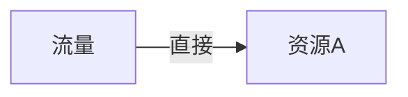
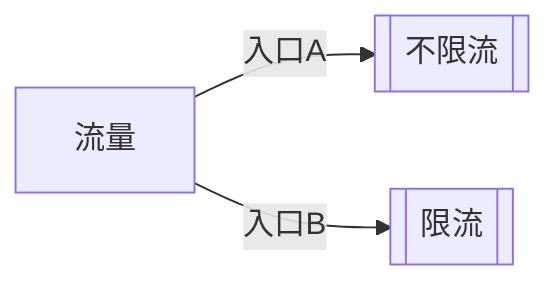
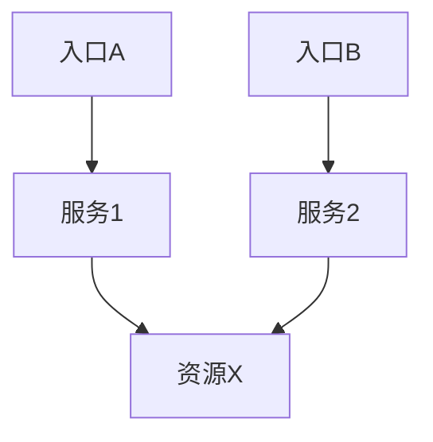

# Nacos注册中心

## 注册中心

### 服务发现

发现服务信息。

```java
@SpringBootTest()
public class DiscoveryTest {

    @Autowired
    private DiscoveryClient discoveryClient;

    @Autowired
    private NacosDiscoveryClient nacosDiscoveryClient;

    @Test
    void discoveryClientTest() {
        for (String service : discoveryClient.getServices()) {
            System.out.println(service);

            for (ServiceInstance instance : discoveryClient.getInstances(service)) {
                System.out.println("IP地址：" + instance.getHost());
                System.out.println("端口号" + instance.getPort());
            }
        }

        System.out.println("----------------------------------------------");

        // 两个方式一样，DiscoveryClient 是 Spring自带的 NacosDiscoveryClient是 Nacos
        for (String service : nacosDiscoveryClient.getServices()) {
            System.out.println(service);

            for (ServiceInstance instance : nacosDiscoveryClient.getInstances(service)) {
                System.out.println("IP地址：" + instance.getHost());
                System.out.println("端口号" + instance.getPort());
            }
        }
    }
}
```

### 远程调用

订单模块调用远程商品模块，使用了nacos，可以使用`RestTemplate`，其中`RestTemplate`是线程安全的，只要注册一次全局都是可以使用。

**RestTemplate源码**

继承了`InterceptingHttpAccessor`，在`InterceptingHttpAccessor`中，使用了单例模式。

```java
public ClientHttpRequestFactory getRequestFactory() {
    List<ClientHttpRequestInterceptor> interceptors = this.getInterceptors();
    if (!CollectionUtils.isEmpty(interceptors)) {
        ClientHttpRequestFactory factory = this.interceptingRequestFactory;
        if (factory == null) {
            factory = new InterceptingClientHttpRequestFactory(super.getRequestFactory(), interceptors);
            this.interceptingRequestFactory = factory;
        }

        return factory;
    } else {
        return super.getRequestFactory();
    }
}
```

#### 实现远程调用

##### 普通方式调用

注册`RestTemplate`

```java
@Bean
public RestTemplate restTemplate() {
    return new RestTemplate();
}
```

如果我们的服务启动了多个，在下面代码中即使一个服务宕机也可以做到远程调用。

```java
private Product getProductFromRemote(Long productId) {
    // 获取商品服务所有及其的 IP+port
    List<ServiceInstance> instances = discoveryClient.getInstances("service-product");
    ServiceInstance instance = instances.get(0);

    // 远程URL
    String url = "http://" + instance.getHost() + ":" + instance.getPort() + "/api/product/" + productId;

    // 2. 远程发送请求
    log.info("远程调用：{}", url);
    return restTemplate.getForObject(url, Product.class);
}
```

##### 负载均衡调用

注册`RestTemplate`

```java
@Bean
public RestTemplate restTemplate() {
    return new RestTemplate();
}
```

使用负载均衡`LoadBalancerClient`，通过负载均衡算法动态调用远程服务。

```java
/**
 * 远程调用商品模块 --- 负载均衡
 *
 * @param productId 商品id
 * @return 商品对象
 */
private Product getProductFromRemoteWithLoadBalancer(Long productId) {
    // 1. 获取商品服务所有及其的 IP+port
    ServiceInstance instance = loadBalancerClient.choose("service-product");

    // 远程URL
    String url = "http://" + instance.getHost() + ":" + instance.getPort() + "/api/product/" + productId;

    // 2. 远程发送请求
    log.info("负载均衡远程调用：{}", url);
    return restTemplate.getForObject(url, Product.class);
}
```

##### 负载均衡注解调用

> [!TIP]
>
> 如果远程注册中心宕机是否可以调用？
>
> 调用过：远程调用不在依赖注册中心，可以通过。
>
> 没调用过：第一次发起远程调用；不能通过。

在`RestTemplate`上加上`@LoadBalanced`注解使用负载均衡。

```java
@Bean
@LoadBalanced
public RestTemplate restTemplate() {
    return new RestTemplate();
}
```

在实际的调用中并不需要再显式调用，将URL替换成服务名称即可。

```java
/**
 * 远程调用商品模块 --- 负载均衡注解调用
 *
 * @param productId 商品id
 * @return 商品对象
 */
private Product getProductFromRemoteWithLoadBalancerAnnotation(Long productId) {
    // 远程URL，实现动态替换
    String url = "http://service-product/api/product/" + productId;

    // 远程发送请求
    log.info("负载均衡注解调用：{}", url);
    return restTemplate.getForObject(url, Product.class);
}
```

## 按需加载

### 数据隔离架构


### 命名空间管理

#### 创建命名空间

> [!TIP]
> 预配置的命名空间示例可在项目 `samples/namespace-config` 目录下找到。

建议创建以下标准命名空间：

- `dev` - 开发环境
- `test` - 测试环境
- `prod` - 生产环境

**操作步骤**：

1. 进入Nacos控制台命名空间管理
2. 点击"新建命名空间"
3. 填写命名空间信息（ID和名称）


#### 配置管理

**开发环境配置示例**：

1. 基础配置：

```yaml
order:
  timeout: 1min
  auto-confirm: 1h
```

2. 数据库配置：

```yaml
order:
  db-url: jdbc:mysql://dev-db:3306/order_dev
```


#### 命名空间克隆

通过克隆功能快速创建相似环境的命名空间：


### 动态环境配置

#### Spring Boot 配置方案

**基础配置**：

```yaml
server:
  port: 8000
spring:
  application:
    name: service-order
  profiles:
    active: dev
  cloud:
    nacos:
      server-addr: ${NACOS_HOST:192.168.3.150}:8848
      config:
        namespace: ${spring.profiles.active:dev} # 动态匹配当前profile
        group: DEFAULT_GROUP
```

**多环境配置加载**：

```yaml
spring:
  config:
    import:
      - optional:nacos:service-order.yml
      - optional:nacos:common.yml?group=order
      - optional:nacos:database.yml?group=order
```

> [!NOTE]
> 使用`optional:`前缀可避免配置不存在时启动失败

### 配置读取实现

**配置类**：

```java
@Configuration
@ConfigurationProperties(prefix = "order")
@Getter
@Setter
public class OrderProperties {
    private String timeout;
    private String autoConfirm;
    private String dbUrl; // 自动映射db-url
}
```

**REST接口**：

```java
@RestController
@RequestMapping("/api/order")
@RequiredArgsConstructor
public class OrderController {
    private final OrderProperties orderProperties;

    @GetMapping("/config")
    public Map<String, String> getConfig() {
        return Map.of(
            "timeout", orderProperties.getTimeout(),
            "autoConfirm", orderProperties.getAutoConfirm(),
            "dbUrl", orderProperties.getDbUrl()
        );
    }
}
```

### 按需加载策略

#### 多环境差异化配置

```yaml
spring:
  profiles:
    active: prod # 可通过启动参数覆盖

---
# 生产环境配置
spring:
  config:
    import:
      - nacos:service-order-prod.yml
      - nacos:common-prod.yml?group=order
    activate:
      on-profile: prod

---
# 开发环境配置
spring:
  config:
    import:
      - nacos:service-order-dev.yml
      - nacos:database-dev.yml?group=order
    activate:
      on-profile: dev

---
# 测试环境配置
spring:
  config:
    import:
      - nacos:service-order-test.yml
      - nacos:database-test.yml?group=order
    activate:
      on-profile: test
```

## OpenFeign 使用

### 基础配置

#### 依赖引入

```xml
<dependency>
    <groupId>org.springframework.cloud</groupId>
    <artifactId>spring-cloud-starter-openfeign</artifactId>
    <version>${spring-cloud.version}</version>
</dependency>
```

#### 启用Feign客户端

```java
@SpringBootApplication
@EnableFeignClients(basePackages = "com.yourpackage.feign")
public class OrderServiceApplication {
    public static void main(String[] args) {
        SpringApplication.run(OrderServiceApplication.class, args);
    }
}
```

> [!NOTE]
> `@EnableDiscoveryClient`注解，Spring Cloud最新版本已自动启用服务发现功能。

### Feign客户端使用

#### 服务间调用

**Feign客户端定义**：

```java
@FeignClient(
    name = "service-product",  
    path = "/api/product",
    configuration = ProductFeignConfig.class
)
public interface ProductFeignClient {

    @GetMapping("/{id}")
    ResponseEntity<Product> getProductById(@PathVariable("id") Long productId);

    @PostMapping
    ResponseEntity<Void> createProduct(@Valid @RequestBody Product product);  // 添加@Valid注解支持参数校验
}
```

**服务调用示例优化**：

```java
@Service
@RequiredArgsConstructor
public class OrderService {
    private final ProductFeignClient productFeignClient;

    public Order createOrder(Long productId, Long userId) {
        Product product = productFeignClient.getProductById(productId)
            .orElseThrow(() -> new ProductNotFoundException(productId));  // 使用Optional简化判断
        
        return Order.builder()
            .productId(product.getId())
            .userId(userId)
            // 其他订单属性
            .build();
    }
}
```

#### 第三方服务调用优化

```java
@FeignClient(
    name = "bunny-client",
    url = "${external.bunny.api.url}",
    configuration = ExternalFeignConfig.class
)
public interface BunnyFeignClient {

    @PostMapping("/login")
    ResponseEntity<AuthResponse> login(@Valid @RequestBody LoginDto loginDto);  // 使用具体返回类型替代String
}
```

### 负载均衡对比

| 特性       | 客户端负载均衡 (OpenFeign)       | 服务端负载均衡 (Nginx等) |
|----------|---------------------------|------------------|
| **实现位置** | 客户端实现                     | 服务端实现            |
| **依赖关系** | 需要服务注册中心                  | 不依赖注册中心          |
| **性能**   | 直接调用，减少网络跳转               | 需要经过代理服务器        |
| **灵活性**  | 可定制负载均衡策略                 | 配置相对固定           |
| **服务发现** | 集成服务发现机制                  | 需要手动维护服务列表       |
| **适用场景** | 微服务内部调用                   | 对外暴露API或跨系统调用    |
| **容错能力** | 集成熔断机制（如Sentinel、Hystrix） | 依赖代理服务器容错配置      |

### 高级配置

#### 日志配置优化

**application.yml**:

```yaml
logging:
  level:
    org.springframework.cloud.openfeign: DEBUG
    com.yourpackage.feign: DEBUG
```

**Java配置**：

```java
@Configuration
public class FeignConfig {
    
    @Bean
    Logger.Level feignLoggerLevel() {
        // 生产环境建议使用BASIC级别
        return Logger.Level.FULL; 
    }
}
```

#### 超时与重试配置优化

**application.yml**:

```yaml
spring:
  cloud:
    openfeign:
      client:
        config:
          default:  # 全局默认配置
            connect-timeout: 2000
            read-timeout: 5000
            logger-level: basic
            retryable: false  # 默认关闭重试，避免幂等问题
            
          service-product:  # 特定服务配置
            connect-timeout: 3000
            read-timeout: 10000
            retryable: true
```

**重试机制配置**：

```java
@Bean
public Retryer feignRetryer() {
    // 重试间隔100ms，最大间隔1s，最大尝试次数3次
    return new Retryer.Default(100, 1000, 3);
}
```

### Feign拦截器优化

#### 最佳实践

```java
@Component
@RequiredArgsConstructor
public class AuthRequestInterceptor implements RequestInterceptor {
    private final AuthService authService;

    @Override
    public void apply(RequestTemplate template) {
        template.header("Authorization", "Bearer " + authService.getCurrentToken());
    }
}
```

**配置方式**：

```yaml
spring:
  cloud:
    openfeign:
      client:
        config:
          default:
            request-interceptors:
              - com.yourpackage.feign.interceptor.AuthRequestInterceptor
              - com.yourpackage.feign.interceptor.LoggingInterceptor
```

### 熔断降级配置优化

#### 整合Sentinel

```xml
<dependency>
    <groupId>com.alibaba.cloud</groupId>
    <artifactId>spring-cloud-starter-alibaba-sentinel</artifactId>
    <version>${sentinel.version}</version>
</dependency>
```

**配置**：

```yaml
feign:
  sentinel:
    enabled: true
    # 降级策略配置
    fallback:
      enabled: true
      # 默认降级类路径
      default: com.yourpackage.feign.fallback.DefaultFallback
```

**降级实现优化**：

```java
@Slf4j
@Component
public class ProductFeignClientFallback implements ProductFeignClient {
    
    @Override
    public ResponseEntity<Product> getProductById(Long productId) {
        log.warn("Product服务降级，productId: {}", productId);
        return ResponseEntity.ok(Product.getDefaultProduct(productId));
    }
}
```

**FeignClient使用**：

```java
@FeignClient(
    name = "service-product",
    path = "/api/product",
    fallback = ProductFeignClientFallback.class,
    fallbackFactory = ProductFeignClientFallbackFactory.class  // 可选，用于获取异常信息
)
public interface ProductFeignClient {
    // 方法定义
}
```

## Sentinel 使用指南

> [!NOTE]
> 如果安装完Sentinel打开控制面板可以看到服务，但簇点链路为空，可能原因：
>
> 1. 微服务与Sentinel不在同一IP段
> 2. 服务未发送心跳到Sentinel Dashboard
> 3. 未正确配置`spring.cloud.sentinel.transport.dashboard`

### 依赖引入

```xml
<dependency>
    <groupId>com.alibaba.cloud</groupId>
    <artifactId>spring-cloud-starter-alibaba-sentinel</artifactId>
    <version>2022.0.0.0</version> <!-- 建议指定版本 -->
</dependency>
```

### 基础配置

```yaml
spring:
  cloud:
    sentinel:
      enabled: true
      eager: true # 提前初始化
      transport:
        dashboard: 192.168.3.150:8858 # Sentinel控制台地址
        port: 8719 # 本地启动的HTTP Server端口
        client-ip: ${spring.cloud.client.ip-address} # 客户端IP
      filter:
        enabled: true
      web-context-unify: false # 关闭统一上下文(链路模式需要)
```

### 自定义异常处理

#### MVC接口自定义返回

```java
@Component
public class MyBlockExceptionHandler implements BlockExceptionHandler {
    private final ObjectMapper objectMapper = new ObjectMapper();

    @Override
    public void handle(HttpServletRequest request, HttpServletResponse response, 
                      String s, BlockException e) throws Exception {
        response.setContentType("application/json;charset=utf-8");
        response.setStatus(429); // 建议使用429 Too Many Requests
        
        Map<String, Object> result = Map.of(
            "code", 429,
            "message", "请求被限流",
            "timestamp", System.currentTimeMillis(),
            "rule", e.getRule()
        );
        
        objectMapper.writeValue(response.getWriter(), result);
    }
}
```

#### REST接口全局异常处理

```java
@RestControllerAdvice
public class GlobalExceptionHandler {
    
    @ExceptionHandler(BlockException.class)
    public ResponseEntity<Object> handleBlockException(BlockException e) {
        return ResponseEntity.status(429)
               .body(Map.of(
                   "error", "Too Many Requests",
                   "rule", e.getRule().toString()
               ));
    }
}
```

### @SentinelResource详解

#### 作用

- 定义资源名称(用于流量控制)
- 指定限流/降级处理逻辑
- 配置异常降级策略

#### blockHandler vs fallback区别

有block先走block。

| 特性     | blockHandler             | fallback            |
| -------- | ------------------------ | ------------------- |
| 触发条件 | 流量控制/熔断时触发      | 业务异常时触发      |
| 参数要求 | 需包含BlockException参数 | 需包含Throwable参数 |
| 优先级   | 更高                     | 更低                |
| 典型场景 | 限流/熔断处理            | 业务降级处理        |

#### blockHandler使用示例

```java
@Operation(summary = "创建订单")
@SentinelResource(
    value = "orderService", 
    blockHandler = "createBlockHandler",
    fallback = "createFallback"
)
@GetMapping("create")
public Order createOrder(Long userId, Long productId) {
    return orderService.createOrder(productId, userId);
}

// 限流处理(参数需匹配原方法且最后加BlockException)
public Order createBlockHandler(Long userId, Long productId, BlockException ex) {
    log.warn("触发限流，rule={}", ex.getRule());
    return Order.fallbackOrder(userId, "限流:" + ex.getClass().getSimpleName());
}

// 降级处理(参数需匹配原方法且最后加Throwable)
public Order createFallback(Long userId, Long productId, Throwable t) {
    log.error("业务异常", t);
    return Order.fallbackOrder(userId, "降级:" + t.getMessage());
}
```

### 流控规则详解

#### 阈值类型

| 类型   | 说明                             | 适用场景             |
| ------ | -------------------------------- | -------------------- |
| QPS    | 每秒请求数                       | 绝大多数场景推荐使用 |
| 线程数 | 并发线程数(统计服务内部线程数量) | 同步服务/耗时操作    |

> [!WARNING]
> 线程数模式需要统计服务内部线程数量，性能开销较大，非必要不推荐使用

#### 集群模式

| 模式     | 说明                               | 示意图                                            |
| -------- | ---------------------------------- | ------------------------------------------------- |
| 单机均摊 | 总阈值=单机阈值×节点数(均匀分配)   |  |
| 总体阈值 | 所有节点共享总阈值(按实际请求分配) | -                                                 |

### 流控模式

#### 1. 直接模式



- 最简单的模式，直接对资源生效

#### 2. 关联模式



配置要求：

```yaml
spring.cloud.sentinel.web-context-unify: false
```

典型场景：写操作触发时限制读操作

#### 3. 链路模式



- 只针对特定入口的调用链路限流
- 需要配合`@SentinelResource`标注资源点

### 流控效果

#### 1. 快速失败

- 直接抛出FlowException
- 支持所有流控模式
- 配置简单，性能最好

#### 2. Warm Up(预热)


- 冷启动阶段逐步提高阈值
- 防止冷系统被突发流量击垮
- 需配置预热时长(秒)

#### 3. 匀速排队


- 以恒定间隔处理请求
- 需配置超时时间(毫秒)
- 不支持QPS>1000的场景

## 熔断降级

1. **熔断恢复**：系统会在熔断时间结束后自动尝试恢复，进入半开状态
2. **监控建议**：建议配合Dashboard监控熔断事件，设置合理的告警机制
3. **阈值设置**：需要根据实际业务场景调整阈值，过高会导致保护不足，过低可能误熔断
4. **降级策略**：应准备有意义的降级响应，如缓存数据、默认值或友好提示

熔断降级是分布式系统中重要的稳定性保障手段，主要功能包括：

- **切断不稳定调用**：自动识别并隔离故障服务
- **快速返回不积压**：避免请求堆积导致资源耗尽
- **避免雪崩效应**：防止故障在系统中级联扩散

### 典型场景

在分布式系统中，如果A服务调用G服务，G服务调用D服务，当D服务出现性能问题时，会导致整个调用链路响应变慢。通过熔断机制，G服务可以快速识别D服务的异常状态，直接返回预设的降级响应，避免无效等待和资源浪费。

### 断路器工作原理

1. **关闭状态**：初始状态，所有请求正常通过
2. **熔断状态**：当触发熔断条件时，直接拒绝请求，快速失败
3. **半开状态**：熔断时间结束后，尝试放行少量请求测试服务是否恢复
   - 成功则关闭熔断，恢复正常
   - 失败则继续保持熔断状态

### 最佳实践

熔断降级作为自身保护手段，通常在客户端（调用端）进行配置：

- 针对关键依赖服务配置熔断规则
- 设置合理的熔断阈值和恢复时间
- 配合降级逻辑提供有意义的fallback响应
- 监控熔断事件，及时预警

### 实际示例

#### 慢调用比例

配置参数：

- **最大RT**：1000ms（超过此响应时间的请求视为慢调用）
- **比例阈值**：0.8（当慢调用比例超过80%时触发熔断）
- **熔断时长**：30s（触发熔断后持续30秒）
- **最小请求数**：5（统计窗口内至少需要5个请求才进行熔断判断）
- **统计时长**：5000ms（滑动窗口统计的时间长度为5秒）


#### 异常比例

配置参数：

- **比例阈值**：0.5（当异常比例超过50%时触发熔断）
- **熔断时长**：10s
- **最小请求数**：10
- **统计时长**：10000ms

适用场景：适用于服务依赖不稳定，可能出现大量异常的情况。

#### 异常数

配置参数：

- **异常数阈值**：5（当异常数量达到5次时触发熔断）
- **熔断时长**：60s
- **统计时长**：60000ms

适用场景：适用于低流量但要求高可用的服务，可以快速响应偶发异常。

## Gateway

Spring Cloud Gateway 是基于 Spring 5、Spring Boot 2 和 Project Reactor 构建的 API 网关，提供了一种简单有效的方式来路由到 API，并为它们提供跨领域的关注点，如：安全性、监控/指标和弹性。

> [!WARNING]
>
> **不要同时引入 `spring-boot-starter-web` 和 `spring-cloud-starter-gateway`**
>
> 报错原因是项目中同时存在了两个不兼容的 Web 框架：
>
> 1. Spring MVC (基于 Servlet API 的阻塞式编程模型)
> 2. Spring Cloud Gateway (基于 Reactor 的非阻塞式编程模型)

### 冲突分析与解决方案

#### 原因分析

1. **编程模型冲突**：
   - Spring MVC 使用传统的同步阻塞式 I/O 模型
   - Spring Cloud Gateway 基于 Project Reactor 和 Netty，使用异步非阻塞式响应式编程模型
   - 这两种模型在底层处理 HTTP 请求的方式完全不同，无法共存

2. **自动配置机制**：
   - Spring Boot 的自动配置会根据类路径上的依赖自动配置应用
   - 当检测到 `spring-boot-starter-web` 时，会配置为 Servlet 容器（如 Tomcat）
   - 当检测到 `spring-cloud-starter-gateway` 时，会期望配置为 Netty 服务器

3. **Web 应用类型冲突**：
   - Spring Boot 2.x 引入了 `WebApplicationType` 概念，可以是 SERVLET、REACTIVE 或 NONE
   - 系统无法自动决定应该使用哪种类型，因为发现了两种冲突的实现

#### 解决方案

##### 推荐方案

在 `application.properties` 或 `application.yml` 中明确指定应用类型：

```properties
spring.main.web-application-type=reactive
```

##### 替代方案

1. 完全移除 `spring-boot-starter-web` 依赖
2. 如果需要某些 Spring MVC 的功能，考虑使用 `spring-boot-starter-webflux` 替代

### 项目创建与基本配置

#### 依赖配置

```xml
<dependency>
    <groupId>org.springframework.cloud</groupId>
    <artifactId>spring-cloud-starter-gateway</artifactId>
</dependency>
<dependency>
    <groupId>org.springframework.cloud</groupId>
    <artifactId>spring-cloud-starter-loadbalancer</artifactId>
</dependency>
```

#### 基础配置示例

```yaml
server:
  port: 8888

spring:
  application:
    name: gateway
  cloud:
    nacos:
      server-addr: 192.168.3.150:8848
    gateway:
      discovery:
        locator:
          enabled: true  # 开启服务发现自动路由
```

### 路由配置详解

Spring Cloud Gateway 提供了强大而灵活的路由功能，通过合理配置断言和过滤器，可以实现复杂的API网关需求。遵循响应式编程模型，确保不要与传统的Spring MVC混合使用，是成功使用Gateway的关键。

#### 基本路由配置

路由规则按从上到下的顺序加载，第一个匹配的规则将被执行（除非自定义规则顺序）。

```yaml
spring:
  cloud:
    gateway:
      routes:
        - id: order-route
          uri: lb://service-order  # lb://表示使用负载均衡
          predicates:
            - Path=/api/order/**
          filters:
            - StripPrefix=1  # 去掉前缀/api
        - id: product-route
          uri: lb://service-product
          predicates:
            - Path=/api/product/**
          order: 1  # 优先级，数字越小优先级越高
```

#### URI 类型说明

- `lb://service-name`: 通过服务发现进行负载均衡
- `http://host:port`: 直接HTTP请求
- `https://host:port`: 直接HTTPS请求

### 断言(Predicates)详解

断言用于定义路由的匹配条件，支持多种匹配方式。

更多配置参考下面图片，全局搜索`RoutePredicateFactory`，之后`Ctrl+H`找到所有方法。

#### 常用断言类型

##### Path 断言

```yaml
predicates:
  - Path=/api/product/**
```

或长格式：

```yaml
predicates:
  - name: Path
    args:
      patterns: /api/product/**
      matchTrailingSlash: true  # 是否匹配结尾斜杠
```

##### Query 断言

匹配请求参数：

```yaml
predicates:
  - Query=q, 被世界温柔以待  # 参数名和正则表达式
```

长格式：

```yaml
predicates:
  - name: Query
    args:
      param: q
      regexp: 被世界温柔以待
```

##### Method 断言

匹配HTTP方法：

```yaml
predicates:
  - Method=GET,POST
```

##### Header 断言

匹配请求头：

```yaml
predicates:
  - Header=X-Request-Id, \d+  # 匹配数字
```

##### Cookie 断言

匹配Cookie：

```yaml
predicates:
  - Cookie=sessionid, abc.*
```

##### Host 断言

匹配Host头：

```yaml
predicates:
  - Host=**.example.com
```

##### 时间相关断言

- After: 指定时间之后
- Before: 指定时间之前
- Between: 两个时间之间

```yaml
predicates:
  - After=2023-01-20T17:42:47.789-07:00[America/Denver]
```

#### 自定义断言

```java
@Component
public class VipRoutePredicateFactory extends AbstractRoutePredicateFactory<VipRoutePredicateFactory.Config> {

    public VipRoutePredicateFactory() {
        super(Config.class);
    }

    @Override
    public List<String> shortcutFieldOrder() {
        return List.of("param", "value");
    }

    @Override
    public Predicate<ServerWebExchange> apply(Config config) {
        return (GatewayPredicate) serverWebExchange -> {
            ServerHttpRequest request = serverWebExchange.getRequest();

            String first = request.getQueryParams().getFirst(config.param);

            return StringUtils.hasText(first) && first.equals(config.value);
        };
    }

    @Getter
    @Setter
    @Validated
    public static class Config {
        @NotEmpty
        private String param;

        @NotEmpty
        private String value;
    }
}
```

##### 配置使用方式

**短写法配置**

```
predicates:
  - Vip=user,bunny
```

**长写法配置**

```
predicates:
  - name: Vip
    args:
      param: user
      value: bunny
```

### 过滤器(Filters)详解

过滤器用于修改请求和响应，可以在路由前后执行。

> [!TIP]
>
> [更多参考文档](https://docs.spring.io/spring-cloud-gateway/reference/spring-cloud-gateway/gatewayfilter-factories/addrequestheader-factory.html)

#### 常用内置过滤器

##### 路径相关

- `StripPrefix`: 去掉前缀

  ```yaml
  filters:
    - StripPrefix=2  # 去掉前两级路径
  ```

- `PrefixPath`: 添加前缀

  ```yaml
  filters:
    - PrefixPath=/api
  ```

##### 请求头相关

> [!NOTE]
>
> 在有的浏览器中看不到`X-Request-red`，因为`x-`开头可能是自定义请求头，有的浏览器防止泄露隐私就隐藏了，需要在指定的下游接口中打印可以看到。

- `AddRequestHeader`: 添加请求头

  ```yaml
  filters:
    - AddRequestHeader=X-Request-red, blue
  ```

- `RemoveRequestHeader`: 移除请求头

- `SetRequestHeader`: 设置请求头

如果访问这个接口，可以输出`Received headers: blue`

```java
@Operation(summary = "读取配置")
@GetMapping("config")
public String config(HttpServletRequest request) {
    String timeout = orderProperties.getTimeout();
    String autoConfirm = orderProperties.getAutoConfirm();
    String dbUrl = orderProperties.getDbUrl();

    // 携带的请求头内容
    String header = request.getHeader("X-Request-red");
    log.info("Received headers: {}", header);

    return "timeout：" + timeout + "\nautoConfirm：" + autoConfirm + "\norder.db-url" + dbUrl;
}
```

##### 响应头相关

- `AddResponseHeader`: 添加响应头
- `RemoveResponseHeader`: 移除响应头
- `SetResponseHeader`: 设置响应头

##### 重定向相关

- `RedirectTo`: 重定向

  ```yaml
  filters:
    - RedirectTo=302, https://example.org
  ```

##### 断路器相关

- `CircuitBreaker`: 断路器

  ```yaml
  filters:
    - name: CircuitBreaker
      args:
        name: myCircuitBreaker
        fallbackUri: forward:/fallback
  ```

##### 重试相关

- `Retry`: 重试机制

  ```yaml
  filters:
    - name: Retry
      args:
        retries: 3
        statuses: BAD_GATEWAY
  ```

### 全局过滤器

可以应用于所有路由的过滤器，常用于认证、日志等全局功能。

```java
@Bean
public GlobalFilter customGlobalFilter() {
    return (exchange, chain) -> {
        // 前置处理
        return chain.filter(exchange).then(Mono.fromRunnable(() -> {
            // 后置处理
        }));
    };
}
```

### 高级特性

#### 自定义过滤器

实现`GlobalFilter`

```java
@Slf4j
@Component
public class RTFilter implements GlobalFilter, Ordered {

    @Override
    public Mono<Void> filter(ServerWebExchange exchange, GatewayFilterChain chain) {
        ServerHttpRequest request = exchange.getRequest();
        URI uri = request.getURI();
        long start = System.currentTimeMillis();
        log.error("请求【{}】开始时间：{}", uri, start);

        // 处理逻辑
        // return chain.filter(exchange)
        //         // 因为是异步的，不能写在下main，需要处理后续逻辑写在 doFinally
        //         .doFinally(result -> {
        //             long end = System.currentTimeMillis();
        //             log.error("请求【{}】结束 ，时间：{}，耗时:{}", uri, end, end - start);
        //         });
        return chain.filter(exchange)
                .doOnError(e -> log.error("请求失败", e))
                .doFinally(result -> {
                    long end = System.currentTimeMillis();
                    log.info("请求【{}】结束，状态：{}，耗时：{}ms",
                            uri, result, end - start);
                });
    }

    @Override
    public int getOrder() {
        return 0; // 执行顺序
    }
}
```

#### 自定义过滤器工厂

添加完成后再请求头中添加`X-Response-Token`


```java
@Component
public class OnceTokenGatewayFilterFactory extends AbstractNameValueGatewayFilterFactory {

    @Override
    public GatewayFilter apply(NameValueConfig config) {
        // 每次相应之前添加一次性令牌

        return (exchange, chain) -> chain.filter(exchange)
                .then(Mono.fromRunnable(() -> {
                    ServerHttpResponse response = exchange.getResponse();
                    HttpHeaders headers = response.getHeaders();

                    String name = config.getName();
                    String value = config.getValue();

                    if ("uuid".equalsIgnoreCase(value)) {
                        value = UUID.randomUUID().toString();
                    }

                    if ("jwt".equalsIgnoreCase(value)) {
                        value = "JWT的token";
                    }

                    headers.add(name, value);
                }));
    }
}
```

**配置中设置**

```yaml
spring:
  cloud:
    gateway:
      routes:
        - id: order-route
          uri: lb://service-order
          predicates:
            - Path=/api/order/**
          filters:
            - AddRequestHeader=X-Request-red, blue
            - OnceToken=X-Response-Token, uuid
```

#### 动态路由

可通过数据库或配置中心实现动态路由更新。

```java
@Autowired
private RouteDefinitionLocator routeDefinitionLocator;

@Autowired
private RouteDefinitionWriter routeDefinitionWriter;

public void updateRoutes() {
    // 获取新路由定义
    List<RouteDefinition> definitions = ...;
    
    // 清空现有路由
    routeDefinitionLocator.getRouteDefinitions()
        .collectList()
        .subscribe(existing -> existing.forEach(route -> 
            routeDefinitionWriter.delete(Mono.just(route.getId()))));
    
    // 添加新路由
    definitions.forEach(definition -> 
        routeDefinitionWriter.save(Mono.just(definition)).subscribe());
}
```

#### 跨域设置

请求后会出有下面的内容：


```yaml
spring:
  cloud:
    gateway:
      # 全局跨域
      globalcors:
        cors-configurations:
          '[/**]':
            allowed-headers:
              - "*"
            allowed-origin-patterns:
              - "*"
            allowed-methods:
              - "*"
```

**CORS问题**：在Gateway层统一配置CORS

```yaml
spring:
  cloud:
    gateway:
      globalcors:
        cors-configurations:
          '[/**]':
            allowedOrigins: "*"
            allowedMethods:
              - GET
              - POST
```

### 最佳实践

1. **路由组织**：按业务功能组织路由，使用清晰的ID命名
2. **优先级管理**：合理使用order属性控制路由匹配顺序
3. **异常处理**：配置全局异常处理和fallback路由
4. **监控**：集成Actuator监控端点
5. **性能**：合理使用缓存和断路器

### 常见问题

1. **超时配置**：

   ```yaml
   spring:
     cloud:
       gateway:
         httpclient:
           connect-timeout: 1000
           response-timeout: 5s
   ```

2. **负载均衡**：确保正确配置服务发现和负载均衡器

3. **远程调用是否过网关**

正常的远程调用是不过网关的，毕竟直接调用nacos中服务就行，多走一遍路没什么意思，如果非要过网关可以按照下面格式：

将`value`值修改为`gateway`，通常不建议过网关。

```java
// Feign 客户端
// @FeignClient(value = "service-product", path = "/api/product", fallback = ProductFeignClientFallback.class)
@FeignClient(value = "gateway", path = "/api/product", fallback = ProductFeignClientFallback.class)
public interface ProductFeignClient {

    // 标注在 Controller 上是接受请求
    // 标注在 FeignClient 时发送请求
    @GetMapping("{id}")
    Product getProduct(@PathVariable("id") Long productId);

}
```
