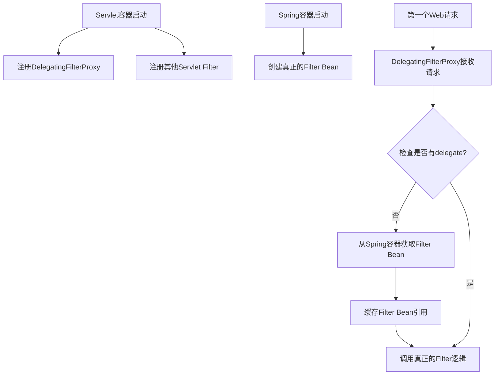

## 简介

在了解Spring Security之前，需要了解整个过滤器架构的形成过程。Spring Security使用Spring Web的Filter机制来实现安全控制。这些Security Filter最终被包装到Spring Web模块提供的`DelegatingFilterProxy`中（不是Spring Security特有的）。

`DelegatingFilterProxy`的关键作用是实现Filter Bean的延迟查找。虽然Spring容器在启动时会创建所有的Bean（包括Filter Bean），但`DelegatingFilterProxy`要到第一次Web请求到达时才会从Spring容器中查找并获取真正的Filter Bean引用。这个延迟查找机制非常重要，因为它解决了Servlet容器和Spring容器启动顺序的问题。

## HTTP Servlet 过滤器架构


### 源码展示

以下是`Filter`接口源码，包位于`jakarta.servlet`

```java
public interface Filter {
    default void init(FilterConfig filterConfig) throws ServletException {
    }

    void doFilter(ServletRequest var1, ServletResponse var2, FilterChain var3) throws IOException, ServletException;

    default void destroy() {
    }
}
```

### 含义解释

#### 1、基于 Servlet 的 Filter

Spring Security 的 Servlet 支持是建立在 **Servlet 过滤器** 这一原生机制之上的。
当一个 HTTP 请求到达 Servlet 容器（如 Tomcat）时，容器会创建一个 **过滤器链 (FilterChain)**，链上包含多个过滤器和最终处理请求的 Servlet。

#### 2、过滤器链的结构

容器根据请求的 **URI 路径** 决定哪些过滤器（Filter）和哪个 Servlet（如 `DispatcherServlet`）应当被加入链中并依次执行。

#### 3、过滤器的功能

在链中，**一个请求可以由多个过滤器处理**，但**最多只能由一个 Servlet 处理**（如在 Spring MVC 中，通常是 `DispatcherServlet`）。

过滤器主要有两个作用：

- 阻止下游执行：过滤器可以直接处理请求并写入 `HttpServletResponse`，然后不再调用链中的后续过滤器或 Servlet。
- 修改请求/响应：过滤器可以在请求到达下游过滤器或 Servlet 之前修改 `HttpServletRequest`，或在响应返回客户端之前修改 `HttpServletResponse`。

#### 4、FilterChain

过滤器之所以强大，是因为它被传入了整个 **FilterChain 对象**。
过滤器可以选择：

- 调用 `chain.doFilter(request, response)` 将请求传递给链中的下一个组件；
- 或者在必要时中断调用，直接返回响应。

#### 5、 与 Spring MVC 的关系

在 Spring MVC 应用中，最终的 Servlet 一般是 **`DispatcherServlet`**，它负责将请求分发给对应的 Controller。
而 **Spring Security 的一系列过滤器（如认证、授权、CSRF 保护等）会在这个 `DispatcherServlet` 之前执行**，从而在请求到达业务逻辑之前完成安全层面的处理。

## `DelegatingFilterProxy` 代理过滤器

### 源码展示

```java
public class DelegatingFilterProxy extends GenericFilterBean {}
```


### 含义解释

1. **Servlet容器**（如Tomcat）有自己的标准来注册和管理Filter
2. **Spring容器**管理Spring Bean
3. **两个容器是独立的**：Servlet容器不知道Spring Bean的存在

`DelegatingFilterProxy` 本身是立即加载的，它是Servlet容器中的普通Filter，启动时就存在。延迟的昌**目标Filter Bean**而不是 `DelegatingFilterProxy` 

**实际流程如下：**

1. Servlet容器初始化
2. 创建并注册DelegatingFilterProxy（Spring提供）
3. DelegatingFilterProxy构造函数执行
   - 此时：targetFilterBean = null （还未查找）
4. ContextLoaderListener触发
5. Spring ApplicationContext初始化
6. 真正的Filter Bean（如springSecurityFilterChain）被创建
7. 请求到达Servlet容器
8. 调用DelegatingFilterProxy.doFilter()
9. DelegatingFilterProxy发现delegate为null
10. 从Spring容器查找并获取真正的Filter Bean
11. 缓存这个Bean引用
12. 调用真正的Filter Bean.doFilter()



### FAQ

1. 那么 Spring Bean 是否知道 Servlet 存在：部分知道，但通常不直接依赖。
2.  如果 Servlet 中的 Filter 和 Spring Bean 中的 Filter 重复了怎么办？
   - Servlet Filter通常有明确的命名
   - Spring Bean Filter通过DelegatingFilterProxy桥接
   - 通过Bean名称的精确匹配来定位

## FilterChainProxy 作用

### 简介

`FilterChainProxy` 是一个具体的类，通常来说我们不会去配置，除非真的要非常精细的权限控制。一般有下面场景：

1. 完全自定义过滤器执行流程
2. 需要非标准的请求匹配逻辑
3. 高性能网关/代理场景
4. 混合安全框架集成
5. 复杂的多租户架构
6. 需要深度性能优化或监控


### 源码展示

源码是继承了`GenericFilterBean`

```java
public class FilterChainProxy extends GenericFilterBean {}
```

### 含义解释

Spring Security 的 Servlet 支持功能包含在 `FilterChainProxy` 中，`FilterChainProxy` 是 Spring Security 提供的一种特殊的过滤器，允许 `SecurityFilterChain` 请求转发给多个过滤器实例。由于 `FilterChainProxy` 是一个 Bean，通常会将其封装到 `DelegatingFilterProxy` 中。


## SecurityFilterChain 作用

### 源码展示

```java
public interface SecurityFilterChain {
    boolean matches(HttpServletRequest request);
    List<Filter> getFilters();
}
```

### 含义解释

在 `SecurityFilterChain` 中的安全过滤器通常是 Bean 类型，但它们是通过 `FilterChainProxy` 而非 `DelegatingFilterProxy` 进行注册的。

`FilterChainProxy` 在注册方式上比直接与 `Servlet` 容器或 `DelegatingFilterProxy` 进行注册具有诸多优势。

首先，它为 Spring Security 的所有 `Servlet` 支持提供了基础。因此，如果要对 Spring Security 的 `Servlet` 支持进行故障排查，那么在 `FilterChainProxy` 中添加调试点是一个很好的开始点。


实现 `SecurityFilterChain` 的过滤器会有多个，但只会匹配第一个。比如按照上图中的过滤器， `/api/message` 会被`/api/**` 和 `/**` 匹配，但只匹配第一个 `/api/**` 的过滤器。

##  Security Filters

>[!TIP]
>`FilterOrderRegistration` 位于  `org.springframework.security.config.annotation.web.builders.FilterOrderRegistration` 下。

安全过滤器是通过 `SecurityFilterChain` API 插入到 `FilterChainProxy` 中的。这些过滤器可用于多种不同的目的，例如漏洞防护、身份验证、授权等等。这些过滤器会按照特定的顺序执行，以确保它们能在正确的时间被调用，例如，执行身份验证的过滤器应该在执行授权的过滤器之前被调用。

通常情况下，无需了解 Spring Security 过滤器的执行顺序。然而，有时了解其顺序是有益的，如果想了解这些顺序，可以查看 `FilterOrderRegistration` 代码。这些安全过滤器通常通过一个`HttpSecurity`实例来声明。以下是 `FilterOrderRegistration` 节选部分，可以发现过滤器注册时顺序都是以 `100` 累加的。

```java
@SuppressWarnings("serial")
final class FilterOrderRegistration {

	private static final int INITIAL_ORDER = 100;

	private static final int ORDER_STEP = 100;

	private final Map<String, Integer> filterToOrder = new HashMap<>();

	FilterOrderRegistration() {
		Step order = new Step(INITIAL_ORDER, ORDER_STEP);
		put(DisableEncodeUrlFilter.class, order.next());
		put(ForceEagerSessionCreationFilter.class, order.next());
		// 还有很多...
}
```

| 如果你的过滤器是以下类型 | 请将它放置在以下过滤器之后                   | 因为这些事件已经发生 |
| ------------ | ------------------------------- | ---------- |
| **攻击防护过滤器**  | `SecurityContextHolderFilter`   | 1          |
| **身份验证过滤器**  | `LogoutFilter`                  | 1, 2       |
| **授权过滤器**    | `AnonymousAuthenticationFilter` | 1, 2, 3    |

[^1]: 安全上下文已建立（SecurityContext established）
[^2]: 登出已处理（Logout processed）
[^3]: 匿名身份已分配（Anonymous authentication assigned）

>[!TIP]
>通常情况下，应用程序会添加自定义认证机制。这意味着它们应置于 `LogoutFilter` 之后。

比如要判断一个用户是否有多租户权限可以用下面这样的方式：

```java
public class TenantFilter implements Filter {

    @Override
    public void doFilter(ServletRequest servletRequest, ServletResponse servletResponse, FilterChain filterChain) throws IOException, ServletException {
        HttpServletRequest request = (HttpServletRequest) servletRequest;
        HttpServletResponse response = (HttpServletResponse) servletResponse;
		// 租户Id
        String tenantId = request.getHeader("X-Tenant-Id"); (1)
        // 是否可以访问
        boolean hasAccess = isUserAllowed(tenantId); (2)
        // 可以访问交给下一个过滤器（调用链中的其余过滤器）
        if (hasAccess) {
            filterChain.doFilter(request, response); (3)
            return;
        }
        // 不能访问抛出异常
        throw new AccessDeniedException("Access denied"); (4)
    }

}
```

>[!NOTE]
>`OncePerRequestFilter` 是来自Spring Web 中的非 Spring Security 提供。

在 Spring Security 中可以继承 `OncePerRequestFilter` 无需使用 Filter。该类是仅在每次请求中执行一次的过滤器的基类，并提供了带有 `HttpServletRequest` 和 `HttpServletResponse` 参数的 `doFilterInternal` 方法。

一般来说，将其添加在匿名认证过滤器之后，即该链中最后的认证过滤器位置，具体方式如下：

```java
@Bean
SecurityFilterChain filterChain(HttpSecurity http) throws Exception {
    http
    	// ...
        // 使用 `HttpSecurity#addFilterAfter` 方法将租户过滤器添加到匿名身份验证过滤器之后。
        .addFilterAfter(new TenantFilter(), AnonymousAuthenticationFilter.class);
    return http.build();
}
```