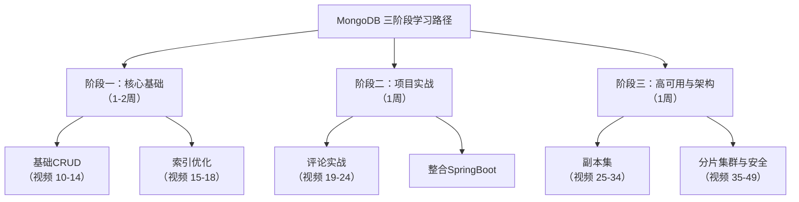

# 环境搭建

## 📚 MongoDB 学习重点与深度建议

对于你的角色和目标，学习MongoDB的核心思想是：**“重应用、轻运维；重场景、轻配置”**。你不是DBA，你的目标是知道在什么业务场景下选用MongoDB，并能用它高效解决实际问题。

### 🎯 学习目标分层（你需要掌握的程度）

| 层级                   | 内容                       | 目标（对你而言）                                 |
| :--------------------- | :------------------------- | :----------------------------------------------- |
| **核心应用（重点）**   | CRUD操作、索引、聚合框架   | **熟练掌握**，能在Spring Boot项目中流畅使用      |
| **架构设计（理解）**   | 文档模型设计、模式设计     | **深刻理解**，能根据业务需求合理设计文档结构     |
| **集群与安全（了解）** | 副本集、分片集群、安全认证 | **了解原理**，能在开发环境中搭建，能连接生产环境 |

---

### 📖 具体学习路径与规划

根据你提供的视频列表，我为你划分了三个清晰的阶段：



#### **阶段一：核心基础（1-2周）**

**目标**：掌握MongoDB的基础操作和性能核心——索引。

- **基础CRUD（视频 10-14）**：重点看**11（更新）**、**13（分页查询）** 和 **14（更多查询）**。MongoDB的更新操作和复杂查询是重点。
- **索引（视频 15-18）**：这是**重中之重**！必须搞懂：
  - **15-16**：索引类型和管理（怎么创建）
  - **17**：**执行计划（`explain()`）** 必须掌握，这是你判断查询是否走索引的唯一方法。
  - **18**：覆盖查询（理想状态）

#### **阶段二：项目实战（整合Spring Boot，1周）**

**目标**：将MongoDB融入你的技术栈，解决实际问题。

- **文章评论实战（视频 19-24）**：这是一个非常好的案例。重点看：
  - **19**：**技术选型**部分，思考“为什么这里用MongoDB而不是MySQL？”（答案：半结构化数据、灵活嵌套、读写频繁）。
  - **23-24**：分页列表和点赞操作，这是后台管理系统最常见的需求。
- **整合到你自己的RBAC系统**：
  - **思考**：你的系统里有没有类似“日志”、“通知消息”、“用户操作记录”这种写入频繁、数据结构可能变化的功能？**用它来练手**。

#### **阶段三：高可用与架构（1周）**

**目标**：理解原理，以备不时之需，面试也能用上。

- **副本集（视频 25-34）**：**重点看 25（概念）、31（主节点选举）、32-33（故障测试）**。你不需要记住搭建的每一步命令，但要理解：
  - 主从复制、故障自动切换、数据高可用的概念。
  - **SpringData连接副本集（视频 34）**：**必须看**，知道怎么连就行。
- **分片集群与安全（视频 35-49）**：
  - **快速浏览**：看懂分片是为了解决**海量数据+高并发**的横向扩展问题即可。
  - **安全认证（视频 44-47）**：**重点看**！尤其是 **47（SpringData认证连接）**，这是连接生产环境数据库的必备技能。

---

### 🔗 如何将MongoDB融入你的技术体系

你现在学的不是一个孤立的中间件，而是为你已有的技术栈增加一种**新的“武器”**。关键在于知道**什么时候该用它**。

| 业务场景               | 技术选型                          | 理由                                                |
| :--------------------- | :-------------------------------- | :-------------------------------------------------- |
| **权限控制、用户管理** | **MySQL**                         | 数据结构稳定，关系性强，需要事务支持                |
| **日志记录、操作审计** | **MongoDB**                       | 写入频繁，数据结构可能变化，无复杂关联              |
| **消息通知、站内信**   | **MongoDB** 或 **Redis**          | MongoDB用于持久化存储，Redis用于实时推送            |
| **文件元信息管理**     | **MongoDB** + **MinIO**           | MongoDB存文件属性、路径，MinIO存文件本身            |
| **报表统计、数据分析** | **MongoDB**（聚合框架） 或 **ES** | MongoDB适合固定维度的统计，ES适合全文检索和复杂分析 |

**你的行动计划**：
在你的RBAC系统里，**新增一个“操作日志”模块**。用户的所有重要操作（登录、增删改）都异步记录到MongoDB中。这个练习能让你同时用到：

- **MongoDB**：存储日志文档
- **RabbitMQ**：异步化，削峰填谷
- **Vue/React**：前端展示日志列表和分页
- **Spring Boot**：后端接口开发

---

### ⚠️ 注意事项（避坑指南）

1.  **不要用MongoDB替代MySQL做强事务性操作**（如订单、支付）。它不适合多文档复杂事务。
2.  **设计文档结构时，要倾向于“嵌入式”而非“规范化”**。MongoDB的优势在于读写快，而不是像MySQL一样做多表关联查询。
3.  **索引是双刃剑**：加速查询，但降低写速度、占用空间。不要过度索引。
4.  **官方文档怎么看**：**作为工具书**。比如，你要做一个`$group`聚合，记不清语法了，直接去文档查【Aggregation Pipeline】章节。**不需要通读**。

## 安装MongoDB

### 设置权限

```sh
sudo mkdir -p ~/docker/docker_data/mongo/conf
sudo mkdir -p ~/docker/docker_data/mongo/logs
sudo chmod 777 ~/docker/docker_data/mongo/logs
sudo chmod 777 ~/docker/docker_data/mongo/conf

cd ~/docker/docker_data/mongo/logs
sudo touch mongod.log
sudo chmod 777 mongod.log

cd ~/docker/docker_data/mongo/conf
sudo vim mongod.conf
```

**配置文件**

```properties
# 数据库文件存储位置
dbpath = /data/db
# log文件存储位置
logpath = /data/log/mongod.log
# 使用追加的方式写日志
logappend = true
# 是否以守护进程方式运行
# fork = true
# 全部ip可以访问
bind_ip = 0.0.0.0
# 端口号
port = 27017
# 是否启用认证
auth = true
# 设置oplog的大小(MB)
oplogSize=2048
```

#### 执行安装

```sh
docker run -it \
    --name mongodb \
    --restart=always \
    --privileged \
    -p 27017:27017 \
    -v ~/docker/docker_data/mongo/data:/data/db \
    -v ~/docker/docker_data/mongo/conf:/data/configdb \
    -v ~/docker/docker_data/mongo/logs:/data/log/  \
    -d mongo:latest \
    -f /data/configdb/mongod.conf
```

### 设置账号密码

```sh
#进入容器
docker exec -it mongodb /bin/bash

#进入mongodb shell
mongosh --port 27017

#切换到admin库
use admin

#创建账号/密码
db.createUser({ user: 'admin', pwd: '02120212', roles: [ { role: "root", db: "admin" } ] });
# db.createUser({ user: 'admin', pwd: '123456', roles: [ { role: "userAdminAnyDatabase", db: "admin" } ] });
```

### 移除Docker镜像 

```sh
docker stop mongodb
docker rm mongodb
```

## 常用链接速查

| 名称            | 地址                                         | 备注 |
| --------------- | -------------------------------------------- | ---- |
| MondoDB Compass | https://www.mongodb.com/try/download/compass |      |

