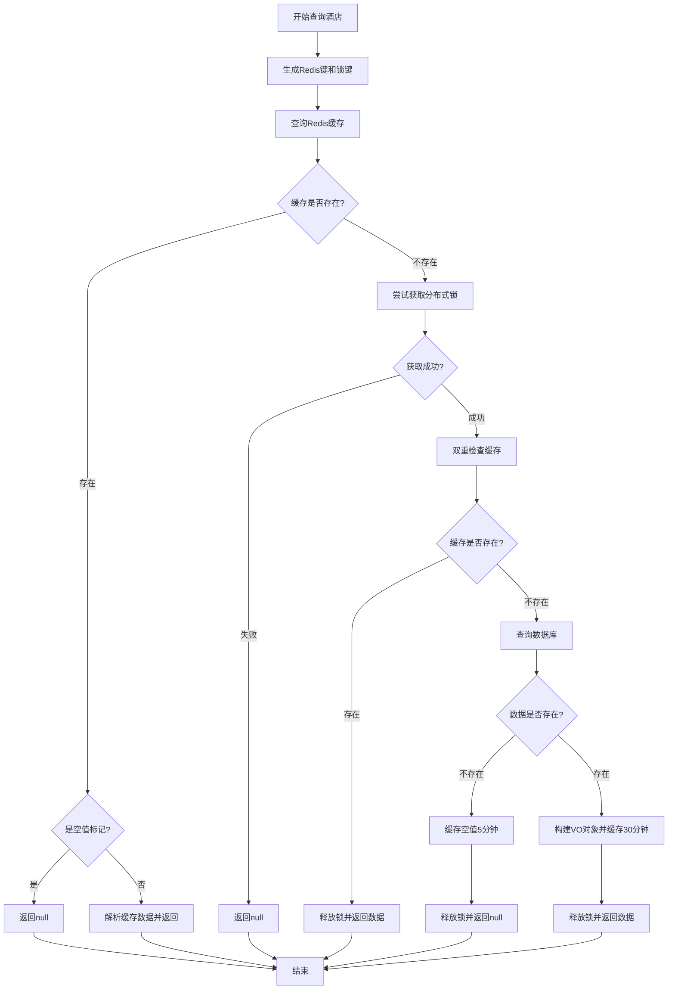

# Redis缓存问题与解决方案

## 📌 缓存穿透

### 什么是缓存穿透？
**缓存穿透**是指查询一个**不存在的数据**，该数据在缓存和数据库中都不存在。导致每次请求都会直接访问数据库，可能引发数据库压力过大甚至宕机。

### 根本原因
- **恶意攻击**：攻击者故意查询大量不存在的key
- **业务异常**：业务逻辑错误产生大量无效查询

### 正常查询流程
先查询缓存，若不存在则查询数据库，将结果存入缓存后返回。

```java
public HotelVO queryById(Long id) {
    String redisKey = CACHE_HOTEL_KEY + id;
    Object hotelObject = redisTemplate.opsForValue().get(redisKey);

    if (hotelObject != null) {
        return JSONUtil.toBean(JSON.toJSONString(hotelObject), HotelVO.class);
    }

    HotelEntity hotel = super.getById(id);
    if (hotel == null) {
        throw new RuntimeException("酒店不存在");
    }

    HotelVO hotelVO = BeanUtil.copyProperties(hotel, HotelVO.class);
    hotelVO.setSystemTime(LocalDateTime.now());
    redisTemplate.opsForValue().set(redisKey, hotelVO, 30, TimeUnit.SECONDS);
    return hotelVO;
}
```

### 解决方案对比

#### 1. 缓存空对象
当查询到数据不存在时，将空值（如"NULL"）存入缓存并设置较短过期时间。

```java
public HotelVO queryById(Long id) {
    String redisKey = CACHE_HOTEL_KEY + id;
    
    // 查询缓存
    String cacheValue = (String) redisTemplate.opsForValue().get(redisKey);
    
    if (cacheValue != null) {
        if (NULL_VALUE.equals(cacheValue)) {
            throw new RuntimeException("酒店不存在");
        }
        return JSON.parseObject(cacheValue, HotelVO.class);
    }
    
    // 查询数据库
    HotelEntity hotel = super.getById(id);
    if (hotel == null) {
        // 缓存空值，设置较短过期时间
        redisTemplate.opsForValue().set(redisKey, NULL_VALUE, 5, TimeUnit.MINUTES);
        throw new RuntimeException("酒店不存在");
    }
    
    HotelVO hotelVO = BeanUtil.copyProperties(hotel, HotelVO.class);
    redisTemplate.opsForValue().set(redisKey, JSON.toJSONString(hotelVO), 30, TimeUnit.MINUTES);
    return hotelVO;
}
```

#### 2. 布隆过滤器
使用布隆过滤器预先判断key是否存在，不存在则直接返回，避免查询数据库。

```java
@Component
public class BloomFilterService {
    
    private final BloomFilter<Long> bloomFilter;
    
    public BloomFilterService() {
        // 预计元素数量100万，误判率1%
        this.bloomFilter = BloomFilter.create(
            Funnels.longFunnel(), 
            1000000, 
            0.01
        );
    }
    
    // 初始化布隆过滤器
    public void initBloomFilter(List<Long> existingIds) {
        for (Long id : existingIds) {
            bloomFilter.put(id);
        }
    }
    
    // 检查是否存在
    public boolean mightContain(Long id) {
        return bloomFilter.mightContain(id);
    }
}

// 在查询中使用
public HotelVO queryByIdWithBloomFilter(Long id) {
    // 先用布隆过滤器判断
    if (!bloomFilterService.mightContain(id)) {
        throw new RuntimeException("酒店不存在");
    }
    
    // 后续逻辑与之前相同
    return queryById(id);
}
```

#### 方案对比表
| 方案           | 优点               | 缺点                 | 适用场景                 |
| -------------- | ------------------ | -------------------- | ------------------------ |
| **缓存空对象** | 实现简单、维护方便 | 内存消耗、数据不一致 | 数据相对固定、空查询不多 |
| **布隆过滤器** | 内存占用少、性能高 | 实现复杂、有误判率   | 海量数据、防止恶意攻击   |

## ❄️ 缓存雪崩

### 什么是缓存雪崩？
**缓存雪崩**是指在同一时段大量的缓存key同时失效或者Redis服务宕机，导致大量请求直接访问数据库，造成数据库巨大压力。

### 解决方案
- **差异化过期时间**：给不同的Key的TTL添加随机值
- **高可用架构**：利用Redis集群提高服务的可用性
- **降级限流**：给缓存业务添加降级限流策略
- **多级缓存**：给业务添加多级缓存（如本地缓存+Redis）

## ⚡ 缓存击穿

### 什么是缓存击穿？
**缓存击穿**（热点Key问题）是指一个被高并发访问并且缓存重建业务较复杂的key突然失效，大量请求在瞬间给数据库带来巨大冲击。

### 解决方案对比

#### 1. 互斥锁
使用分布式锁，保证只有一个线程去重建缓存。

**优点**：
- 没有额外的内存消耗
- 保证数据一致性
- 实现相对简单

**缺点**：
- 线程需要等待，性能受影响
- 可能有死锁风险

#### 2. 逻辑过期
不设置实际过期时间，而是在value中存储逻辑过期时间。

**优点**：
- 线程无需等待，性能较好

**缺点**：
- 不保证强一致性
- 有额外内存消耗
- 实现相对复杂

### 选择依据
根据业务需求在**一致性**和**可用性**之间权衡：
- 强一致性场景 → 选择互斥锁
- 高可用性场景 → 选择逻辑过期

## 🛠️ 综合解决方案流程

### 流程说明

#### 1. 缓存查询阶段
- **步骤1**：根据酒店ID生成Redis缓存键和分布式锁键
- **步骤2**：首先查询Redis缓存
  - 如果缓存命中且为有效数据 → 直接返回酒店信息
  - 如果缓存命中且为空值标记 → 返回null（防止缓存穿透）
  - 如果缓存未命中 → 进入缓存重建流程

#### 2. 分布式锁获取阶段
- **步骤3**：尝试获取分布式锁，最多重试3次
  - 每次重试间隔50ms
  - 如果3次都失败 → 直接返回null（避免等待）
  - 成功获取锁 → 进入缓存重建

#### 3. 缓存重建阶段
- **步骤4**：双重检查缓存（防止重复重建）
- **步骤5**：查询数据库
  - 如果数据库不存在该数据 → 缓存空值（5分钟过期）→ 返回null
  - 如果数据库存在数据 → 构建VO对象 → 写入缓存（30分钟过期）→ 返回数据

#### 4. 清理阶段
- **步骤6**：无论成功与否，最终释放分布式锁

### 流程图

