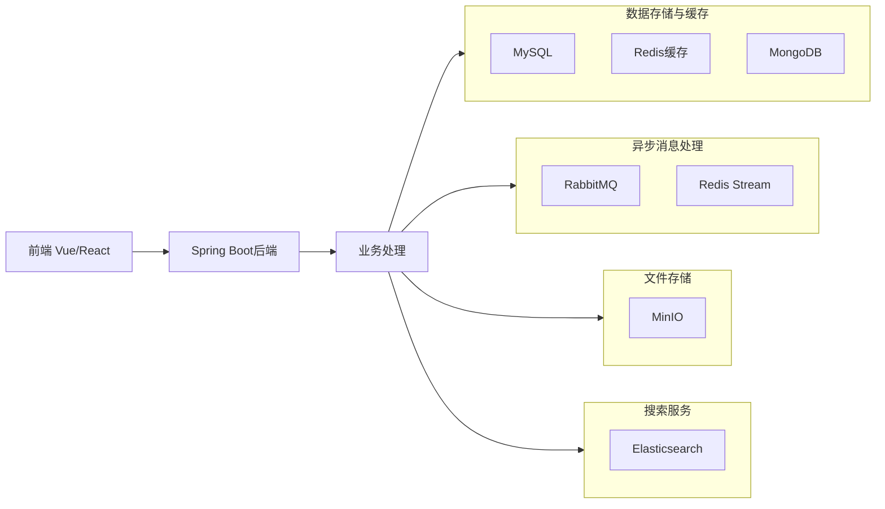

## 📚 Redis 重点学习内容

> [!TIP]
>
> 按优先级排序

### 1. 核心基础（必须掌握）
- **数据结构与应用场景**：String、Hash、List、Set、ZSet的适用场景
- **持久化机制**：RDB和AOF的优缺点及配置（文件中的97-104）
- **高可用方案**：主从复制、哨兵模式（105-107）
- **分布式方案**：分片集群（108-112）

### 2. 实战应用（重点掌握）
- **缓存设计**：缓存穿透、雪崩、击穿解决方案（40-45）
- **分布式锁**：实现原理和Redisson应用（56-68）
- **消息队列**：Stream结构实现异步处理（72-77）
- **位图统计**：签到功能实现（91-93）
- **地理位置**：GEO数据结构（88-90）

### 3. 原理深入（选择性深入）
- **网络模型**：单线程模型和IO多路复用（160-171）
- **内存管理**：过期策略和内存淘汰机制（174-175）
- **数据结构底层**：动态字符串、跳跃表、压缩列表等（146-159）

## 🗓️ 学习计划与时间安排

### 第一阶段：夯实基础（1-2个月）
| 时间    | 学习内容                | 目标                                 |
| ------- | ----------------------- | ------------------------------------ |
| 第1-2周 | Redis核心数据结构与命令 | 掌握5种数据结构的适用场景和常用命令  |
| 第3周   | Redis持久化与高可用     | 理解RDB/AOF机制，能搭建主从和哨兵    |
| 第4周   | Redis实战应用           | 掌握缓存策略、分布式锁、消息队列应用 |

### 第二阶段：项目整合（1个月）
| 时间  | 学习内容               | 目标                             |
| ----- | ---------------------- | -------------------------------- |
| 第5周 | Redis与Spring Boot整合 | 在现有RBAC系统中集成Redis        |
| 第6周 | 权限缓存优化           | 将权限数据缓存到Redis，提高性能  |
| 第7周 | 会话管理               | 使用Redis实现分布式会话          |
| 第8周 | 消息队列应用           | 使用Redis Stream实现异步任务处理 |

### 第三阶段：原理深入（长期）
| 时间     | 学习内容        | 目标                                   |
| -------- | --------------- | -------------------------------------- |
| 持续学习 | Redis源码与机制 | 每周抽出时间阅读一篇原理文章或源码解析 |

## 📖 官方文档学习建议

对于Redis官方文档，建议按以下方式学习：

1. **第一遍**：快速浏览，了解整体结构和功能模块
2. **第二遍**：重点阅读数据结构、持久化、复制部分
3. **第三遍**：结合实际项目需求，深入阅读相关模块
4. **持续参考**：遇到具体问题时作为权威参考

**文档重点章节**：
- Data types（数据结构）
- Persistence（持久化）
- Replication（复制）
- Clients（Java客户端重点看）
- Commands（常用命令要熟悉）

## 🔗 技术串联方案

将你学过的技术串联起来，构建完整的全栈知识体系：

### 在实际项目中的应用思路：

1. **权限系统优化**：用Redis缓存用户权限和会话信息
2. **日志处理**：用RabbitMQ异步处理日志，ES存储和检索日志
3. **文件管理**：用MinIO存储文件，数据库只存储元数据
4. **数据统计**：用Redis HyperLogLog进行UV统计
5. **任务调度**：用Quartz处理定时任务，Redis做分布式锁

## 💡 学习深度建议

对于每个技术，建议达到以下深度：

| 技术        | 掌握程度                                   |
| ----------- | ------------------------------------------ |
| Redis       | 能设计缓存策略、解决缓存问题、使用分布式锁 |
| RabbitMQ    | 能设计消息队列方案、处理消息可靠性         |
| MySQL       | 能设计索引、优化查询、理解事务隔离级别     |
| Spring Boot | 能熟练使用常用功能、理解自动配置原理       |
| Vue/React   | 能开发复杂组件、理解状态管理               |