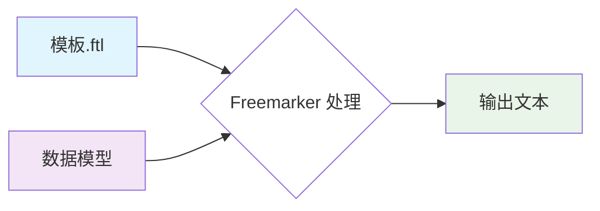

> [!TIP]
>
> 官网：https://freemarker.apache.org/
>
> 文档参考官网：http://freemarker.foofun.cn/dgui_quickstart_template.html#autoid_3

## 文本说明

> [!WARNING]
>
> 如果模板中引用的字段在数据模型中未设置，Freemarker 默认会抛出异常。

```ftl
<#-- 这是 Freemarker 注释，不会输出到最终内容 -->
```

### 插值

```ftl
${expression}    <#-- 输出表达式的值 -->
#{expression}    <#-- 常用于数字/日期格式化 -->
```

### 构建测试基类

```java
public class AbstractBaseFreemarkerTest {

    protected freemarker.template.Configuration configuration;

    @BeforeEach
    public void before() {
        freemarker.template.Configuration cfg = new freemarker.template.Configuration(freemarker.template.Configuration.VERSION_2_3_34);
        // cfg.setClassForTemplateLoading(FramerWorkTest.class, "/freemarker");
        cfg.setClassLoaderForTemplateLoading(getClass().getClassLoader(), "freemarker");
        cfg.setDefaultEncoding("UTF-8");
        cfg.setTimeZone(TimeZone.getTimeZone("Asia/Shanghai"));
        cfg.setTemplateExceptionHandler(TemplateExceptionHandler.RETHROW_HANDLER);
        cfg.setLogTemplateExceptions(true);
        cfg.setWrapUncheckedExceptions(true);
        // Do not fall back to higher scopes when reading a null loop variable:
        cfg.setFallbackOnNullLoopVariable(false);
        // To accomodate to how JDBC returns values; see Javadoc!
        cfg.setSQLDateAndTimeTimeZone(TimeZone.getDefault());

        configuration = cfg;
    }

}
```

## 简单示例



### 内容准备

#### 期望输出的 HTML

```html
<html lang="zh">
<head>
    <title>Welcome!</title>
</head>
<body>
<h1>Welcome 我就是用户!</h1>
<p>Our latest product:
    <a href="https://freemarker.apache.org/docs/pgui_quickstart.html">Freemarker</a>!
</body>
</html>
```

#### 对应的 Freemarker 模板

```ftl
<html>
<head>
  <title>Welcome!</title>
</head>
<body>
  <h1>Welcome ${user}!</h1>
  <p>Our latest product:
  <a href="${latestProduct.url}">${latestProduct.name}</a>!
</body>
</html>
```

### 示例代码

#### 基础配置

```java
/**
 * 初始化 Freemarker 配置
 */
private static Configuration initFreemarker() {
    Configuration cfg = new Configuration(Configuration.VERSION_2_3_34);

    // 设置模板加载路径（类路径下的 /freemarker 目录）
    cfg.setClassForTemplateLoading(FreemarkerSampleTest.class, "/freemarker");

    // 设置编码
    cfg.setDefaultEncoding("UTF-8");

    // 设置时区
    cfg.setTimeZone(TimeZone.getTimeZone("Asia/Shanghai"));

    // 异常处理策略：直接抛出
    cfg.setTemplateExceptionHandler(TemplateExceptionHandler.RETHROW_HANDLER);
    cfg.setLogTemplateExceptions(false);
    cfg.setWrapUncheckedExceptions(true);  // 建议改为 true 便于调试
    cfg.setFallbackOnNullLoopVariable(false);

    // 设置对象包装器
    cfg.setObjectWrapper(new DefaultObjectWrapper(Configuration.VERSION_2_3_34));

    return cfg;
}
```

#### 数据模型类

> **注意**：
> - 类属性或 Getter 方法必须是 `public`，否则 Freemarker 无法访问。
> - 使用 Lombok 时，默认生成的 Getter 是 `public`，无需额外配置。

```java
@Data
public static class HtmlAttributeDemo {
    private String user;
    private Map<String, String> latestProduct;
}
```

#### 生成内容的主程序

```java
public static void main(String[] args) {
    Configuration cfg = initFreemarker();

    // 准备数据模型
    HtmlAttributeDemo data = new HtmlAttributeDemo();
    data.setUser("我就是用户");
    data.setLatestProduct(Map.of(
        "url", "https://freemarker.apache.org/docs/pgui_quickstart.html",
        "name", "Freemarker"
    ));

    // 处理模板并输出
    try {
        Template template = cfg.getTemplate("test/freemarker-sample-demo.ftl");
        template.process(data, new OutputStreamWriter(System.out));
    } catch (Exception e) {
        throw new RuntimeException("Freemarker 模板处理失败", e);
    }
}
```

#### 整合内容

```java
public class FreemarkerSampleTest extends AbstractBaseFreemarkerTest {  
  
    @Test  
    void mainTest() {  
  
        HtmlAttributeDemo htmlAttributeDemo = new HtmlAttributeDemo();  
        htmlAttributeDemo.setUser("我就是用户");  
        htmlAttributeDemo.setLatestProduct(Map.of(  
                "url", "https://freemarker.apache.org/docs/pgui_quickstart.html",  
                "name", "Freemarker"  
        ));  
  
        try {  
            Template template = configuration.getTemplate("test/freemarker-sample-demo.ftl");  
            Writer out = new OutputStreamWriter(System.out);  
            template.process(htmlAttributeDemo, out);  
        } catch (Exception e) {  
            throw new RuntimeException(e);  
        }  
    }  
  
    @Data  
    public static class HtmlAttributeDemo {  
  
        @Schema(description = "用户名")  
        private String user;  
  
        @Schema(description = "最新产品")  
        private Map<String, String> latestProduct;  
  
    }  
}
```

## 基础指令

### 条件判断

#### 指令预览

```xml
<#if price == 0>
    Pythons are free today!
</#if>

<#if price != 0>
    Pythons are not free today!
</#if>

<#if price < otherPrice>
    Pythons are cheaper than elephants today.
</#if>

<#if price < otherPrice>
    Pythons are cheaper than elephants today.
<#else>
    Pythons are not cheaper than elephants today.
</#if>

<#if price < otherPrice>
    Pythons are cheaper than elephants today.
<#elseif otherPrice < price>
    Elephants are cheaper than pythons today.
<#else>
    Elephants and pythons cost the same today.
</#if>
```

如果当前是 Boolean 值，那么可以像下面这样表示：

```xml
<#if flag>
    Pythons are protected animals!
</#if>
```

#### 生成结果

```
Pythons are not free today!

Pythons are cheaper than elephants today.

Pythons are cheaper than elephants today.

Pythons are cheaper than elephants today.

Pythons are protected animals!
```

#### 代码示例

```java
public class ConditionalJudgmentTest extends AbstractBaseFreemarkerTest {

    @Test
    void test() {
        // 设置基础价格
        Product product = new Product();
        product.setPrice(BigDecimal.valueOf(10));
        product.setOtherPrice(BigDecimal.valueOf(20));
        product.setFlag(true);

        // 生成模板
        try {
            Template template = configuration.getTemplate("test/conditional-judgment-demo.ftl");
            Writer out = new OutputStreamWriter(System.out);
            template.process(product, out);
        } catch (Exception e) {
            throw new RuntimeException(e);
        }
    }


    @Data
    public static class Product {

        @Schema(description = "价格")
        private BigDecimal price;

        @Schema(description = "其他价格")
        private BigDecimal otherPrice;

        @Schema(description = "标志")
        private Boolean flag;

    }

}
```

### 列表指令

#### 指令预览

```xml
<p>We have these animals:
<table border=1>
  <#list animals as animal>
    <tr><td>${animal.name}<td>${animal.price} Euros
  </#list>
</table>
```

#### 生成结果

```xml
<p>We have these animals:
<table border=1>
    <#list animals as animal>
        <tr>
            <td>${animal.name}</td>
            <td>${animal.price} Euros</td>
        </tr>
    </#list>
</table>
```

#### 示例代码

```java
public class ListSampleTest extends AbstractBaseFreemarkerTest {

    @Test
    void mainTest() {
        List<Animal> animals = List.of(
                new Animal("DOG", BigDecimal.valueOf(10)),
                new Animal("CAT", BigDecimal.valueOf(20)),
                new Animal("BIRD-A", BigDecimal.valueOf(30)),
                new Animal("BIRD-B", BigDecimal.valueOf(40)),
                new Animal("BIRD", BigDecimal.valueOf(50))
        );

        // 使用 Map 包装数据
        Map<String, Object> data = new HashMap<>();
        data.put("animals", animals);

        // 生成模板
        try {
            Template template = configuration.getTemplate("test/list-sample-demo.ftl");
            Writer out = new OutputStreamWriter(System.out);
            template.process(data, out);
        } catch (Exception e) {
            throw new RuntimeException(e);
        }
    }

    @Data
    @AllArgsConstructor
    public static class Animal {

        @Schema(description = "名称")
        private String name;

        @Schema(description = "价格")
        private BigDecimal price;

    }

}

```

### 包含指令

#### 指令预览

创建 `include` 模板内容

```html
<hr>
<i>
Copyright (c) 2000 <a href="http://www.acmee.com">Acmee Inc</a>,
<br>
All Rights Reserved.
</i>
```

使用指令

```html
<html>
<head>
  <title>Test page</title>
</head>
<body>
  <h1>Test page</h1>
  <p>Blah blah...
  <#include "/copyright_footer.html">
</body>
</html>
```

#### 生成结果

```html
<html>
<head>
    <title>Test page</title>
</head>
<body>
<h1>Test page</h1>
<p>Blah blah...
<hr>
<i>
    Copyright (c) 2000 <a href="http://www.acmee.com">Acmee Inc</a>,
    <br>
    All Rights Reserved.
</i>
</body>
</html>
```

#### 示例代码

```java
public class IncludeTest extends AbstractBaseFreemarkerTest {

    @Test
    void mainTest() {
        try {
            Template template = configuration.getTemplate("test/include-demo.ftl");
            OutputStreamWriter out = new OutputStreamWriter(System.out);
            template.process(null, out);
        } catch (Exception e) {
            throw new RuntimeException(e);
        }
    }

}

```

## 内置函数参考

- `user?html` 给出 `user` 的 HTML 转义版本，比如 `&` 会由 `&amp;` 来代替。
- `user?upper_case` 给出 `user` 值的大写版本（比如 "JOHN DOE" 来替代 "John Doe"）
- `animal.name?cap_first` 给出 `animal.name` 的首字母大写版本（比如 "Mouse" 来替代 "mouse"）
- `user?length` 给出 `user` 值中 *字符* 的数量（对于 "John Doe" 来说就是 8）
- `animals?size` 给出 `animals` 序列中 *项目* 的个数（我们示例数据模型中是 3 个）
- 如果在 `<#list animals as animal>` 和对应的 `</#list>` 标签中：
  - `animal?index` 给出了在 `animals` 中基于 0 开始的 `animal` 的索引值
  - `animal?counter` 也像 `index`，但是给出的是基于 1 的索引值
  - `animal?item_parity` 基于当前计数的奇偶性，给出字符串 "odd" 或 "even"。在给不同行着色时非常有用，比如在 `<td class="${animal?item_parity}Row">` 中。

一些内建函数需要参数来指定行为，比如：

- `animal.protected?string("Y", "N")` 基于 `animal.protected` 的布尔值来返回字符串 "Y" 或 "N"。
- `animal?item_cycle('lightRow','darkRow')` 是之前介绍的 `item_parity` 更为常用的变体形式。
- `fruits?join(", ")` 通过连接所有项，将列表转换为字符串，在每个项之间插入参数分隔符（比如 "orange,banana"）
- `user?starts_with("J")` 根据 `user` 的首字母是否是 "J" 返回布尔值 true 或 false。

## 处理不存在的变量

如果 `user` 不存在，会返回 `"visitor"`

```xml
<h1>Welcome ${user!"visitor"}!</h1>
```

如果 `user` 不存在会忽略整个表达式内容

```xml
<#if user??><h1>Welcome ${user}!</h1></#if>
```

## 字符串操作

### 插值（或连接）

#### 指令预览

```xml
<#assign s = "Hello ${user}!">
${s}

<#-- 也可以使用 + 号来达到类似的效果 -->
<#assign s = "Hello " + user + "!">
${s}
```

#### 生成结果

```
Hello 字符串!

Hello 字符串!
```

### 获取字符

#### 指令预览

```xml
<#-- 获取字符 -->
${user[0]}
${user[2]}
```

#### 生成结果

```
字
串
```

### 字符串切分（子串）

#### 指令预览

```xml
<#assign s = "ABCDEF">
${s[2..3]}
${s[2..<4]}
${s[2..*3]}
${s[2..*100]}
${s[2..]}
```

#### 生成结果

```
CD
CD
CDE
CDEF
CDEF
```

### 代码示例

```java
public class StringOperationTest extends AbstractBaseFreemarkerTest {

    @Test
    void mainTest() {
        Map<String, String> map = Map.of("user", "字符串");
        try {
            Template template = configuration.getTemplate("test/string-operation-demo.ftl");
            Writer out = new OutputStreamWriter(System.out);
            template.process(map, out);
        } catch (Exception e) {
            throw new RuntimeException(e);
        }
    }
}

```

## 序列操作

### 连接

#### 指令预览

```xml
<#list ["Joe", "Fred"] + ["Julia", "Kate"] as user>
- ${user}
</#list>
```

#### 生成结果

```
- Joe
- Fred
- Julia
- Kate
```

### 序列切分

#### 指令预览

```xml
<#assign seq = ["A", "B", "C", "D", "E"]>
<#list seq[1..3] as i>${i}</#list>
    
Slicing with length limited ranges:
- <#list seq[0..*2] as i>${i}</#list>
- <#list seq[1..*2] as i>${i}</#list>
- <#list seq[2..*2] as i>${i}</#list> <#-- Not an error -->
- <#list seq[3..*2] as i>${i}</#list> <#-- Not an error -->

Slicing with right-unlimited ranges:
- <#list seq[0..] as i>${i}</#list>
- <#list seq[1..] as i>${i}</#list>
- <#list seq[2..] as i>${i}</#list>
- <#list seq[3..] as i>${i}</#list>
```

#### 生成结果

```
BCD

Slicing with length limited ranges:
- AB
- BC
- CD
- DE

Slicing with right-unlimited ranges:
- ABCDE
- BCDE
- CDE
- DE
```

### 代码示例

```java
public class ListOperationTest extends AbstractBaseFreemarkerTest {

    @Test
    void mainTest() {
        try {
            Template template = configuration.getTemplate("test/list-operation-demo.ftl");
            Writer out = new OutputStreamWriter(System.out);
            template.process(null, out);
        } catch (Exception e) {
            throw new RuntimeException(e);
        }
    }
}

```

## 哈希表操作

### 连接

#### 指令预览

```xml
<#assign ages = {"Joe":23, "Fred":25} + {"Joe":30, "Julia":18}>
- Joe is ${ages.Joe}
- Fred is ${ages.Fred}
- Julia is ${ages.Julia}
```

#### 生成结果

```
- Joe is 30
- Fred is 25
- Julia is 18
```

#### 代码示例

```java
public class HashTableTest extends AbstractBaseFreemarkerTest {

    @Test
    void mainTest() {
        try {
            Template template = configuration.getTemplate("test/hash-table-demo.ftl");
            Writer out = new OutputStreamWriter(System.out);
            template.process(null, out);
        } catch (Exception e) {
            throw new RuntimeException(e);
        }
    }

}

```

## 算术运算

> [!CAUTION]
>
> 算术不能用于字符串运算
>
> ```java
> ${3 * "5"}  <#-- 错误！ -->
> ```
>
> 但是可以这样，输出后是这样的：`35`
>
> ```java
> ${3 + "5"}  <#-- 注意：这里会进行字符串拼接 -->
> ```

### 指令预览

```xml
${100 - x * x}
${x / 2}
${12 % 10}
```

### 生成结果

```
-443456
333
2
```

### 代码示例

```java
public class MathOperationTest extends AbstractBaseFreemarkerTest {

    @Test
    void mainTest() {
        Map<String, BigDecimal> map = Map.of("x", BigDecimal.valueOf(666));

        try {
            Template template = configuration.getTemplate("test/math-operation-demo.ftl");
            Writer out = new OutputStreamWriter(System.out);
            template.process(map, out);
        } catch (Exception e) {
            throw new RuntimeException(e);
        }
    }
}

```

## 内建函数

### 指令预览

```xml
${testString?upper_case}
${testString?html}
${testString?upper_case?html}

${testSequence?size}
${testSequence?join(", ")}
```

### 生成结果

```
THIS_IS &
THIS_IS &amp;
THIS_IS &amp;

3
1, 2, 4
```

### 代码示例

```java
public class BuiltInFunctionTest extends AbstractBaseFreemarkerTest {

    @Test
    void mainTest() {
        List<Integer> integers = List.of(1, 2, 4);
        Map<String, Object> map = Map.of(
                "testString", "this_is &",
                "testSequence", integers
        );

        try {
            Template template = configuration.getTemplate("test/built-in-function.ftl");
            Writer out = new OutputStreamWriter(System.out);
            template.process(map, out);
        } catch (Exception e) {
            throw new RuntimeException(e);
        }
    }
}

```

## 方法调用

### 指令预览

```ftl
${repeat("Foo", 3)}
```

### 生成结果

```
Foo---3
```

### 代码示例

方法调用的几种方式：

1. 类+方法
2. 指令方式调用
3. Lambda 方式

```java
public class MethodInvocationTest extends AbstractBaseFreemarkerTest {

    @Test
    void mainTest() {
        Map<String, Object> dataModel = Map.of(
                "repeat", new MyRepeatMethod(),
                "repeatDirective", new RepeatDirective(),
                "repeat2", (freemarker.template.TemplateMethodModelEx) arguments -> {
                    if (arguments.size() != 2) {
                        throw new IllegalArgumentException("Expected 2 arguments");
                    }

                    String str = arguments.get(0).toString();

                    // 使用 DeepUnwrap 来解包 FreeMarker 包装的类型
                    Object countObj;
                    try {
                        countObj = DeepUnwrap.unwrap((TemplateModel) arguments.get(1));
                    } catch (TemplateModelException e) {
                        throw new IllegalArgumentException("Failed to unwrap number argument", e);
                    }

                    if (!(countObj instanceof Number)) {
                        throw new IllegalArgumentException("Second argument must be a number");
                    }

                    int count = ((Number) countObj).intValue();
                    return repeat(str, count);
                }
        );

        try {
            Template template = configuration.getTemplate("test/method-invocation-demo.ftl");
            OutputStreamWriter writer = new OutputStreamWriter(System.out);
            template.process(dataModel, writer);
        } catch (Exception e) {
            throw new RuntimeException(e);
        }
    }

    public String repeat(String string, int count) {
        return string + "---" + count;
    }

    /**
     * 使用类方式调用
     */
    public static class MyRepeatMethod {
        public String execute(String str, int count) {
            return str + "---" + count;
        }
    }

    /**
     * 指令方式调用
     */
    public static class RepeatDirective implements TemplateDirectiveModel {
        @Override
        public void execute(Environment env, Map params, TemplateModel[] loopVars, TemplateDirectiveBody body) throws IOException {

            String str = params.get("str").toString();
            int count = Integer.parseInt(params.get("count").toString());

            String result = str + "---" + count;
            env.getOut().write(result);
        }
    }

}
```

## 处理不存在的值

```ftl
${mouse!"No mouse."}
<#assign mouse="Jerry">
${mouse!"No mouse."}
```

## 操作符的优先级

| 运算符组           | 运算符                                                       |
| :----------------- | :----------------------------------------------------------- |
| 最高优先级运算符   | `[subvarName] [subStringRange] . ? (methodParams) expr! expr??` |
| 一元前缀运算符     | `+expr -expr !expr`                                          |
| 乘除法，求模运算符 | `* / %`                                                      |
| 加减法运算符       | `+ -`                                                        |
| 数字值域           | `..` `..<` `..!` `..*`                                       |
| 关系运算符         | `< > <= >=`（和等价形式：`gt`, `lt` 等）                     |
| 相等，不等运算符   | `== !=`（和等价形式：`=`）                                   |
| 逻辑"与"运算符     | `&&`                                                         |
| 逻辑"或"运算符     | `\|\|`                                                       |
