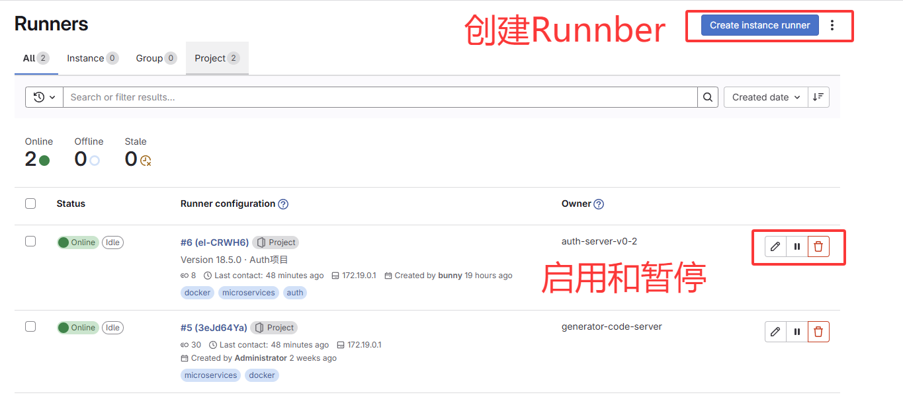
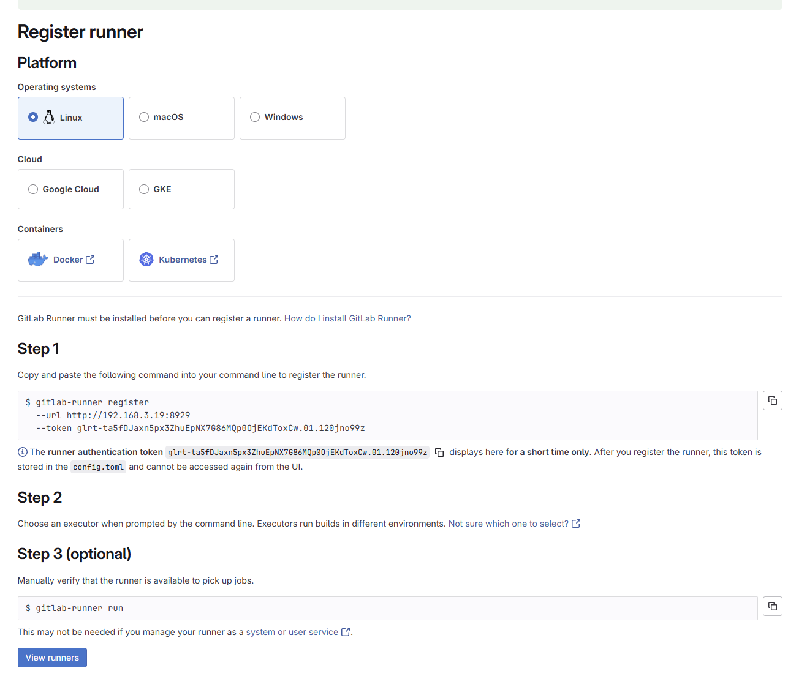
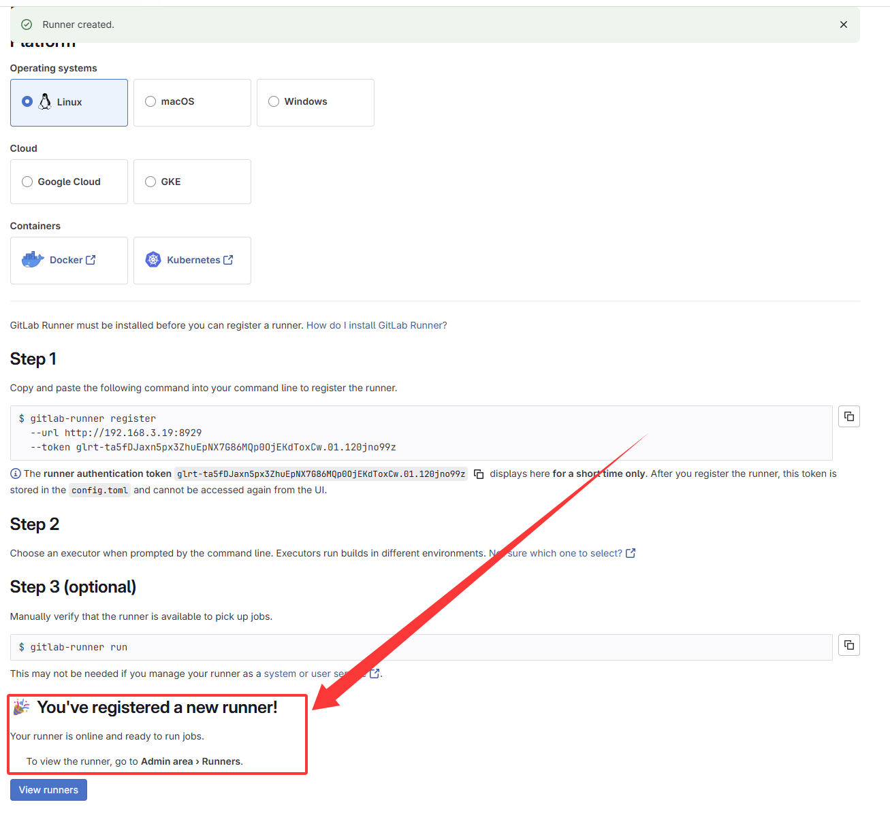

## GitLab Runner 注册

### 页面说明

访问地址：http://192.168.3.19:8929/admin/runners

创建Runner后如果删除其中的id`#5`、`#6`不会自动排序，而是会往后面累加。



## 页面创建Runner


### 配置说明

#### Tags

这里填写的是匹配标签，用于`.gitlab-ci.yml`中`tags`内容，如果在部署、推送时会用到这些内容。下面的复选框记得勾选

#### Configuration (optional)

这里没有用到，如果有需要超时时间可以在`Maximum job timeout`配置下

### 运行Runner

按照下面提示进行操作



#### Docker中运行

将下面命令粘贴到命令行中

```
docker exec -it gitlab-runner gitlab-runner register  --url http://192.168.3.19:8929  --token glrt-ta5fDJaxn5px3ZhuEpNX7G86MQp0OjEKdToxCw.01.120jno99z
```

在命令行中输入下面内容后页面大致是这样的：

1. 第一步输入你Gitlab地址
2. 如果是docker输入`docker`
3. 默认镜像，我用Java部署所以用的是maven，镜像是`maven:3.9.9-eclipse-temurin-21`


以上步骤完成后，页面会有下面的显示



## 手动创建Runner

在 gitlab-runner 容器中执行：

```bash
docker exec -it gitlab-runner gitlab-runner register
  --url "http://gitlab:8929" \
  --registration-token "GR1348941" \
  --executor "docker" \
  --docker-image "maven:3.9.9-eclipse-temurin-21" \
  --description "Docker Runner" \
  --tag-list "docker,java" \
  --run-untagged="true"
```
