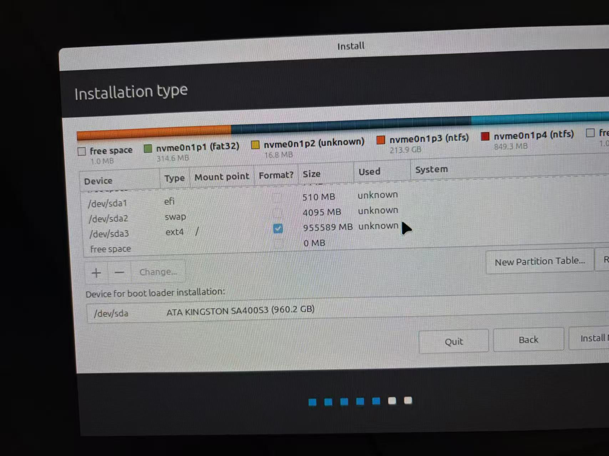

系统装进系统后，需要配置基础分区

| 分区名称     | 大小  | 说明                                 |
| ------------ | ----- | ------------------------------------ |
| EFI分区      | 512MB | 推荐最低是512                        |
| Ext4         | 全部  | 这个是主要的                         |
| BIOS(传统的) | 1MB   | 如果系统是**UEFI+GPT**，没有任何作用 |

> [!NOTE]
>
> BIOS分区说明：
>
>   这是为**传统BIOS+MBR**准备的引导分区 ，不需要这个分区 这1MB纯粹浪费，

