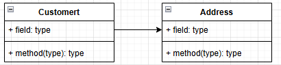
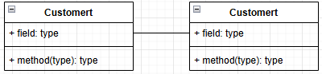
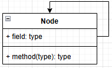
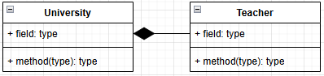
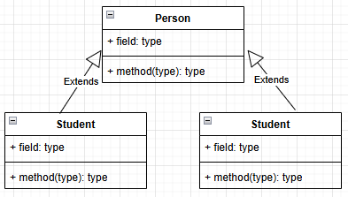

## 类图表示方法

### 可见性符号

加号公开，减号私有，井号保护

- `+` → `public`
- `-` → `private`
- `#` → `protected`

### 属性与方法表示

```
属性格式：可见性 属性名: 数据类型 [= 默认值]
方法格式：可见性 方法名(参数名: 参数类型): 返回值类型
```

**示例**：

```
- name: String = "Unknown"
+ getName(): String
+ setName(name: String): void
```

### 类之间的关系

| 关系类型  | 表示方法                        | 说明                 | 示例                                                         |
| --------- | ------------------------------- | -------------------- | ------------------------------------------------------------ |
| 单向关联  | 实线 + 黑色箭头                 | 一个类知道另一个类   |  |
| 双向关联  | 实线                            | 两个类互相知道       |  |
| 自关联    | 箭头指向自身                    | 类与自身关联         |  |
| 聚合      | 空心菱形 + 实线（菱形指向整体） | 整体与部分可独立存在 |  |
| 组合      | 实心菱形 + 实线（菱形指向整体） | 整体与部分同生共死   |  |
| 依赖      | 虚线 + 箭头                     | 临时使用关系         |  |
| 继承/泛化 | 空心三角形 + 实线（指向父类）   | 泛化关系             |  |

#### 关联关系

**关联关系**
关联关系是对象之间的一种引用关系，用于表示一类对象与另一类对象之间的联系。

- 明确类之间的单向依赖
- 表示"知道"或"使用"的关系
- 降低耦合，只有一方依赖另一方

**双向关联**

- 表示类之间的双向协作
- 适合需要相互访问的场景

**自关联**

- 表示类的递归关系
- 常用于树形结构、链表结构

#### 聚合与组合关系

整体-部分关系

**聚合关系**

聚合关系是关联关系的一种，是强关联关系，是整体和部分之间的关系。聚合关系也是通过成员对象来实现的，其中成员对象是整体对象的一部分，但是成员对象可以脱离整体对象而独立存在。

- 表示松散的整体-部分关系
- 部分可以被多个整体共享
- 整体删除时，部分仍然存在

**组合关系**

组合表示类之间的整体与部分的关系，但它是一种更强烈的聚合关系。在组合关系中，整体对象可以控制部分对象的生命周期，一旦整体对象不存在，部分对象也将不存在，部分对象不能脱离整体对象而存在。

- 表示紧密的整体-部分关系
- 强调所有权的归属
- 表示更强的内聚性

**依赖关系**

依赖关系是一种使用关系，它是对象之间耦合度最弱的一种关联方式，是临时性的关联。在代码中，某个类的方法通过局部变量、方法的参数或者对静态方法的调用来访问另一个类（被依赖类）中的某些方法来完成一些职责。

在UML类图中，依赖关系使用带箭头的虚线来表示，箭头从使用类指向被依赖的类。

- 表示类之间的临时使用关系
- 降低耦合度
- 常用于：
  - 方法参数
  - 局部变量
  - 静态方法调用
  - 返回类型

**继承关系**

继承关系是对象之间耦合度最大的一种关系，表示一般与特殊的关系，是父类与子类之间的关系，是一种继承关系。

在UML类图中，泛化关系用带空心三角箭头的实线来表示，箭头从子类指向父类。在代码实现时，使用面向对象的继承机制来实现泛化关系。例如，Student类和Teacher类都是Person类的子类。

- 实现代码复用
- 实现多态
- 建立类层次结构
- 体现抽象与具体的关系

### 如何选择关系类型？

1. 第一步：问生命周期

   ```
   整体没了，部分必须也没了吗？
       ├── 是 → **组合关系**（强关联，同生命周期）
       └── 否 → 继续提问
   ```

   ```
   整体没了，部分还能存在吗？
       ├── 是 → **聚合关系**（弱关联，可独立存在）
       └── 否 → 只是临时使用？ → **依赖关系**
   ```

   #### 第二步：问方向性

   ```
   A类需要知道B类，但B类不需要知道A类吗？
       ├── 是 → **单向关联**
       └── 否 → 互相需要知道吗？ → **双向关联**
   ```

   #### 第三步：问性质

   ```
   是"一种"（is-a）关系吗？
       ├── 是 → **继承关系**
       └── 否 → 是"有一个"（has-a）关系吗？ → **关联/聚合/组合**
   ```

   ### 关系强度排序（从强到弱）

   ```
   组合 > 聚合 > 关联 > 依赖
   继承（特殊关系，用于类层次结构）
   ```

   **实用技巧**：

   - 如果犹豫不决，先画**依赖**（最弱），需要时再加强
   - **组合**和**聚合**都使用成员变量实现，区别在于**生命周期控制**
   - 超过80%的情况下，**依赖**和**关联**可以满足需求


## 开闭原则

对**扩展开放，对修改关闭**。在程序需要进行拓展的时候，不能去修改原有的代码，实现一个热插拔的效果。简言之，是为了使程序的扩展性好，易于维护和升级。

想要达到这样的效果，我们需要使用接口和抽象类。

因为抽象灵活性好，适应性广，只要抽象的合理，可以基本保持软件架构的稳定。而软件中易变的细节可以从抽象派生来的实现类来进行扩展，当软件需要发生变化时，只需要根据需求重新派生一个实现类来扩展就可以了。

## 里氏代换原则

里氏代换原则是面向对象设计的基本原则之一。

里氏代换原则：任何基类可以出现的地方，子类一定可以出现。通俗理解：子类可以扩展父类的功能，但不能改变父类原有的功能工换句话说，子类继承父类时，除添加新的方法完成新增功能外，尽量不要重写父类的方法。

如果通过重写父类的方法来完成新的功能，这样写起来虽然简单，但是整个继承体系的可复用性会比较差，特别是运用多态比较频繁时，程序运行出错的概率会非常大。