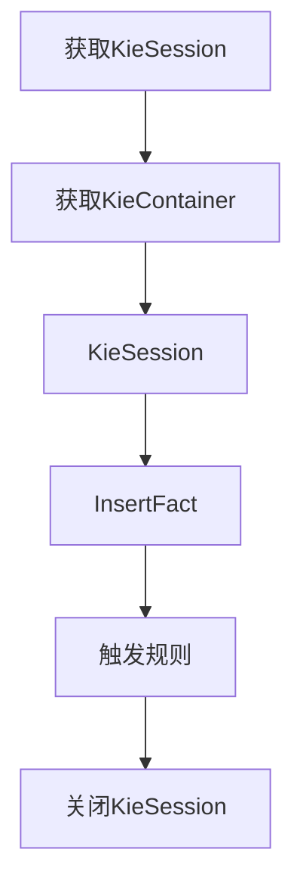
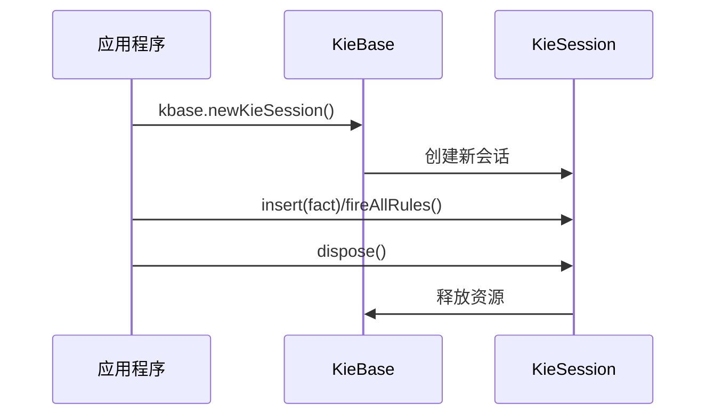

# Drools

## 快速入门

### 注释

```JAVA
// XXXXX

/*
XXXXX
*/
```

### 入门示例

```java
// 大于100元 5折优惠
rule "Give 5% discount for orders over 100"
    when
        $order: Order(amount > 100)
    then
        $order.applyDiscount(0.05);
        System.out.println("当订单金额超过100元时，给予5%折扣");
end

// VIP客户额外获得2%折扣
rule "Give additional 2% discount for VIP customers"
    when
        $order: Order(amount > 100,vip == true)
    then
       $order.applyDiscount(0.02);
       System.out.println("是个Vip");
end

// 没有优惠
rule "No discount for small orders"
    when
        $order: Order(amount <= 100)
    then
       System.out.println("没有优惠");
end
```

# 搭建Drools 

## 基础环境

KIE 使用默认设置来尽量减少配置量。 最简单的配置就是一个空的 kmodule.xml 文件。 必须始终存在一个 kmodule.xml 文件，即使为空，因为它用于发现 JAR 及其内容。

**官网的文件**


### 环境依赖

```xml
<dependency>
    <groupId>org.drools</groupId>
    <artifactId>drools-compiler</artifactId>
    <version>7.6.0.Final</version>
</dependency>
```

### 开发步骤



安装Idea插件（可选）


## 构成

drools规则引擎由以下三部分构成：

- Working Memory（工作内存）
- **Rule Base**（规则库）
- **Inference Engine**（推理引擎）

其中Inference Engine（推理引擎）又包括：

- Pattern Matcher（匹配器）     具体匹配哪一个规则，由这个完成
- **Execution Engine**（执行引擎）

- **Rules:** Business rules or DMN decisions that you define. All rules must contain at a minimum the conditions that trigger the rule and the actions that the rule dictates.规则：您定义的业务规则或 DMN 决策。所有规则至少必须包含触发规则的条件以及规则所规定的操作。
- **Facts:** Data that enters or changes in the Drools rule engine that the Drools rule engine matches to rule conditions to execute applicable rules.事实：进入或在 Drools 规则引擎中更改的数据，Drools 规则引擎将其与规则条件进行匹配，以执行适用的规则。
- **Production memory:** Location where rules are stored in the Drools rule engine.生产内存：在 Drools 规则引擎中存储规则的位置。
- **Working memory:** Location where facts are stored in the Drools rule engine.工作内存：在 Drools 规则引擎中存储事实的位置。
- **Agenda:** Location where activated rules are registered and sorted (if applicable) in preparation for execution.议程：已激活规则的注册位置，并在适用情况下对其进行排序，以准备执行。

### kmodule.xml

> [!NOTE]
>
> 项目中使用 `kmodule.xml` 时，如果使用 `drools-engine` ，则必须显式添加 `drools-xml-support` 依赖项。
>
> ```xml
> <dependency>
>  <groupId>org.drools</groupId>
>  <artifactId>drools-engine</artifactId>
> </dependency>
> <!-- when not using Rule Unit and using `kmodule.xml` for defining a rule base -->
> <dependency> 
>  <groupId>org.drools</groupId>
>  <artifactId>drools-xml-support</artifactId>
> </dependency>
> ```

创建空的`kmodule.xml` 文件；kmodule.xml 文件是声明式配置可从 KIE 项目创建的 `KieBase` （模块）和 `KieSession` （会话）的位置。

```xml
<?xml version="1.0" encoding="UTF-8"?>
<kmodule xmlns="http://www.drools.org/xsd/kmodule"/>
```

> 特别是，知识库是应用程序所有知识定义的存储库。 它将包含规则、流程、函数和类型模型。 知识库本身不包含数据；相反，会从知识库创建会话，在其中可以插入数据，并从中启动流程实例。
>
>  *创建知识库可能比较耗时，而会话创建则非常轻便*，因此建议在可能的情况下缓存知识库，以便重复创建会话。 不过，最终用户通常无需担心，因为这种缓存机制已经由系统自动提供。

> [!IMPORTANT]
>
> XML文件需要放在`resources/META-INF/kmodule.xml`中！！！
>
> XML是为了方便管理规则文件和一些配置。

```xml
<?xml version="1.0" encoding="UTF-8" ?>
<kmodule xmlns="http://www.drools.org/xsd/kmodule">
    <!--
        name:指定kbase的名称，可以任意，但是需要唯一
        packages:指定规则文件的目录，需要根据实际情况填写，否则无法加载到规则文件
        default:指定当前kbase是否为默认
    -->
    <kbase name="myKbase1" packages="rules" default="true">
        <!--
            name:指定ksession名称，可以任意，但是需要唯一
            default:指定当前session是否为默认
        -->
        <ksession name="ksession-rule" default="true"/>
    </kbase>
</kmodule>
```

#### 官网XML示例

> [!IMPORTANT]
>
> 必须注意的是，由于 KSession2_1 和 KSession2_2 属于两种不同的类型（前者是有状态的，而后者是无状态的），因此需要根据它们声明的类型在 `KieContainer` 上调用两种不同的方法。 如果向 `KieContainer` 请求的 `KieSession` 的类型与 kmodule.xml 文件中声明的类型不一致， `KieContainer` 将抛出 `RuntimeException` 异常。 另外，由于 `KieBase` 和 `KieSession` 已被标记为默认，因此可以从 `KieContainer` 获取它们而无需传递任何名称。

```xml
<kmodule xmlns:xsi="http://www.w3.org/2001/XMLSchema-instance"
        xmlns="http://www.drools.org/xsd/kmodule">
  <configuration>
    <property key="drools.evaluator.supersetOf" value="org.mycompany.SupersetOfEvaluatorDefinition"/>
  </configuration>
  <kbase name="KBase1" default="true" eventProcessingMode="cloud" equalsBehavior="equality" declarativeAgenda="enabled" packages="org.domain.pkg1">
    <ksession name="KSession2_1" type="stateful" default="true"/>
    <ksession name="KSession2_2" type="stateless" default="false" beliefSystem="jtms"/>
  </kbase>
    
  <kbase name="KBase2" default="false" eventProcessingMode="stream" equalsBehavior="equality" declarativeAgenda="enabled" packages="org.domain.pkg2, org.domain.pkg3" includes="KBase1">
    <ksession name="KSession3_1" type="stateful" default="false" clockType="realtime">
      <fileLogger file="drools.log" threaded="true" interval="10"/>
      <workItemHandlers>
        <workItemHandler name="name" type="org.domain.WorkItemHandler"/>
      </workItemHandlers>
      <calendars>
        <calendar name="monday" type="org.domain.Monday"/>
      </calendars>
      <listeners>
        <ruleRuntimeEventListener type="org.domain.RuleRuntimeListener"/>
        <agendaEventListener type="org.domain.FirstAgendaListener"/>
        <agendaEventListener type="org.domain.SecondAgendaListener"/>
        <processEventListener type="org.domain.ProcessListener"/>
      </listeners>
    </ksession>
  </kbase>
</kmodule>
```

#### 通过编程定义 KieModule

目的是减少了对xml的编写，如果想修改xml必须要修改之后运行，编程方式可以动态的修改

也可以通过编程方式定义属于 KieModule 的 `KieBase` 和 `KieSession` ，而不是在 kmodule.xml 文件中进行声明式定义。 同样的编程 API 还允许您明确添加包含 Kie 资源的文件，而不是自动从项目的资源文件夹中读取它们。 要做到这一点，必须创建一个 `KieFileSystem` ，一种虚拟文件系统，并将项目中包含的所有资源添加到其中。


与所有其他 Kie 核心组件一样，您可以从 `KieServices` 中获取 `KieFileSystem` 的实例。 必须将 kmodule.xml 配置文件添加到文件系统中。 这是强制性的步骤。 Kie 还提供了一个由 `KieModuleModel` 实现的方便的流畅 API，用于以编程方式创建此文件。


通过编程的方式可以动态的添加

```java
KieServices kieServices = KieServices.Factory.get();
KieModuleModel kieModuleModel = kieServices.newKieModuleModel();

KieBaseModel kBase1 = kieModuleModel.newKieBaseModel("kBase1")
        .setDefault(true)
        .setEqualsBehavior(EqualityBehaviorOption.EQUALITY)
        .setEventProcessingMode(EventProcessingOption.STREAM);

kBase1.newKieSessionModel("KSession1")
        .setDefault(true)
        .setType(KieSessionModel.KieSessionType.STATEFUL)
        .setClockType(ClockTypeOption.get("realtime"));

KieFileSystem kfs = kieServices.newKieFileSystem();
kfs.writeKModuleXML(kieModuleModel.toXML());

System.out.println(kieModuleModel.toXML());
```

> 转换之后的xml输出到控制台。
>
> ```xml
> <kmodule xmlns:xsi="http://www.w3.org/2001/XMLSchema-instance" 
>       xmlns="http://www.drools.org/xsd/kmodule">
> <kbase name="kBase1" default="true" eventProcessingMode="stream" prototypes="disabled" equalsBehavior="equality" mutability="allowed" declarativeAgenda="disabled" sequential="false" sessionsPool="-1" betaRangeIndex="disabled" scope="jakarta.enterprise.context.ApplicationScoped">
>  <ksession name="KSession1" type="stateful" default="true" directFiring="false" threadSafe="true" accumulateNullPropagation="false" clockType="realtime" beliefSystem="simple"/>
> </kbase>
> </kmodule>
> ```

可以将 Kie 资源既作为普通字符串添加，也可以作为 `Resource` 添加。 在后一种情况下， `Resource` 可以通过 `KieResources` 工厂创建，该工厂也由 `KieServices` 提供。 `KieResources` 提供了许多方便的工厂方法，用于将表示文件系统路径的 `InputStream` 、 `File` 或 `String` 转换为 `Resource` ，以便由 `KieFileSystem` 进行管理。

> [!IMPORTANT]
>
> Drools 8 系列不再支持 `URLResource` ，这是为了确保知识库构建更具可重复性（避免使用远程 URL）以及提高安全性。如果您过去使用过 `URLResource` ，可以在 Drools 应用程序外部管理远程资源的本地获取，从而将 Drools 构建的关注点限制在包含知识资产的本地资源上。


将 Kie 构件添加到 KieFileSystem 中

> [!NOTE]
>
> **Artifact** 在软件开发中特指 **"构建产物/构件"**（如JAR、DRL规则文件等）
>
> | 英文术语            | 正确翻译 | 实例                             |
> | :------------------ | :------- | :------------------------------- |
> | Rule artifacts      | 规则构件 | .drl 文件                        |
> | Decision tables     | 决策表   | .xls/.csv 文件                   |
> | Process definitions | 流程定义 | .bpmn 文件                       |
> | Resource            | 资源     | 任何通过`KieResources`加载的文件 |

```java
kfs.write("src/main/resources/KBase1/ruleSet1.drl", stringContainingAValidDRL)
        .write("src/main/resources/dtable.xls",
                kieServices.getResources().newInputStreamResource(dtableFileStream));
```

> 可以将 Kie 资源既作为普通字符串添加，也可以作为 `Resource` 添加。 在后一种情况下， `Resource` 可以通过 `KieResources` 工厂创建，该工厂也由 `KieServices` 提供。 `KieResources` 提供了许多方便的工厂方法，用于将表示文件系统路径的 `InputStream` 、 `File` 或 `String` 转换为 `Resource` ，以便由 `KieFileSystem` 进行管理。

### Drl

在规则文件中基本结构如下

> [!NOTE]
>
> 其中`$`是可选的是一个变量。
>
> package 并不是随便写的，如果在同一个包下可以共享
>
> import导入，和Java一样

```java
package rules;
import xxx.xxx

// 大于100元 5折优惠
rule "Give 5% discount for orders over 100"
    when
        $order: Order(amount > 100)
    then
        $order.applyDiscount(0.05);
        System.out.println("当订单金额超过100元时，给予5%折扣");
end
```

#### 关键字

| 关键字   | 描述                                                         |
| :------- | :----------------------------------------------------------- |
| package  | 包名，只限于逻辑上的管理，同一个包名下的查询或者函数可以直接调用 |
| import   | 用于导入类或者静态方法                                       |
| global   | 全局变量                                                     |
| function | 自定义函数                                                   |
| query    | 查询                                                         |
| rule end | 规则体                                                       |

##### global全局变量

global关键字用于在规则文件中**定义全局变量**，它可以让应用程序的对象在规则文件中能够被访问。可以用来为规则文件提供数据或服务。

语法结构为：**global 对象类型 对象名称**

在使用global定义的全局变量时有两点需要注意：

1、如果对象类型为**包装类型**时，在一个规则中改变了global的值，那么**只针对当前规则有效**，对其他规则中的global不会有影响。可以理解为它是当前规则代码中的global副本，规则内部修改不会影响全局的使用。

2、如果对象类型为**集合类型或JavaBean**时，在一个规则中改变了global的值，对java代码和所有规则都有效。

##### query查询

query查询提供了一种**查询working memory中符合约束条件的Fact对象**的简单方法。它仅包含规则文件中的LHS部分，不用指定“when”和“then”部分并且以end结束。

##### function函数

function关键字用于在规则文件中定义函数，就相当于java类中的方法一样。可以在规则体中调用定义的函数。使用函数的好处是可以将业务逻辑集中放置在一个地方，根据需要可以对函数进行修改。

#### 操作符

| 符号         | 说明                                                         |
| :----------- | :----------------------------------------------------------- |
| >            | 大于                                                         |
| <            | 小于                                                         |
| >=           | 大于等于                                                     |
| <=           | 小于等于                                                     |
| ==           | 等于                                                         |
| !=           | 不等于                                                       |
| contains     | 检查一个Fact对象的某个属性值是否包含一个指定的对象值         |
| not contains | 检查一个Fact对象的某个属性值是否不包含一个指定的对象值       |
| memberOf     | 判断一个Fact对象的某个属性是否在一个或多个集合中             |
| not memberOf | 判断一个Fact对象的某个属性是否不在一个或多个集合中           |
| matches      | 判断一个Fact对象的属性是否与提供的标准的Java正则表达式进行匹配 |
| not matches  | 判断一个Fact对象的属性是否不与提供的标准的Java正则表达式进行匹配 |

##### contains

```java
Object(Field[Collection/Array] contains value)
Object(Field[Collection/Array] not contains value)
```

##### memberOf 

```java
Object(field memberOf value[Collection/Array])
Object(field not memberOf value[Collection/Array])
```

##### matches 

```java
Object(field matches "正则表达式")
Object(field not matches "正则表达式")
```

##### 复合值限制in/not in

复合值限制是指超过一种匹配值的限制条件，类似于SQL语句中的in关键字。Drools规则体中的LHS部分可以使用in或者not in进行复合值的匹配。

##### 条件元素eval

eval用于规则体的LHS部分，并返回一个Boolean类型的值。

##### 条件元素not

not用于判断Working Memory中是否存在某个Fact对象，如果不存在则返回true，如果存在则返回false。

##### 条件元素exists

exists的作用与not相反，用于判断Working Memory中是否存在某个Fact对象，如果存在则返回true，不存在则返回false。

#### 规则属性  attributes

| 属性名           | 说明                                               |
| :--------------- | :------------------------------------------------- |
| salience         | 指定规则执行优先级                                 |
| dialect          | 指定规则使用的语言类型，取值为java和mvel           |
| enabled          | 指定规则是否启用                                   |
| date-effective   | 指定规则生效时间                                   |
| date-expires     | 指定规则失效时间                                   |
| activation-group | 激活分组，具有相同分组名称的规则只能有一个规则触发 |
| agenda-group     | 议程分组，只有获取焦点的组中的规则才有可能触发     |
| timer            | 定时器，指定规则触发的时间                         |
| auto-focus       | 自动获取焦点，一般结合agenda-group一起使用         |
| no-loop          | 防止死循环                                         |

##### enabled

enabled属性对应的取值为true和false，默认值为true。

用于指定当前规则是否启用，如果设置的值为false则当前规则无论是否匹配成功都不会触发

##### dialect属性

dialect属性用于指定当前规则使用的语言类型，取值为java和mvel，默认值为java。

注：mvel是一种基于java语法的表达式语言。

mvel像正则表达式一样，有直接支持集合、数组和字符串匹配的操作符。

mvel还提供了用来配置和构造字符串的模板语言。

mvel表达式内容包括属性表达式，布尔表达式，方法调用，变量赋值，函数定义等。

##### salience属性

salience属性用于指定规则的执行优先级，**取值类型为Integer**。**数值越大越优先执行**。每个规则都有一个默认的执行顺序，如果不设置salience属性，规则体的执行顺序为由上到下。

##### no-loop属性

no-loop属性用于防止死循环，当规则通过update之类的函数修改了Fact对象时，可能使当前规则再次被激活从而导致死循环。取值类型为Boolean，默认值为false.

##### activation-group属性

activation-group属性是指**激活分组**，取值为String类型。具有相同分组名称的规则只能有一个规则被触发。

##### agenda-group属性

agenda-group属性为**议程分组**，属于另一种可控的规则执行方式。用户可以通过设置agenda-group来控制规则的执行，只有获取焦点的组中的规则才会被触发。

##### auto-focus属性

auto-focus属性为**自动获取焦点**，取值类型为Boolean，默认值为false。一般结合agenda-group属性使用，当一个议程分组未获取焦点时，可以设置auto-focus属性来控制。如果在同一个分组中一个设置为true其余都为true

##### timer属性

> [!NOTE]
>
> timer(2s 2s)

timer属性可以通过定时器的方式指定规则执行的时间，使用方式有两种：

**方式一**：timer (int: <initial delay> <repeat interval>?)

此种方式遵循java.util.Timer对象的使用方式，第一个参数表示几秒后执行，第二个参数表示每隔几秒执行一次，第二个参数为可选。

**方式二**：timer(cron: <cron expression>) 

此种方式使用标准的unix cron表达式的使用方式来定义规则执行的时间。

##### date-effective属性

date-effective属性**用于指定规则的生效时间**，即只有当前系统时间大于等于设置的时间或者日期规则才有可能触发。默认日期格式为：dd-MMM-yyyy。用户也可以自定义日期格式。

##### date-expires属性

date-expires属性用于指定规则的**失效时间**，即只有当前系统时间小于设置的时间或者日期规则才有可能触发。默认日期格式为：dd-MMM-yyyy。用户也可以自定义日期格式。

#### 方法介绍

> [!CAUTION]
>
> update要避免死循环

- update方法的作用是更新工作内存中的数据，并让相关的规则重新匹配。   

- insert方法的作用是向工作内存中插入数据，并让相关的规则重新匹配。
- retract方法的作用是删除工作内存中的数据，并让相关的规则重新匹配。

#### RHS加强

RHS部分是规则体的重要组成部分，当LHS部分的条件匹配成功后，对应的RHS部分就会触发执行。一般在RHS部分中需要进行业务处理。

在RHS部分Drools为我们提供了一个内置对象，名称就是drools。本小节我们来介绍几个drools对象提供的方法。

##### halt

halt方法的作用是**立即终止后面所有规则的执行**。

```java
package testhalt
rule "rule_halt_1"
    when
    then
        System.out.println("规则：rule_halt_1触发");
        drools.halt();//立即终止后面所有规则执行
end

//当前规则并不会触发，因为上面的规则调用了halt方法导致后面所有规则都不会执行
rule "rule_halt_2"
    when
    then
        System.out.println("规则：rule_halt_2触发");
end
```

##### getWorkingMemory

getWorkingMemory方法的作用是返回工作内存对象。

```java
package testgetWorkingMemory
rule "rule_getWorkingMemory"
    when
    then
        System.out.println(drools.getWorkingMemory());
end
```

##### getRule

getRule方法的作用是返回规则对象。

```java
package testgetRule
rule "rule_getRule"
    when
    then
        System.out.println(drools.getRule());
end
```

### Kie相关

**Kie(Knowledge Is Everything)**

`KieServices` 是一个接口，通过它能够访问所有 Kie 构建和运行时设施：

1. **KieBase**  

 - 核心知识库，存储规则/流程等静态定义  
 - 类比：类似Java的`ClassLoader`，承载规则编译后的结构

2. **Session**  

 - 运行时从KieBase派生的有状态/无状态会话  
 - 关键区别：KieBase=规则定义，Session=规则执行+数据

3. **KieContainer**  

 - 自动管理KieBase缓存的容器（通过`KieServices.Factory.get()`获取）

- 性能建议：应在应用初始化时创建KieBase（如Servlet的`init()`方法）
- 线程安全：KieBase线程安全，但Session非线程安全需隔离使用

#### KieServices

```java
KieServices kieServices = KieServices.Factory.get();
```


这样，kmodule 将包含一个默认的 `KieBase` 。 存储在 resources 文件夹或其任何子文件夹下的所有 Kie 资源都将被编译并添加到其中。 要触发这些构件的构建，只需为它们创建一个 `KieContainer` 即可。

对于这种简单的情况，只需创建一个 `KieContainer` ，从类路径读取要构建的文件即可。

#### KieContainer

```java
KieServices kieServices = KieServices.Factory.get();
KieContainer container = kieServices.getKieClasspathContainer();

ClassLoader classLoader = container.getClassLoader();
KieBase kieBase = container.getKieBase();
ReleaseId releaseId = container.getReleaseId();
// ...
```


通过这种方式，所有的 Java 源代码和 Kie 资源都被编译并部署到 KieContainer 中，使其内容在运行时可供使用。

#### KieBase

```java
KieServices kieServices = KieServices.Factory.get();
KieContainer container = kieServices.getKieClasspathContainer();

ClassLoader classLoader = container.getClassLoader();
ReleaseId releaseId = container.getReleaseId();


KieBase kieBase = container.getKieBase();

// 需要传入参数
KieBase kieBase1 = container.newKieBase(KieBaseConfiguration var1);
KieBase kieBase1 = container.newKieBase(String var1, KieBaseConfiguration var2);
```


#### KieSession 



在 Drools 规则引擎中，**`ksession`（KieSession）** 是规则执行的核心运行时环境，其作用类似于数据库中的"连接会话"。以下通过您提供的配置片段展开专业解析：

> [!WARNING]
>
> 1. **创建开销**：  
>    - `KieBase`创建成本高（需编译规则），但`KieSession`创建极轻量
>    - **最佳实践**：复用`KieBase`，频繁创建/销毁`KieSession`
>
> 2. **内存泄漏风险**：  
>    - Stateful会话需显式调用`dispose()`  
>    - 未释放的会话会导致`Fact`对象驻留内存

| 特性             | Session-scoped Globals | Application-scoped Globals |
| :--------------- | :--------------------- | :------------------------- |
| **生命周期**     | 随会话创建/销毁        | 整个应用生命周期           |
| **线程安全要求** | 高（多会话可能并行）   | 极高（所有会话共享）       |
| **典型用例**     | 会话级配置/临时数据    | 全局缓存/公共服务          |

Drools 规则引擎通过以下基本组件运行：


KIE 会话可以是无状态的，也可以是有状态的。在无状态的 KIE 会话中，前一次调用 KIE 会话时的数据（即前一次会话的状态）会在会话调用之间被丢弃。而在有状态的 KIE 会话中，这些数据会被保留。您使用哪种类型的 KIE 会话取决于您的项目需求以及您希望如何保存来自不同资产调用的数据。

```xml
<kmodule>
  ...
  <kbase name="KBase2" default="false" eventProcessingMode="stream" equalsBehavior="equality" declarativeAgenda="enabled" packages="org.domain.pkg2, org.domain.pkg3" includes="KBase1">
    ...
  </kbase>
  ...
</kmodule>
```

> [!NOTE]
>
> 美元符号（ `$` ）是可选的，有助于区分变量名和字段名。

无状态 KIE 会话是一种不使用推理随着时间推移对事实进行迭代更改的会话。在无状态 KIE 会话中，KIE 会话先前调用的数据（即先前会话状态）在会话调用之间会被丢弃，而在有状态 KIE 会话中，这些数据会被保留。无状态 KIE 会话的行为类似于函数，其产生的结果取决于 KIE 基础设施的内容以及在特定时间点传递给 KIE 会话以执行的数据。KIE 会话不会记住之前传递给它的任何数据。

无状态 KIE 会话通常用于以下用例：

- **Validation**, such as validating that a person is eligible for a mortgage例如，验证一个人是否有资格获得抵押贷款。
- **Calculation**, such as computing a mortgage premium例如计算抵押贷款保费之类的计算
- **Routing and filtering**, such as sorting incoming emails into folders or sending incoming emails to a destination路由和筛选，例如将收到的电子邮件分类到文件夹中或将收到的电子邮件发送到目的地。

> [!WARNING]
>
> 对于可变的全局变量要谨慎使用，因为执行调用可能在不同的线程中同时执行。

会话范围内的全局变量：对于会话范围内的全局变量，您可以使用方法 `getGlobals()` 来返回一个 `Globals` 实例，该实例提供对 KIE 会话全局变量的访问。这些全局变量用于所有执行调用。

```java
import org.kie.api.runtime.StatelessKieSession;

StatelessKieSession ksession = kbase.newStatelessKieSession();

// Set a global `myGlobal` that can be used in the rules.
ksession.setGlobal("myGlobal", "I am a global");

// Execute while resolving the `myGlobal` identifier.
ksession.execute(collection);
```

**为什么文档特别提示"谨慎使用可变全局变量"？**

```java
// 危险示例：多线程下可能产生竞态条件
ksession.setGlobal("counter", new AtomicInteger(0));

// 规则文件：
rule "危险示例"
when
    $order : Order()
then
    ((AtomicInteger)globals.get("counter")).incrementAndGet(); // 非原子操作
end
```

**原因：**

- **并行执行机制**：Drools引擎可能并发执行多个规则（通过`kieSession.fireAllRules()`）
- **全局变量共享**：同一会话的所有执行线程共享全局变量引用

**推荐使用不可变的全局变量**

```java
// 安全做法：使用不可变对象
ksession.setGlobal("config", Collections.unmodifiableMap(configMap));

// 使用并发容器
ksession.setGlobal("cache", new ConcurrentHashMap<>());

// 通过线程安全的服务类访问
ksession.setGlobal("paymentService", new PaymentServiceProxy());

// 限制为stateless会话使用（无并发问题）
StatelessKieSession session = kbase.newStatelessKieSession();
session.setGlobal("tempData", new HashMap()); // 单线程内有效
```

> [!CAUTION]
>
> 频繁访问全局变量可能成为性能瓶颈（相比Working Memory直接访问）有状态的

> [!WARNING]
>
> 在运行有状态的 KIE 会话后，请务必调用 `dispose()` 方法，以避免在会话调用之间出现内存泄漏。

有状态的 KIE 会话是一种使用推理随着时间推移对事实进行迭代更改的会话。在有状态的 KIE 会话中，KIE 会话先前调用的数据（即先前会话的状态）会在会话调用之间保留，而在无状态的 KIE 会话中，该数据会被丢弃。

有状态的 KIE 会话通常用于以下用例：

- **Monitoring**, such as monitoring a stock market and automating the buying process例如对股市进行监控以及自动化购买流程
- **Diagnostics**, such as running fault-finding processes or medical diagnostic processes诊断，例如运行故障排查流程或医疗诊断流程
- **Logistics**, such as parcel tracking and delivery provisioning物流，例如包裹追踪和配送安排
- **Ensuring compliance**, such as verifying the legality of market trades确保合规，例如核实市场交易的合法性

```java
// Obtain a KIE session pool from the KIE container
KieContainerSessionsPool pool = kContainer.newKieSessionsPool(10);

// Create KIE sessions from the KIE session pool
KieSession kSession = pool.newKieSession();
```

##### **KieSession 的核心作用**

###### 1. **规则执行容器**

   - **功能类比**：类似JDBC的`Connection`对象
   - **数据隔离**：每个session独立维护自己的：
     - **Working Memory**（工作内存，存储插入的`Fact`对象）
     - **Agenda**（规则执行队列）

   ```java
KieSession ksession = kbase.newKieSession();
ksession.insert(new Order(100)); // 数据仅影响当前session
   ```

###### 2. **会话类型控制**（通过`ksession`配置）

   ```xml
<ksession name="ksession6" type="stateless"/> 
   ```

| 类型          | 特征                                 | 典型场景                   |
| ------------- | ------------------------------------ | -------------------------- |
| **stateful**  | 保留多次`fireAllRules()`间的数据状态 | 订单风控（持续累积事件）   |
| **stateless** | 每次执行后自动清除数据，类似函数调用 | 保费计算（单次无状态决策） |

###### 3. **运行时配置**

   - **时钟类型**（控制规则中的时间语义）

     ```xml
     <ksession clockType="realtime"/>  <!-- 默认系统时钟 -->
     <ksession clockType="pseudo"/>    <!-- 手动推进的模拟时钟 -->
     ```

   - **监听器绑定**（通过代码动态添加）

     ```java
     ksession.addEventListener(new DebugRuleRuntimeEventListener());
     ```

##### 典型使用模式

###### 1. **有状态会话（长期维护）**

```java
// 初始化
KieSession ksession = kbase.newKieSession(); 

// 持续交互
while (true) {
    Order order = getOrderFromQueue();
    ksession.insert(order);
    ksession.fireAllRules(); // 保留之前插入的数据
}

// 显式释放
ksession.dispose(); 
```

###### 2. **无状态会话（单次执行）**

```java
StatelessKieSession ksession = kbase.newStatelessKieSession();

// 批量执行后自动清除数据
List<Object> facts = Arrays.asList(new Order(), new Customer());
ksession.execute(facts); // 等价于 insert+fireAllRules+dispose
```

##### 与KieBase的关键区别

| 特性         | KieBase            | KieSession               |
| ------------ | ------------------ | ------------------------ |
| **创建成本** | 高（规则编译）     | 低（仅初始化数据结构）   |
| **线程安全** | 是（可多线程共享） | 否（需每个线程独立实例） |
| **数据存储** | 不存储业务数据     | 维护Working Memory       |
| **典型用途** | 规则仓库           | 规则执行上下文           |

## 决策表

| 关键字       | 说明                                                         | 是否必须                                                     |
| :----------- | :----------------------------------------------------------- | :----------------------------------------------------------- |
| RuleSet      | 相当于drl文件中的package                                     | 必须，只能有一个。如果没有设置RuleSet对应的值则使用默认值rule_table |
| Sequential   | 取值为Boolean类型。true表示规则按照表格自上到下的顺序执行，false表示乱序 | 可选                                                         |
| Import       | 相当于drl文件中的import，如果引入多个类则类之间用逗号分隔    | 可选                                                         |
| Variables    | 相当于drl文件中的global，用于定义全局变量，如果有多个全局变量则中间用逗号分隔 | 可选                                                         |
| RuleTable    | 它指示了后面将会有一批rule，RuleTable的名称将会作为以后生成rule的前缀 | 必须                                                         |
| CONDITION    | 规则条件关键字，相当于drl文件中的when。下面两行则表示 LHS 部分，第三行则为注释行，不计为规则部分，从第四行开始，每一行表示一条规则 | 每个规则表至少有一个                                         |
| ACTION       | 规则结果关键字，相当于drl文件中的then                        | 每个规则表至少有一个                                         |
| NO-LOOP      | 相当于drl文件中的no-loop                                     | 可选                                                         |
| AGENDA-GROUP | 相当于drl文件中的agenda-group                                | 可选                                                         |

## 动态实现

如果需要做动态的，可以用自带的`KieHelper`有字符串还有表格，看哪种好实现了。

```java
KieHelper kieHelper = new KieHelper();
KieHelper addContent = kieHelper.addContent("", ResourceType.DRL);
```

### 源码中支持解析的

在`ResourceType`中有下面的内容可以支持解析。

```java
public static final ResourceType DRL = addResourceTypeToRegistry("DRL", "Drools Rule Language", "src/main/resources", "drl");
public static final ResourceType DRLX = addResourceTypeToRegistry("DRLX", "Drools Extended Rule Language (experimental)", "src/main/resources", "drlx");
public static final ResourceType GDRL = addResourceTypeToRegistry("GDRL", "Drools Rule Language", "src/main/resources", "gdrl");
public static final ResourceType RDRL = addResourceTypeToRegistry("RDRL", "Drools Rule Language", "src/main/resources", "rdrl");
public static final ResourceType DSL = addResourceTypeToRegistry("DSL", "Drools DSL", "src/main/resources", "dsl");
public static final ResourceType DSLR = addResourceTypeToRegistry("DSLR", "Drools DSL Rule", "src/main/resources", "dslr");
public static final ResourceType RDSLR = addResourceTypeToRegistry("RDSLR", "Drools DSL Rule", "src/main/resources", "rdslr");
public static final ResourceType DRF = addResourceTypeToRegistry("DRF", "Drools Rule Flow Language", "src/main/resources", "rf");
public static final ResourceType BPMN2 = addResourceTypeToRegistry("BPMN2", "jBPM BPMN2 Language", "src/main/resources", "bpmn", "bpmn2", "bpmn-cm");
public static final ResourceType CMMN = addResourceTypeToRegistry("CMMN", "jBPM CMMN Language", "src/main/resources", "cmmn");
public static final ResourceType DTABLE = addResourceTypeToRegistry("DTABLE", "Decision Table", "src/main/resources", "drl.xls", "drl.xlsx", "drl.csv");
public static final ResourceType XSD = addResourceTypeToRegistry("XSD", "XSD", "src/main/resources", "xsd");
public static final ResourceType PMML = addResourceTypeToRegistry("PMML", false, "Predictive Model Markup Language", "src/main/resources", "pmml");
public static final ResourceType DESCR = addResourceTypeToRegistry("DESCR", "Knowledge Descriptor", "src/main/resources", "descr");
public static final ResourceType JAVA = addResourceTypeToRegistry("JAVA", "Java class", "src/main/java", "java");
public static final ResourceType PROPERTIES = addResourceTypeToRegistry("PROPERTIES", "Properties file", "src/main/resources", "properties");
public static final ResourceType SCARD = addResourceTypeToRegistry("SCARD", "Score Crd", "src/main/resources", "sxls");
public static final ResourceType BAYES = addResourceTypeToRegistry("Bayes", "Bayesian Belief Network", "src/main/resources", "xmlbif", "bif");
public static final ResourceType TDRL = addResourceTypeToRegistry("TDRL", "Drools Rule Language", "src/main/resources", "tdrl");
public static final ResourceType TEMPLATE = addResourceTypeToRegistry("TEMPLATE", "Drools Rule Template", "src/main/resources", "drl.template");
/** @deprecated */
@Deprecated
public static final ResourceType DRT = addResourceTypeToRegistry("DRT", "Drools Rule Template", "src/main/resources", "drt");
public static final ResourceType GDST = addResourceTypeToRegistry("GDST", "Guided Decision Table", "src/main/resources", "gdst");
public static final ResourceType SCGD = addResourceTypeToRegistry("SCGD", "Guided Score Card", "src/main/resources", "scgd");
public static final ResourceType SOLVER = addResourceTypeToRegistry("SOLVER", "OptaPlanner Solver Configuration", "src/main/resources", "solver");
public static final ResourceType DMN = addResourceTypeToRegistry("DMN", false, "Decision Model and Notation", "src/main/resources", "dmn");
public static final ResourceType FEEL = addResourceTypeToRegistry("FEEL", false, "Friendly Enough Expression Language", "src/main/resources", "feel");
public static final ResourceType NOOP = addResourceTypeToRegistry("NOOP", false, "No-operation type", "src/main/resources", "no_op");
public static final ResourceType YAML = addResourceTypeToRegistry("YAML", "YAML format DRL", "src/main/resources", "drl.yaml", "drl.yml");
```

# Drools 配置指南

下面我将详细介绍不同场景下的 Drools 配置方法，包括单个文件、规则组、整个文件目录以及前端动态规则的配置。

## 1. 单个规则文件配置

使用你提供的 `DroolsConfiguration` 类可以轻松加载单个或多个规则文件：

```java
// 加载单个规则文件
KieSession session = DroolsConfiguration.createSessionForRules("rule1.drl");

// 加载多个规则文件
KieSession session = DroolsConfiguration.createSessionForRules("rule1.drl", "rule2.drl");
```

## 2. 规则组配置

对于规则组，通常有两种方式：

### 方式一：使用 kmodule.xml 分组

1. 在 `src/main/resources/META-INF/` 下创建 `kmodule.xml`:

```xml
<kmodule xmlns="http://www.drools.org/xsd/kmodule">
    <kbase name="rulesGroup1" packages="com.example.rules.group1">
        <ksession name="ksession-group1"/>
    </kbase>
    <kbase name="rulesGroup2" packages="com.example.rules.group2">
        <ksession name="ksession-group2"/>
    </kbase>
</kmodule>
```

2. 然后按组加载：

```java
KieServices kieServices = KieServices.Factory.get();
KieContainer kieContainer = kieServices.getKieClasspathContainer();
KieSession session = kieContainer.newKieSession("ksession-group1");
```

### 方式二：按文件前缀/路径分组

```java
public static KieSession createSessionForRuleGroup(String groupPrefix) {
    KieServices kieServices = KieServices.Factory.get();
    KieFileSystem kfs = kieServices.newKieFileSystem();
    
    // 假设规则文件按 group1_rule1.drl, group1_rule2.drl 方式命名
    try {
        ResourcePatternResolver resolver = new PathMatchingResourcePatternResolver();
        Resource[] resources = resolver.getResources("classpath*:rules/" + groupPrefix + "_*.drl");
        
        for (Resource resource : resources) {
            kfs.write("src/main/resources/rules/" + resource.getFilename(), 
                     kieServices.getResources().newInputStreamResource(resource.getInputStream()));
        }
        
        KieBuilder kieBuilder = kieServices.newKieBuilder(kfs).buildAll();
        KieContainer kieContainer = kieServices.newKieContainer(kieServices.getRepository().getDefaultReleaseId());
        
        return kieContainer.newKieSession();
    } catch (IOException e) {
        throw new RuntimeException("Failed to load rule group: " + groupPrefix, e);
    }
}
```

## 3. 整个指定目录配置

```java
public static KieSession createSessionForDirectory(String directoryPath) {
    KieServices kieServices = KieServices.Factory.get();
    KieFileSystem kfs = kieServices.newKieFileSystem();
    
    try {
        ResourcePatternResolver resolver = new PathMatchingResourcePatternResolver();
        Resource[] resources = resolver.getResources("classpath*:" + directoryPath + "/**/*.drl");
        
        for (Resource resource : resources) {
            kfs.write("src/main/resources/" + directoryPath + "/" + resource.getFilename(), 
                     kieServices.getResources().newInputStreamResource(resource.getInputStream()));
        }
        
        KieBuilder kieBuilder = kieServices.newKieBuilder(kfs).buildAll();
        KieContainer kieContainer = kieServices.newKieContainer(kieServices.getRepository().getDefaultReleaseId());
        
        return kieContainer.newKieSession();
    } catch (IOException e) {
        throw new RuntimeException("Failed to load rules from directory: " + directoryPath, e);
    }
}
```

## 4. 动态加载前端传递的规则

```java
public static KieSession createSessionFromDynamicRules(String ruleContent) {
    KieServices kieServices = KieServices.Factory.get();
    KieFileSystem kfs = kieServices.newKieFileSystem();
    
    // 使用随机文件名避免冲突
    String fileName = "dynamic_rule_" + System.currentTimeMillis() + ".drl";
    kfs.write("src/main/resources/rules/" + fileName, 
             kieServices.getResources().newReaderResource(new StringReader(ruleContent)));
    
    KieBuilder kieBuilder = kieServices.newKieBuilder(kfs).buildAll();
    Results results = kieBuilder.getResults();
    
    if (results.hasMessages(Message.Level.ERROR)) {
        throw new RuntimeException("Error compiling dynamic rules: " + results.getMessages());
    }
    
    KieContainer kieContainer = kieServices.newKieContainer(kieServices.getRepository().getDefaultReleaseId());
    return kieContainer.newKieSession();
}

// 使用示例
String frontendRule = "package com.example.rules\n\n" +
                     "rule \"Dynamic Rule\"\n" +
                     "when\n" +
                     "    $order : Order(total > 100)\n" +
                     "then\n" +
                     "    $order.setDiscount(0.1);\n" +
                     "end";
                     
KieSession session = createSessionFromDynamicRules(frontendRule);
```

## 5. 增强版配置类

这是一个更完整的配置类，支持多种加载方式：

```java
import org.kie.api.KieServices;
import org.kie.api.builder.*;
import org.kie.api.io.Resource;
import org.kie.api.runtime.KieContainer;
import org.kie.api.runtime.KieSession;
import org.springframework.core.io.ResourcePatternResolver;
import org.springframework.core.io.support.PathMatchingResourcePatternResolver;

import java.io.IOException;
import java.io.StringReader;
import java.util.Arrays;

public class EnhancedDroolsConfiguration {
    
    private static final KieServices kieServices = KieServices.Factory.get();
    
    public enum LoadMode {
        SINGLE_FILE,
        MULTIPLE_FILES,
        FILE_GROUP,
        DIRECTORY,
        DYNAMIC_CONTENT
    }
    
    public static KieSession createKieSession(LoadMode mode, String... params) {
        switch (mode) {
            case SINGLE_FILE:
                return createSessionForRules(params[0]);
            case MULTIPLE_FILES:
                return createSessionForRules(params);
            case FILE_GROUP:
                return createSessionForRuleGroup(params[0]);
            case DIRECTORY:
                return createSessionForDirectory(params[0]);
            case DYNAMIC_CONTENT:
                return createSessionFromDynamicRules(params[0]);
            default:
                throw new IllegalArgumentException("Unsupported load mode: " + mode);
        }
    }
    
    // 原有方法保持不变，添加新的方法...
    
    // 清理已加载的KieContainer（用于动态规则更新）
    public static void releaseKieContainer(KieContainer kieContainer) {
        if (kieContainer != null) {
            kieContainer.dispose();
        }
    }
    
    // 验证规则语法
    public static boolean validateRuleSyntax(String ruleContent) {
        try {
            KieSession session = createSessionFromDynamicRules(ruleContent);
            session.dispose();
            return true;
        } catch (Exception e) {
            return false;
        }
    }
}
```

使用这个增强版配置类：

```java
// 加载单个文件
KieSession session1 = EnhancedDroolsConfiguration.createKieSession(
    EnhancedDroolsConfiguration.LoadMode.SINGLE_FILE, "rule1.drl");

// 加载动态规则
KieSession session2 = EnhancedDroolsConfiguration.createKieSession(
    EnhancedDroolsConfiguration.LoadMode.DYNAMIC_CONTENT, frontendRule);

// 验证规则语法
boolean isValid = EnhancedDroolsConfiguration.validateRuleSyntax(frontendRule);
```
