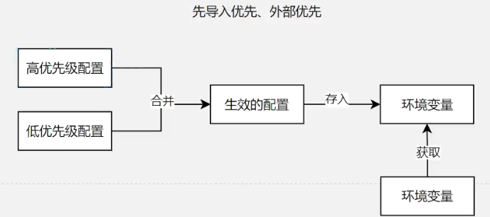

# 微服务文档

## 注册中心

### 服务发现

发现服务信息。

```java
@SpringBootTest()
public class DiscoveryTest {

    @Autowired
    private DiscoveryClient discoveryClient;

    @Autowired
    private NacosDiscoveryClient nacosDiscoveryClient;

    @Test
    void discoveryClientTest() {
        // 使用Spring Cloud标准DiscoveryClient
        for (String service : discoveryClient.getServices()) {
            System.out.println("服务名称: " + service);

            for (ServiceInstance instance : discoveryClient.getInstances(service)) {
                System.out.println("实例IP地址: " + instance.getHost());
                System.out.println("实例端口号: " + instance.getPort());
            }
        }

        System.out.println("----------------------------------------------");

        // 使用Nacos专用DiscoveryClient
        for (String service : nacosDiscoveryClient.getServices()) {
            System.out.println("服务名称: " + service);

            for (ServiceInstance instance : nacosDiscoveryClient.getInstances(service)) {
                System.out.println("实例IP地址: " + instance.getHost());
                System.out.println("实例端口号: " + instance.getPort());
            }
        }
    }
}
```

### 远程调用

订单模块调用远程商品模块，使用Nacos作为注册中心，可以使用`RestTemplate`进行远程调用。`RestTemplate`是线程安全的，只需注册一次即可全局使用。

**RestTemplate线程安全说明**

`RestTemplate`继承了`InterceptingHttpAccessor`，其中使用了单例模式保证线程安全：

```java
public ClientHttpRequestFactory getRequestFactory() {
    List<ClientHttpRequestInterceptor> interceptors = this.getInterceptors();
    if (!CollectionUtils.isEmpty(interceptors)) {
        ClientHttpRequestFactory factory = this.interceptingRequestFactory;
        if (factory == null) {
            factory = new InterceptingClientHttpRequestFactory(super.getRequestFactory(), interceptors);
            this.interceptingRequestFactory = factory;
        }
        return factory;
    } else {
        return super.getRequestFactory();
    }
}
```

#### 实现远程调用

##### 基础调用方式

1. 注册`RestTemplate` Bean：

```java
@Bean
public RestTemplate restTemplate() {
    return new RestTemplate();
}
```

2. 实现远程调用：

```java
private Product getProductFromRemote(Long productId) {
    // 获取商品服务所有实例
    List<ServiceInstance> instances = discoveryClient.getInstances("service-product");
    if (instances.isEmpty()) {
        throw new RuntimeException("未找到可用的商品服务实例");
    }
    
    ServiceInstance instance = instances.get(0);
    String url = "http://" + instance.getHost() + ":" + instance.getPort() + "/api/product/" + productId;

    log.info("远程调用商品服务: {}", url);
    return restTemplate.getForObject(url, Product.class);
}
```

##### 负载均衡调用

1. 注册`RestTemplate` Bean：

```java
@Bean
public RestTemplate restTemplate() {
    return new RestTemplate();
}
```

2. 使用`LoadBalancerClient`实现负载均衡：

```java
/**
 * 使用负载均衡调用远程商品服务
 *
 * @param productId 商品ID
 * @return 商品信息
 */
private Product getProductFromRemoteWithLoadBalancer(Long productId) {
    ServiceInstance instance = loadBalancerClient.choose("service-product");
    String url = "http://" + instance.getHost() + ":" + instance.getPort() + "/api/product/" + productId;

    log.info("负载均衡远程调用商品服务: {}", url);
    return restTemplate.getForObject(url, Product.class);
}
```

##### 注解式负载均衡调用

> [!TIP]
> 关于注册中心宕机的影响：
> - 已调用过的服务：可以继续调用，因为客户端有缓存
> - 未调用过的服务：首次调用会失败，因为需要从注册中心获取服务列表

1. 注册带负载均衡的`RestTemplate`：

```java
@Bean
@LoadBalanced
public RestTemplate restTemplate() {
    return new RestTemplate();
}
```

2. 直接使用服务名进行调用：

```java
/**
 * 使用注解式负载均衡调用远程商品服务
 *
 * @param productId 商品ID
 * @return 商品信息
 */
private Product getProductFromRemoteWithLoadBalancerAnnotation(Long productId) {
    String url = "http://service-product/api/product/" + productId;
    log.info("负载均衡注解调用商品服务: {}", url);
    return restTemplate.getForObject(url, Product.class);
}
```

### 远程配置管理

#### 基础配置

1. 添加依赖：

```xml
<dependency>
    <groupId>com.alibaba.cloud</groupId>
    <artifactId>spring-cloud-starter-alibaba-nacos-config</artifactId>
</dependency>
```

2. 在Nacos中配置：

配置内容示例：
```yaml
order:
  timeout: 30min
  auto-confirm: true
```

3. 创建配置读取接口：

```java
@RestController
@RequestMapping("/api/order")
@RequiredArgsConstructor
public class OrderController {

    @Value("${order.timeout}")
    private String timeout;

    @Value("${order.auto-confirm}")
    private String autoConfirm;

    @Operation(summary = "读取配置")
    @GetMapping("config")
    public String config() {
        return "timeout: " + timeout + "\nautoConfirm: " + autoConfirm;
    }
}
```

4. 应用配置：

```yaml
server:
  port: 8000
spring:
  application:
    name: service-order
  profiles:
    active: dev
  config:
    import:
      - nacos:service-order.yml
  cloud:
    nacos:
      server-addr: 192.168.95.135:8848
      config:
        import-check:
          enabled: false
```

> [!CAUTION]
> 注意事项：
> - 不要在`server-addr`中使用变量引用如`${nacos.server-addr}`，这可能导致连接失败
> - 对于不需要动态配置的模块，可以禁用配置检查

#### 动态刷新配置

1. 添加`@RefreshScope`注解：

```java
@SpringBootApplication
@EnableDiscoveryClient
@RefreshScope
public class ProductServiceApplication {
    public static void main(String[] args) {
        SpringApplication.run(ProductServiceApplication.class, args);
    }
}
```

#### 批量配置绑定

> [!TIP]
> 使用`@ConfigurationProperties`批量绑定配置：
> - 无需`@RefreshScope`即可实现动态刷新
> - 支持中划线命名自动转为驼峰命名

1. 创建配置类：

```java
@Configuration
@ConfigurationProperties(prefix = "order")
public class OrderProperties {
    private String timeout;
    private String autoConfirm;
    // getters and setters
}
```

2. 使用配置：

```java
@RestController
@RequestMapping("/api/order")
@RequiredArgsConstructor
public class OrderController {

    private final OrderProperties orderProperties;

    @Operation(summary = "读取配置")
    @GetMapping("config")
    public String config() {
        return "timeout: " + orderProperties.getTimeout() + 
               "\nautoConfirm: " + orderProperties.getAutoConfirm();
    }
}
```

#### 高级配置管理

1. 多环境配置：

```yaml
spring:
  profiles:
    active: @profileActive@
  config:
    import:
      - nacos:service-order-${spring.profiles.active}.yml
```

2. 共享配置：

```yaml
spring:
  config:
    import:
      - nacos:common-config.yml
      - nacos:service-order.yml
```

3. 命名空间和分组：

```yaml
cloud:
  nacos:
    config:
      namespace: dev
      group: DEFAULT_GROUP
```

4. 配置优先级：
   - 应用名-profile.yml (最高优先级)
   - 应用名.yml
   - 扩展配置
   - 共享配置 (最低优先级)

### 配置监听



#### 实现配置监听

1. 项目启动时注册监听器：

```java
@SpringBootApplication
@EnableDiscoveryClient
public class OrderServiceApplication {
    public static void main(String[] args) {
        SpringApplication.run(OrderServiceApplication.class, args);
    }

    @Bean
    public ApplicationRunner runner(NacosConfigManager nacosConfigManager) {
        return args -> {
            ConfigService configService = nacosConfigManager.getConfigService();
            configService.addListener("service-order.yml", "DEFAULT_GROUP", new Listener() {
                @Override
                public Executor getExecutor() {
                    return Executors.newFixedThreadPool(10);
                }

                @Override
                public void receiveConfigInfo(String configInfo) {
                    System.out.println("配置变更内容: " + configInfo);
                    // 实现配置变更后的处理逻辑
                    System.out.println("发送配置变更通知邮件...");
                }
            });
            System.out.println("订单服务启动完成，配置监听已注册");
        };
    }
}
```

