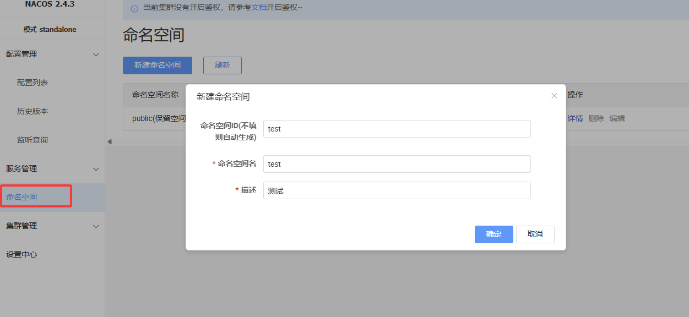
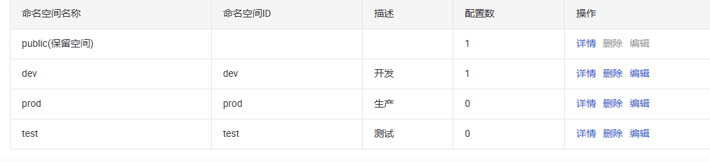
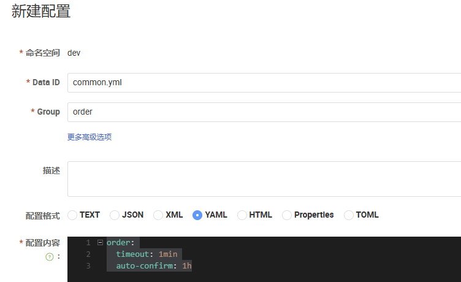
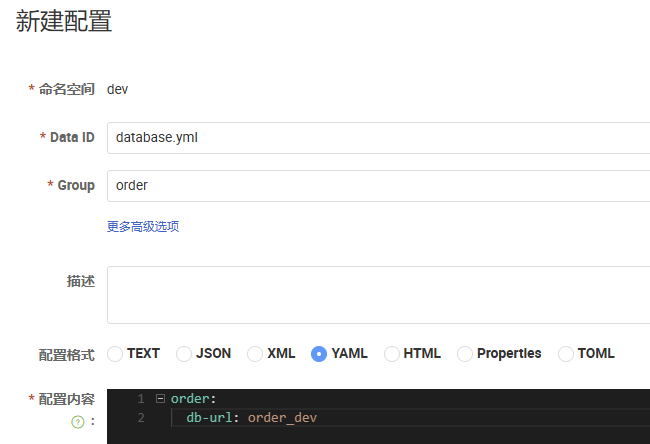
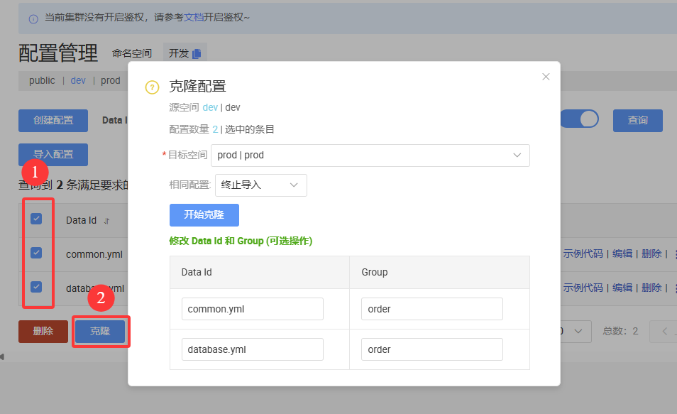

# 微服务

## 环境搭建

### Docker镜像源设置

```bash
# 创建目录
sudo mkdir -p /etc/docker
# 写入配置文件
sudo tee /etc/docker/daemon.json <<-'EOF'
{
    "registry-mirrors": [
    	"https://docker-0.unsee.tech",
        "https://docker-cf.registry.cyou",
        "https://docker.1panel.live"
    ]
}
EOF

# 重启docker服务
sudo systemctl daemon-reload && sudo systemctl restart docker
```

使用docker-compose有的时候会因为版本不同，但是配置文件主要内容就是这些。需要注意版本问题

### 配置相关

#### MySQL配置问题

| **特性**   | `**my.cnf**`        | `**conf.d**` **目录** |
|----------|:--------------------|:-------------------:|
| **文件类型** | 单个文件                |  目录，包含多个 `.cnf` 文件  |
| **配置方式** | 集中式配置               |        分布式配置        |
| **优先级**  | 高（覆盖 `conf.d` 中的配置） |  低（被 `my.cnf` 覆盖）   |
| **适用场景** | 全局配置，核心配置           |    模块化配置，便于扩展和维护    |

#### MongoDB配置

```bash
sudo mkdir -p ~/docker/docker_data/mongo/conf
sudo mkdir -p ~/docker/docker_data/mongo/logs
sudo chmod 777 ~/docker/docker_data/mongo/logs
sudo chmod 777 ~/docker/docker_data/mongo/conf

cd ~/docker/docker_data/mongo/logs
sudo touch mongod.log
sudo chmod 777 mongod.log

cd ~/docker/docker_data/mongo/conf
sudo vim mongod.conf

cd ~
```

##### 配置文件

```bash
# 数据库文件存储位置
dbpath = /data/db
# log文件存储位置
logpath = /data/log/mongod.log
# 使用追加的方式写日志
logappend = true
# 是否以守护进程方式运行
# fork = true
# 全部ip可以访问
bind_ip = 0.0.0.0
# 端口号
port = 27017
# 是否启用认证
auth = true
# 设置oplog的大小(MB)
oplogSize=2048
```

##### 设置账户密码

```shell
#进入容器
docker exec -it mongodb /bin/bash

#进入mongodb shell
mongosh --port 27017

#切换到admin库
use admin

#创建账号/密码
db.createUser({ user: 'admin', pwd: '02120212', roles: [ { role: "root", db: "admin" } ] });
# db.createUser({ user: 'admin', pwd: '123456', roles: [ { role: "userAdminAnyDatabase", db: "admin" } ] });
```

### docker-compose.yml

如果休要所有的微服务环境，可以直接复制下面的内容，看清楚目录是否和自己需要的一样。

| 功能           | 旧版 (docker-compose)     | 新版 (docker  compose)    |
|--------------|-------------------------|-------------------------|
| **启动服务**     | docker-compose  up -d   | docker  compose up -d   |
| **停止服务**     | docker-compose  down    | docker  compose down    |
| **查看日志**     | docker-compose  logs -f | docker  compose logs -f |
| **列出容器**     | docker-compose  ps      | docker  compose ps      |
| **停止不删除容器**  | docker-compose  stop    | docker  compose stop    |
| **启动已停止的容器** | docker-compose  start   | docker  compose start   |
| **重启服务**     | docker-compose  restart | docker  compose restart |
| **构建镜像**     | docker-compose  build   | docker  compose build   |

```yaml
name: cloud-services
services:
  mysql:
    container_name: mysql_master
    image: mysql:8.0.33
    ports:
      - "3306:3306"
    environment:
      - MYSQL_ROOT_PASSWORD=123456
      - TZ=Asia/Shanghai
    volumes:
      # - ~/docker/docker_data/mysql/mysql_master/etc/my.cnf:/etc/my.cnf # 如果需要创建配置文件
      - ~/docker/docker_data/mysql/mysql_master/etc/mysql:/etc/mysql/conf.d
      - ~/docker/docker_data/mysql/mysql_master/data:/var/lib/mysql
      - ~/docker/docker_data/mysql/mysql_master/backup:/backup
    command:
      - "--log-bin=mysql-bin"
      - "--server-id=1"
      - "--collation-server=utf8mb4_unicode_ci"
      - "--character-set-server=utf8mb4"
      - "--lower-case-table-names=1"
    restart: always
    privileged: true
    networks:
      - cloud

  redis:
    container_name: redis_master
    image: redis:7.0.10
    ports:
      - "6379:6379"
    volumes:
      # - ~/docker/docker_data/redis_master/redis.conf:/etc/redis/redis.conf # 需要创建配置文件
      - ~/docker/docker_data/redis_master:/etc/redis # 之后要配置文件可以直接在这里创建 redis.conf
      - ~/docker/docker_data/redis_master/data:/data
    command:
      - "--appendonly yes"
      - "--daemonize no"
      - "--requirepass 123456"
      - "--tcp-keepalive 300"
    restart: always
    networks:
      - cloud

  minio:
    image: minio/minio
    container_name: minio_master
    ports:
      - "9000:9000"
      - "9090:9090"
    volumes:
      - ~/docker/docker_data/minio/data:/data
    environment:
      - MINIO_ROOT_USER=bunny
      - MINIO_ROOT_PASSWORD=02120212
    command: "server /data --console-address :9090"
    restart: always
    networks:
      - cloud

  mongodb:
    image: mongo:latest
    container_name: mongodb
    restart: always
    privileged: true
    ports:
      - "27017:27017"
    volumes:
      - ~/docker/docker_data/mongo/data:/data/db
      - ~/docker/docker_data/mongo/conf:/data/configdb
      - ~/docker/docker_data/mongo/logs:/data/log
    command: "mongod --config /data/configdb/mongod.conf"
    networks:
      - cloud

  rabbitmq:
    image: rabbitmq:management
    container_name: rabbitmq
    restart: unless-stopped
    ports:
      - "5672:5672"
      - "15672:15672"
    volumes:
      - ~/docker/docker_data/rabbitmq/data:/var/lib/rabbitmq
      - ~/docker/docker_data/rabbitmq/conf:/etc/rabbitmq
      - ~/docker/docker_data/rabbitmq/log:/var/log/rabbitmq
    environment:
      - RABBITMQ_DEFAULT_USER=admin
      - RABBITMQ_DEFAULT_PASS=admin
      - RABBITMQ_DEFAULT_VHOST=/
    networks:
      - cloud

  nacos:
    image: nacos/nacos-server:v2.4.3
    container_name: nacos
    ports:
      - "8848:8848"
      - "9848:9848"
    environment:
      - MODE=standalone
    restart: always
    networks:
      - cloud

  sentinel:
    image: bladex/sentinel-dashboard:1.8.8
    container_name: sentinel
    ports:
      - "8858:8858"
    privileged: true
    restart: always
    networks:
      - cloud

  seata-server:
    image: apache/seata-server:2.3.0.jdk21
    container_name: seata-server
    ports:
      - "8091:8091"
    restart: always
    networks:
      - cloud

networks: # 定义网络
  cloud: # 定义名为 auth 的网络
    name: cloud  # 网络名称为 auth
    driver: bridge  # 使用 bridge 驱动（默认）
```

## 注册中心

### 服务发现

发现服务信息。

```java
@SpringBootTest()
public class DiscoveryTest {

    @Autowired
    private DiscoveryClient discoveryClient;

    @Autowired
    private NacosDiscoveryClient nacosDiscoveryClient;

    @Test
    void discoveryClientTest() {
        for (String service : discoveryClient.getServices()) {
            System.out.println(service);

            for (ServiceInstance instance : discoveryClient.getInstances(service)) {
                System.out.println("IP地址：" + instance.getHost());
                System.out.println("端口号" + instance.getPort());
            }
        }

        System.out.println("----------------------------------------------");

        // 两个方式一样，DiscoveryClient 是 Spring自带的 NacosDiscoveryClient是 Nacos
        for (String service : nacosDiscoveryClient.getServices()) {
            System.out.println(service);

            for (ServiceInstance instance : nacosDiscoveryClient.getInstances(service)) {
                System.out.println("IP地址：" + instance.getHost());
                System.out.println("端口号" + instance.getPort());
            }
        }
    }
}
```

### 远程调用

订单模块调用远程商品模块，使用了nacos，可以使用`RestTemplate`，其中`RestTemplate`是线程安全的，只要注册一次全局都是可以使用。

**RestTemplate源码**

继承了`InterceptingHttpAccessor`，在`InterceptingHttpAccessor`中，使用了单例模式。

```java
public ClientHttpRequestFactory getRequestFactory() {
    List<ClientHttpRequestInterceptor> interceptors = this.getInterceptors();
    if (!CollectionUtils.isEmpty(interceptors)) {
        ClientHttpRequestFactory factory = this.interceptingRequestFactory;
        if (factory == null) {
            factory = new InterceptingClientHttpRequestFactory(super.getRequestFactory(), interceptors);
            this.interceptingRequestFactory = factory;
        }

        return factory;
    } else {
        return super.getRequestFactory();
    }
}
```

#### 实现远程调用

##### 普通方式调用

注册`RestTemplate`

```java
@Bean
public RestTemplate restTemplate() {
    return new RestTemplate();
}
```

如果我们的服务启动了多个，在下面代码中即使一个服务宕机也可以做到远程调用。

```java
private Product getProductFromRemote(Long productId) {
    // 获取商品服务所有及其的 IP+port
    List<ServiceInstance> instances = discoveryClient.getInstances("service-product");
    ServiceInstance instance = instances.get(0);

    // 远程URL
    String url = "http://" + instance.getHost() + ":" + instance.getPort() + "/api/product/" + productId;

    // 2. 远程发送请求
    log.info("远程调用：{}", url);
    return restTemplate.getForObject(url, Product.class);
}
```

##### 负载均衡调用

注册`RestTemplate`

```java
@Bean
public RestTemplate restTemplate() {
    return new RestTemplate();
}
```

使用负载均衡`LoadBalancerClient`，通过负载均衡算法动态调用远程服务。

```java
/**
 * 远程调用商品模块 --- 负载均衡
 *
 * @param productId 商品id
 * @return 商品对象
 */
private Product getProductFromRemoteWithLoadBalancer(Long productId) {
    // 1. 获取商品服务所有及其的 IP+port
    ServiceInstance instance = loadBalancerClient.choose("service-product");

    // 远程URL
    String url = "http://" + instance.getHost() + ":" + instance.getPort() + "/api/product/" + productId;

    // 2. 远程发送请求
    log.info("负载均衡远程调用：{}", url);
    return restTemplate.getForObject(url, Product.class);
}
```

##### 负载均衡注解调用

> [!TIP]
>
> 如果远程注册中心宕机是否可以调用？
>
> 调用过：远程调用不在依赖注册中心，可以通过。
>
> 没调用过：第一次发起远程调用；不能通过。

在`RestTemplate`上加上`@LoadBalanced`注解使用负载均衡。

```java
@Bean
@LoadBalanced
public RestTemplate restTemplate() {
    return new RestTemplate();
}
```

在实际的调用中并不需要再显式调用，将URL替换成服务名称即可。

```java
/**
 * 远程调用商品模块 --- 负载均衡注解调用
 *
 * @param productId 商品id
 * @return 商品对象
 */
private Product getProductFromRemoteWithLoadBalancerAnnotation(Long productId) {
    // 远程URL，实现动态替换
    String url = "http://service-product/api/product/" + productId;

    // 远程发送请求
    log.info("负载均衡注解调用：{}", url);
    return restTemplate.getForObject(url, Product.class);
}
```

## 数据中心-数据隔离


### 名称空间

#### 创建命名空间

> [!TIP]
>
> 如果需要导入和我一样的命名空间，可以在项目目录下的samples文件找到相关配置

分别创建：test、prod、dev





之后到配置列表中创建配置（dev命名空间）



```yml
order:
  timeout: 1min
  auto-confirm: 1h
```



```yml
order:
  db-url: order_dev
```

#### 克隆命名空间


