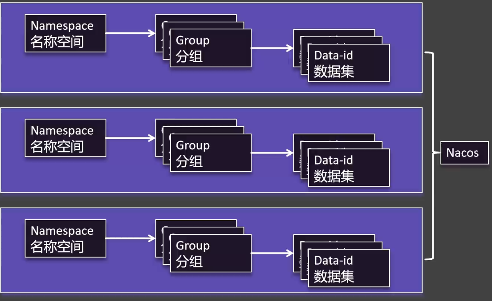

# Nacos注册中心

## 注册中心

### 服务发现

发现服务信息。

```java
@SpringBootTest()
public class DiscoveryTest {

    @Autowired
    private DiscoveryClient discoveryClient;

    @Autowired
    private NacosDiscoveryClient nacosDiscoveryClient;

    @Test
    void discoveryClientTest() {
        for (String service : discoveryClient.getServices()) {
            System.out.println(service);

            for (ServiceInstance instance : discoveryClient.getInstances(service)) {
                System.out.println("IP地址：" + instance.getHost());
                System.out.println("端口号" + instance.getPort());
            }
        }

        System.out.println("----------------------------------------------");

        // 两个方式一样，DiscoveryClient 是 Spring自带的 NacosDiscoveryClient是 Nacos
        for (String service : nacosDiscoveryClient.getServices()) {
            System.out.println(service);

            for (ServiceInstance instance : nacosDiscoveryClient.getInstances(service)) {
                System.out.println("IP地址：" + instance.getHost());
                System.out.println("端口号" + instance.getPort());
            }
        }
    }
}
```

### 远程调用

订单模块调用远程商品模块，使用了nacos，可以使用`RestTemplate`，其中`RestTemplate`是线程安全的，只要注册一次全局都是可以使用。

**RestTemplate源码**

继承了`InterceptingHttpAccessor`，在`InterceptingHttpAccessor`中，使用了单例模式。

```java
public ClientHttpRequestFactory getRequestFactory() {
    List<ClientHttpRequestInterceptor> interceptors = this.getInterceptors();
    if (!CollectionUtils.isEmpty(interceptors)) {
        ClientHttpRequestFactory factory = this.interceptingRequestFactory;
        if (factory == null) {
            factory = new InterceptingClientHttpRequestFactory(super.getRequestFactory(), interceptors);
            this.interceptingRequestFactory = factory;
        }

        return factory;
    } else {
        return super.getRequestFactory();
    }
}
```

#### 实现远程调用

##### 普通方式调用

注册`RestTemplate`

```java
@Bean
public RestTemplate restTemplate() {
    return new RestTemplate();
}
```

如果我们的服务启动了多个，在下面代码中即使一个服务宕机也可以做到远程调用。

```java
private Product getProductFromRemote(Long productId) {
    // 获取商品服务所有及其的 IP+port
    List<ServiceInstance> instances = discoveryClient.getInstances("service-product");
    ServiceInstance instance = instances.get(0);

    // 远程URL
    String url = "http://" + instance.getHost() + ":" + instance.getPort() + "/api/product/" + productId;

    // 2. 远程发送请求
    log.info("远程调用：{}", url);
    return restTemplate.getForObject(url, Product.class);
}
```

##### 负载均衡调用

注册`RestTemplate`

```java
@Bean
public RestTemplate restTemplate() {
    return new RestTemplate();
}
```

使用负载均衡`LoadBalancerClient`，通过负载均衡算法动态调用远程服务。

```java
/**
 * 远程调用商品模块 --- 负载均衡
 *
 * @param productId 商品id
 * @return 商品对象
 */
private Product getProductFromRemoteWithLoadBalancer(Long productId) {
    // 1. 获取商品服务所有及其的 IP+port
    ServiceInstance instance = loadBalancerClient.choose("service-product");

    // 远程URL
    String url = "http://" + instance.getHost() + ":" + instance.getPort() + "/api/product/" + productId;

    // 2. 远程发送请求
    log.info("负载均衡远程调用：{}", url);
    return restTemplate.getForObject(url, Product.class);
}
```

##### 负载均衡注解调用

> [!TIP]
>
> 如果远程注册中心宕机是否可以调用？
>
> 调用过：远程调用不在依赖注册中心，可以通过。
>
> 没调用过：第一次发起远程调用；不能通过。

在`RestTemplate`上加上`@LoadBalanced`注解使用负载均衡。

```java
@Bean
@LoadBalanced
public RestTemplate restTemplate() {
    return new RestTemplate();
}
```

在实际的调用中并不需要再显式调用，将URL替换成服务名称即可。

```java
/**
 * 远程调用商品模块 --- 负载均衡注解调用
 *
 * @param productId 商品id
 * @return 商品对象
 */
private Product getProductFromRemoteWithLoadBalancerAnnotation(Long productId) {
    // 远程URL，实现动态替换
    String url = "http://service-product/api/product/" + productId;

    // 远程发送请求
    log.info("负载均衡注解调用：{}", url);
    return restTemplate.getForObject(url, Product.class);
}
```

## 按需加载

### 数据隔离架构



### 命名空间管理

#### 创建命名空间

> [!TIP]
> 预配置的命名空间示例可在项目 `samples/namespace-config` 目录下找到。

建议创建以下标准命名空间：

- `dev` - 开发环境
- `test` - 测试环境
- `prod` - 生产环境

**操作步骤**：

1. 进入Nacos控制台命名空间管理
2. 点击"新建命名空间"
3. 填写命名空间信息（ID和名称）


#### 配置管理

**开发环境配置示例**：

1. 基础配置：

```yaml
order:
  timeout: 1min
  auto-confirm: 1h
```

2. 数据库配置：

```yaml
order:
  db-url: jdbc:mysql://dev-db:3306/order_dev
```


#### 命名空间克隆

通过克隆功能快速创建相似环境的命名空间：


### 动态环境配置

#### Spring Boot 配置方案

**基础配置**：

```yaml
server:
  port: 8000
spring:
  application:
    name: service-order
  profiles:
    active: dev
  cloud:
    nacos:
      server-addr: ${NACOS_HOST:192.168.95.135}:8848
      config:
        namespace: ${spring.profiles.active:dev} # 动态匹配当前profile
        group: DEFAULT_GROUP
```

**多环境配置加载**：

```yaml
spring:
  config:
    import:
      - optional:nacos:service-order.yml
      - optional:nacos:common.yml?group=order
      - optional:nacos:database.yml?group=order
```

> [!NOTE]
> 使用`optional:`前缀可避免配置不存在时启动失败

### 配置读取实现

**配置类**：

```java
@Configuration
@ConfigurationProperties(prefix = "order")
@Getter
@Setter
public class OrderProperties {
    private String timeout;
    private String autoConfirm;
    private String dbUrl; // 自动映射db-url
}
```

**REST接口**：

```java
@RestController
@RequestMapping("/api/order")
@RequiredArgsConstructor
public class OrderController {
    private final OrderProperties orderProperties;

    @GetMapping("/config")
    public Map<String, String> getConfig() {
        return Map.of(
            "timeout", orderProperties.getTimeout(),
            "autoConfirm", orderProperties.getAutoConfirm(),
            "dbUrl", orderProperties.getDbUrl()
        );
    }
}
```

### 按需加载策略

#### 多环境差异化配置

```yaml
spring:
  profiles:
    active: prod # 可通过启动参数覆盖

---
# 生产环境配置
spring:
  config:
    import:
      - nacos:service-order-prod.yml
      - nacos:common-prod.yml?group=order
    activate:
      on-profile: prod

---
# 开发环境配置
spring:
  config:
    import:
      - nacos:service-order-dev.yml
      - nacos:database-dev.yml?group=order
    activate:
      on-profile: dev

---
# 测试环境配置
spring:
  config:
    import:
      - nacos:service-order-test.yml
      - nacos:database-test.yml?group=order
    activate:
      on-profile: test
```

## OpenFeign

### 基础配置

#### 依赖引入

```xml
<dependency>
    <groupId>org.springframework.cloud</groupId>
    <artifactId>spring-cloud-starter-openfeign</artifactId>
    <version>${spring-cloud.version}</version>
</dependency>
```

#### 启用Feign客户端

```java
@SpringBootApplication
@EnableDiscoveryClient
@EnableFeignClients(basePackages = "com.yourpackage.feign")
public class OrderServiceApplication {
    public static void main(String[] args) {
        SpringApplication.run(OrderServiceApplication.class, args);
    }
}
```

### Feign客户端使用

#### 服务间调用

**Feign客户端定义**：

```java
@FeignClient(
    value = "service-product", 
    path = "/api/product",
    configuration = ProductFeignConfig.class
)
public interface ProductFeignClient {

    @GetMapping("/{id}")
    ResponseEntity<Product> getProductById(@PathVariable("id") Long productId);

    @PostMapping
    ResponseEntity<Void> createProduct(@RequestBody Product product);
}
```

**服务调用示例**：

```java
@Service
@RequiredArgsConstructor
public class OrderService {

    private final ProductFeignClient productFeignClient;

    public Order createOrder(Long productId, Long userId) {
        // 使用Feign客户端调用远程服务
        ResponseEntity<Product> response = productFeignClient.getProductById(productId);
        
        if (!response.getStatusCode().is2xxSuccessful()) {
            throw new RuntimeException("商品服务调用失败");
        }

        Product product = response.getBody();
        Order order = new Order();
        // 订单业务逻辑处理...
        return order;
    }
}
```

#### 第三方服务调用

```java
@FeignClient(
    name = "bunny-client", 
    url = "${external.bunny.api.url}", 
    configuration = ExternalFeignConfig.class
)
public interface BunnyFeignClient {

    @PostMapping("/login")
    ResponseEntity<String> login(@RequestBody LoginDto loginDto);
}
```

**测试用例**：

```java
@SpringBootTest
public class BunnyFeignClientTest {

    @Autowired
    private BunnyFeignClient bunnyFeignClient;

    @Test
    void testLogin() {
        LoginDto loginDto = new LoginDto("bunny", "admin123", "default");
        ResponseEntity<String> response = bunnyFeignClient.login(loginDto);
        
        assertThat(response.getStatusCode()).isEqualTo(HttpStatus.OK);
        System.out.println("登录响应: " + response.getBody());
    }
}
```

### 负载均衡对比

#### 客户端负载均衡 vs 服务端负载均衡

| 特性         | 客户端负载均衡 (OpenFeign) | 服务端负载均衡 (Nginx等) |
| ------------ | -------------------------- | ------------------------ |
| **实现位置** | 客户端实现                 | 服务端实现               |
| **依赖关系** | 需要服务注册中心           | 不依赖注册中心           |
| **性能**     | 直接调用，减少网络跳转     | 需要经过代理服务器       |
| **灵活性**   | 可定制负载均衡策略         | 配置相对固定             |
| **服务发现** | 集成服务发现机制           | 需要手动维护服务列表     |
| **适用场景** | 微服务内部调用             | 对外暴露API或跨系统调用  |

### 高级配置

#### 日志配置

**application.yml**:

```yaml
logging:
  level:
    org.springframework.cloud.openfeign: DEBUG
    com.yourpackage.feign: DEBUG
```

**Java配置**：

```java
public class FeignConfig {
    
    @Bean
    Logger.Level feignLoggerLevel() {
        return Logger.Level.FULL;  // NONE, BASIC, HEADERS, FULL
    }
}
```

#### 超时与重试配置

**application-feign.yml**:

```yaml
spring:
  cloud:
    openfeign:
      client:
        config:
          default:  # 全局默认配置
            connect-timeout: 2000
            read-timeout: 5000
            logger-level: basic
            
          service-product:  # 特定服务配置
            connect-timeout: 3000
            read-timeout: 10000
```

**重试机制配置**：

```java
@Bean
public Retryer feignRetryer() {
    // 重试间隔100ms，最大间隔1s，最大尝试次数3次
    return new Retryer.Default(100, 1000, 3);
}
```
