# RabbitMQ

**安装RabbitMQ**

```bash
docker run -d --name rabbitmq_master --restart=always \
-p 5672:5672 -p 15672:15672   \
-v ~/docker/docker_data/rabbitmq/rabbitmq_master/data:/var/lib/rabbitmq_master \
-v ~/docker/docker_data/rabbitmq/rabbitmq_master/conf:/etc/rabbitmq_master \
-v ~/docker/docker_data/rabbitmq/rabbitmq_master/log:/var/log/rabbitmq_master \
-e RABBITMQ_DEFAULT_VHOST=rabbitmq_master \
-e RABBITMQ_DEFAULT_USER=admin \
-e RABBITMQ_DEFAULT_PASS=admin rabbitmq:3.13.7-management
```

## 基本示例

**生产者**

```java
@SpringBootTest
class MqDemoApplicationTests {

    @Autowired
    private RabbitTemplate rabbitTemplate;

    /**
     * 1. 测试发送消息，示例代码
     * 2. 测试成功的情况
     */
    @Test
    void publishTest() {
        String exchangeDirect = RabbitMQMessageListenerConstants.EXCHANGE_DIRECT;
        String routingKeyDirect = RabbitMQMessageListenerConstants.ROUTING_KEY_DIRECT;
        rabbitTemplate.convertAndSend(exchangeDirect, routingKeyDirect, "你好小球球~~~");

        Bunny bunny = Bunny.builder().rabbitName("Bunny").age(2).build();
        rabbitTemplate.convertAndSend(exchangeDirect, routingKeyDirect, JSON.toJSONString(bunny));
    }

}
```

**消费者**

```java
@Component
@Slf4j
public class MessageListenerOrder {

    @RabbitListener(bindings = @QueueBinding(
            exchange = @Exchange(value = EXCHANGE_DIRECT),
            value = @Queue(value = QUEUE_NAME, durable = "true"),
            key = ROUTING_KEY_DIRECT
    )
    )
    public void processMessage(String dataString, Message message, Channel channel) {
        System.out.println("消费端接受消息：" + dataString);
    }

}
```

## 可靠性

### 1、消息没有发送到消息队列

Q：消息没有发送到消息队列

A：在生产者端进行确认，具体操作中我们会分别针对交换机和队列进行确认，如果没有成功发送到消息队列服务器上，那就可以尝试重新发送。

A：为目标交换机指定备份交换机，当目标交换机投递失败时，把消息投递至备份交换机。

**配置文件**

```yaml
rabbitmq:
  host: ${bunny.rabbitmq.host}
  port: ${bunny.rabbitmq.port}
  username: ${bunny.rabbitmq.username}
  password: ${bunny.rabbitmq.password}
  virtual-host: ${bunny.rabbitmq.virtual-host}
  publisher-confirm-type: correlated # 交换机确认
  publisher-returns: true # 队列确认
```

#### 生产者确认

> [!NOTE]  
> **@PostConstruct 注解**  
> **作用**：在Bean依赖注入完成后执行初始化方法（构造器之后，`afterPropertiesSet()`之前）。  
>
> **特点**：  
> - 方法需**无参**、返回**void**，名称任意  
> - 执行顺序：构造器 → 依赖注入 → `@PostConstruct`  
> - 若抛出异常，Bean创建会失败  
>
> **注意**：  
> - 代理类（如`@Transactional`）中，会在**原始对象**初始化时调用  
> - `prototype`作用域的Bean每次创建均会执行  
> - 避免耗时操作，推荐轻量级初始化  
>
> **替代方案**：  
> `InitializingBean`接口 或 `@Bean(initMethod="xxx")`  

RabbitMQ配置

```java
@Slf4j
@Configuration
@RequiredArgsConstructor
public class RabbitConfiguration implements RabbitTemplate.ConfirmCallback, RabbitTemplate.ReturnsCallback {

    private final RabbitTemplate rabbitTemplate;

    @PostConstruct
    public void initRabbitTemplate() {
        rabbitTemplate.setConfirmCallback(this);
        rabbitTemplate.setReturnsCallback(this);
    }

    @Override
    public void confirm(CorrelationData correlationData, boolean ack, String cause) {
        System.out.println("============correlationData <回调函数打印> = " + correlationData);
        System.out.println("============ack <输出> = " + ack);
        System.out.println("============cause <输出> = " + cause);
    }

    @Override
    public void returnedMessage(ReturnedMessage returnedMessage) {
        // 发送到队列失败才会走这个
        log.error("消息主体:{}", returnedMessage.getMessage().getBody());
        log.error("应答码：{}", returnedMessage.getReplyCode());
        log.error("消息使用的父交换机：{}", returnedMessage.getExchange());
        log.error("消息使用的路由键：{}", returnedMessage.getRoutingKey());
    }
}
```

**测试失败的情况**

交换机找不到

```java
/* 测试失败交换机的情况 */
@Test
void publishExchangeErrorTest() {
    String exchangeDirect = RabbitMQMessageListenerConstants.EXCHANGE_DIRECT;
    String routingKeyDirect = RabbitMQMessageListenerConstants.ROUTING_KEY_DIRECT;
    rabbitTemplate.convertAndSend(exchangeDirect, routingKeyDirect, "----失败的消息发送----");

    Bunny bunny = Bunny.builder().rabbitName("Bunny").age(2).build();
    rabbitTemplate.convertAndSend(exchangeDirect + "~", routingKeyDirect, JSON.toJSONString(bunny));
}
```

队列找不到

```java
/* 测试失败队列的情况 */
@Test
void publishQueueErrorTest() {
    String exchangeDirect = RabbitMQMessageListenerConstants.EXCHANGE_DIRECT;
    String routingKeyDirect = RabbitMQMessageListenerConstants.ROUTING_KEY_DIRECT;
    rabbitTemplate.convertAndSend(exchangeDirect, routingKeyDirect, "----失败的队列发送----");

    Bunny bunny = Bunny.builder().rabbitName("Bunny").age(2).build();
    rabbitTemplate.convertAndSend(exchangeDirect, routingKeyDirect + "~", JSON.toJSONString(bunny));
}
```

#### 备份交换机

> [!NOTE]
>
> 创建好的交换机是无法修改的，只能删除重新建立。

创建广播类型的交换机，因为没有路由键，只能通过广播的方式去找。

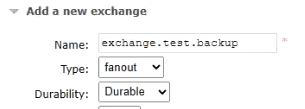

创建与备份交换机的队列，交换机是广播的模式，不指定路由键。

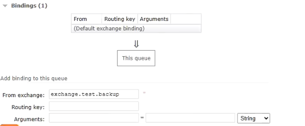

通过指定`Alternate exchange`的交换机进行绑定。第一个填写的不是备份交换机，是投递交换机，之后通过`Alternate exchange`绑定备份的交换机。

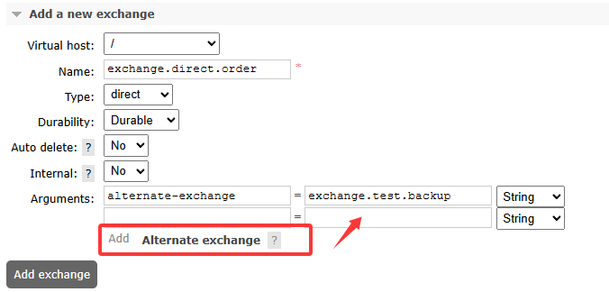

### 2、服务器宕机

Q：服务器宕机导致内存的消息丢失

A：消息持久化到硬盘上，哪怕服务器重启也不会导致消息丢失。

### 3、消费端宕机或抛异常

Q：消费端宕机或者抛异常，导致消息丢失。

A：消费端消费消息成功，给服务器返回ACK信息，通知把消息恢复成待消费状态。

A：消费端消费消息失败，给服务器返回NACK信息，同时把消息恢复为待消费状态，这样就可以再次取回消息，重试一次（需要消费端接口支持幂等性）。

> [!NOTE]
>
> 需要引入一个内容：deliverTag，交付标签。
>
> 每个消息进入队列 时，broker都会自动生成一个唯一标识（64位整数），消息投递时会携带交付标签。
>
> **作用：**消费端把消息处理结果ACK、NACK、Reject等返回给Broker之后，Broker需要对对应的消息执行后续操作，例如删除消息、重新排队或标记为死信等等那么Broker就必须知道它现在要操作的消息具体是哪一条。而deliveryTag作为消息的唯一标识就很好的满足了这个需求。
>
> **问题：**
>
> Q：如果交换机是Fanout模式，同一个消息广播到了不同队列，deliveryTag会重复吗?
>
> A：不会，deliveryTag在Broker范围内唯一，消息复制到各个队列，deliverTag各不相同。
>
> **multiple说明**
>
> 1. 为false时单独处理这一条消息；正常都是false。
> 2. true批量处理消息。

**配置文件**

```yaml
rabbitmq:
  host: ${bunny.rabbitmq.host}
  port: ${bunny.rabbitmq.port}
  username: ${bunny.rabbitmq.username}
  password: ${bunny.rabbitmq.password}
  virtual-host: ${bunny.rabbitmq.virtual-host}
  # 需要注释下面这两个，不需要这两个，因为要手动确认
  # publisher-confirm-type: correlated # 交换机确认
  # publisher-returns: true # 队列确认
  listener:
    simple:
      acknowledge-mode: manual # 手动处理消息
```

#### 消费端流程

> [!NOTE]
>
> - `deliverTag`
>   - 消费端把消息处理结果ACK、NACK、Reject等返回给Broker之后，Broker需要对对应的消息执行后续操作。
>   - 例如删除消息、重新排队或标记为死信等等那么Broker就必须知道它现在要操作的消息具体是哪一条。
>   - 而deliveryTag作为消息的唯一标识就很好的满足了这个需求。
> - `basicReject`和`basicNack`区别：
>   - `basicNack`可以设置是否批量操作，如果需要批量操作，第二个参数传入`true`为批量，反之。
>   - `basicReject`只能做到批量操作。

```java
@RabbitListener(queues = {QUEUE_NAME})
public void processQueue(String dataString, Message message, Channel channel) throws IOException {
    // 设置 deliverTag
    // 消费端把消息处理结果ACK、NACK、Reject等返回给Broker之后，Broker需要对对应的消息执行后续操作。
    // 例如删除消息、重新排队或标记为死信等等那么Broker就必须知道它现在要操作的消息具体是哪一条。
    // 而deliveryTag作为消息的唯一标识就很好的满足了这个需求。
    long deliveryTag = message.getMessageProperties().getDeliveryTag();

    try {
        // 核心操作
        System.out.println("消费端 消息内容：" + dataString);
        channel.basicAck(deliveryTag, false);

        // 核心操作完成，返回ACK信息
    } catch (Exception e) {
        // 当前参数是否是重新投递的，为true时重复投递过了，为法拉瑟是第一次投递
        Boolean redelivered = message.getMessageProperties().getRedelivered();

        // 第三个参数：
        // true：重新放回队列，broker会重新投递这个消息
        // false：不重新放回队列，broker会丢弃这个消息
        channel.basicNack(deliveryTag, false, !redelivered);

        // 除了 basicNack 外还有 basicReject，其中 basicReject 不能控制是否批量操作
        channel.basicReject(deliveryTag, true);

        // 核心操作失败，返回NACK信息
        throw new RuntimeException(e);
    }
}
```

## 消费端限流

### 设置方式

在配置文件中设置`prefetch`值。如果不设置，当生产者将消息放置到RabbitMQ中时，是一次性取回的，无论有多少。

设置了`prefetch`之后，每次取回数量就是`prefetch`的数量。

> [!NOTE]
>
> 并且在UI界面中`Unacked`值和我们设置的值一致。
>
> 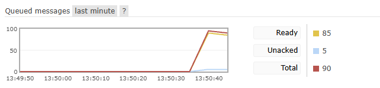
>
> *图中表示表示当前有5条消息已被消费者获取但未确认（正在处理中）*
>
> 当`prefetch=5`且消费速度为1条/秒时：
>
> - 初始会立即获取5条消息（Unacked=5）
> - 每ACK 1条后，Broker会立即推送1条新消息（动态保持Unacked≈5）

```yaml
  rabbitmq:
    host: ${bunny.rabbitmq.host}
    port: ${bunny.rabbitmq.port}
    username: ${bunny.rabbitmq.username}
    password: ${bunny.rabbitmq.password}
    virtual-host: ${bunny.rabbitmq.virtual-host}
    # publisher-confirm-type: correlated # 交换机确认
    # publisher-returns: true # 队列确认
    listener:
      simple:
        acknowledge-mode: manual # 手动处理消息
        prefetch: 5 # 设置每次取回数量，消息条数（非字节或KB）
```

> [!IMPORTANT]  
> **RabbitMQ Prefetch 机制（prefetch=5）**  
>
> 在 RabbitMQ 的 **prefetch（QoS，服务质量设置）** 机制下，当 `prefetch=5` 时，**消费端的行为** 取决于 **消息确认模式（Ack/Nack）** 和 **消费速度**
>
> **核心规则**：  
> - 保持 `unacked` 消息数 **≤ prefetch (5)**  
> - **不会** 等5条全部ACK完才发下一批，而是 **动态补充**（每ACK 1条，补发1条）  
>
> **不同模式对比**：  
> | 模式                                   | 行为                                          |
> | -------------------------------------- | --------------------------------------------- |
> | **手动ACK** (`AcknowledgeMode.MANUAL`) | ✔️ 推荐！保持 `unacked ≤ 5`，ACK后立即补新消息 |
> | **自动ACK** (`AcknowledgeMode.AUTO`)   | ⚠️ 无效！消息投递后立即ACK，prefetch无法限流   |
>
> >*自动ACK模式下**prefetch仍然有效**（限制未处理的消息数），但消息会在投递后立即被ACK，实际可能失去限流意义。*
>
> **消费慢时的表现**：  
>
> - 若消费速度=1条/秒，RabbitMQ会 **持续补消息**，始终维持 `unacked ≈ 5`  
>

### 测试方式

生产者生产一定数量的消息。

```java
/* 发送消息，发送多条消息，测试使用 */
@Test
void buildMessageTest() {
    String exchangeDirect = RabbitMQMessageListenerConstants.EXCHANGE_DIRECT;
    String routingKeyDirect = RabbitMQMessageListenerConstants.ROUTING_KEY_DIRECT;

    for (int i = 0; i < 100; i++) {
        rabbitTemplate.convertAndSend(exchangeDirect, routingKeyDirect, "测试消息发送【" + i + "】");
    }
}
```

消费者进行消费消息，在消费的时候为了方便观察，每秒去读一个。

```java
@RabbitListener(queues = {QUEUE_NAME})
public void processMessagePrefetch(String dataString, Channel channel, Message message) throws IOException, InterruptedException {
    log.info("消费者 消息内容：{}", dataString);

    TimeUnit.SECONDS.sleep(1);

    channel.basicAck(message.getMessageProperties().getDeliveryTag(), false);
}
```

## 消息超时

- 给消息设定一个过期时间，超过这个时间没有被取走的消息就会被删除，从两个层面来给消息设定过期时间。
  - **队列层面：**在队列层面设定消息过期时间，并不是队列的过期时间。意思是这个队列中的消息全部使用同一个过期时间。
  - **消息本身：**给具体的某个消息设定过期时间。
- 可通过两种方式设置消息TTL（Time-To-Live），那么哪个时间短，哪个生效。

### 测试环境

测试时候不要用消费端消费（监听），监听取走了就不是超时了。

**创建交换机**

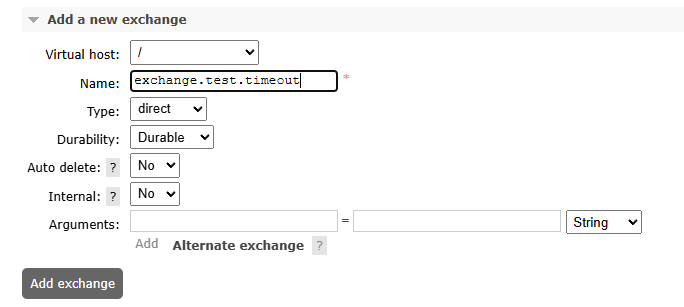

**创建队列**

> [!NOTE]
> 过期时间单位为毫秒，如`5000`表示5秒。

创建交换机。直接点击下面的加粗字体可以直接设置。

**队列TTL设置步骤**：

创建队列时在`Arguments`中添加：`x-message-ttl`: 设置值（如5000）

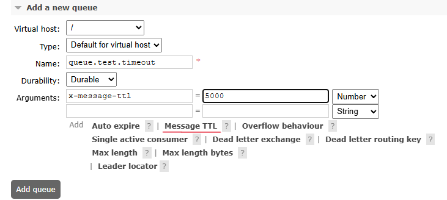

**绑定交换机**

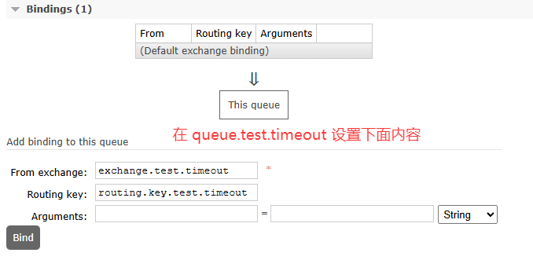

### 测试队列层面

当在队列中设置了过期时间，超时后自动删除。

**测试Code**

```java
/* 测试过期时间 */
@Test
void buildExchangeTimeoutTest() {
    String EXCHANGE = "exchange.test.timeout";
    String QUEUE = "queue.test.timeout";
    String ROUTING_KEY = "routing.key.test.timeout";

    for (int i = 0; i < 100; i++) {
        rabbitTemplate.convertAndSend(EXCHANGE, ROUTING_KEY, "测试消息超时时间【" + i + "】");
    }
}
```

**测试效果**

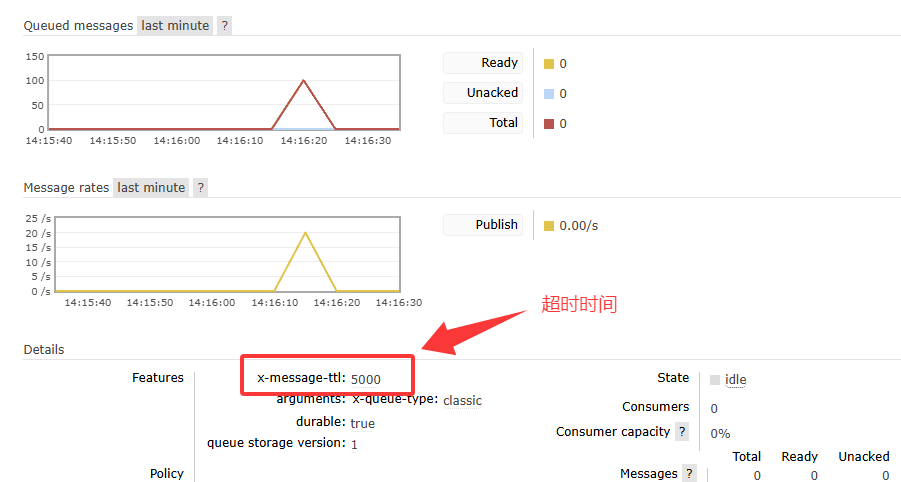

### 测试消息层面

> [!TIP]
>
> 和上面代码对比，区别在于，第四个参数是否设置了`MessagePostProcessor`。
>
> **队列TTL vs 消息TTL**：
>
> - 队列TTL：统一管理，适合批量消息
> - 消息TTL：灵活控制，适合特殊消息

> [!IMPORTANT]
>
> **TTL过期后消息直接删除**（非进入死信队列，除非配置了`x-dead-letter-exchange`）

```java
/* 测试过期时间---消息层面实现消息超时自动删除 */
@Test
void buildExchangeTimeoutTest2() {
    String EXCHANGE = "exchange.test.timeout";
    String QUEUE = "queue.test.timeout";
    String ROUTING_KEY = "routing.key.test.timeout";

    MessagePostProcessor postProcessor = message -> {
        // 设置过期时间
        message.getMessageProperties().setExpiration("7000");
        return message;
    };

    for (int i = 0; i < 100; i++) {
        rabbitTemplate.convertAndSend(EXCHANGE, ROUTING_KEY, "消息层面超时自动删除【" + i + "】", postProcessor);
    }
}
```

## 死信队列

> [!NOTE]
> **死信（Dead Letter）**：满足以下任一条件的消息：
> 1. 被消费者拒绝且不重新入队（`requeue=false`）
> 2. 消息在队列中超过TTL时间
> 3. 队列达到最大长度限制（溢出）

**概念：**当消息因上述原因无法被正常消费时，会被标记为死信（Dead Letter），并可通过死信交换机（DLX）路由到死信队列。

**产生原因：**

1. **拒绝：**消费者拒绝消息`basicNack`/`basicReject`，并且不把消息重新放入源目标队列，`requeue=false`。
2. **溢出：**队列中消息数量达到限制。比如队列最大只能存储10条消息，且现在已经存储了10条消息，此时如果再发送一条消息进来，根据先进先出原则，队列中最早的消息会变成死信。
3. **超时：**消息达到超时时间未被消息。

**死信处理方式：**

- **丢弃**
  适用于对业务无影响的非关键消息（需明确丢弃的监控手段）。
- **入库**
  将死信持久化到数据库，便于后续分析或人工干预。
- **监听（推荐）**
  - 配置独立的死信交换机和队列，与业务逻辑解耦。
  - 消费者专注处理异常消息（如补偿、告警等）。

### 测试环境

#### 搭建死信环境

**创建死信交换机**

exchange.dead.letter.video

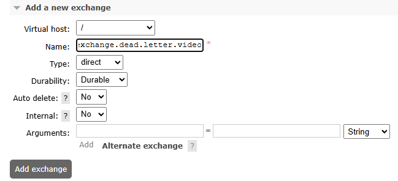

**创建死信队列**

queue.dead.letter.video

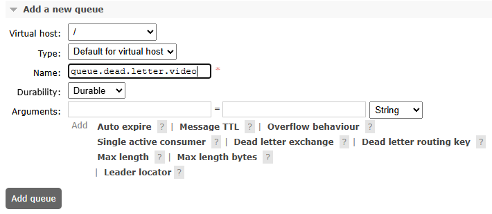

**绑定死信队列**

routing.key.dead.letter.video

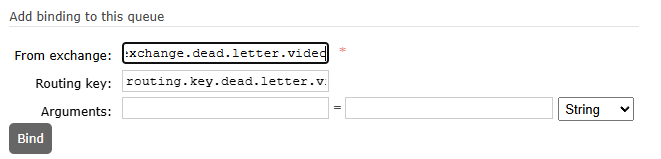

#### 搭建正常环境

> [!WARNING]
> 必须为正常队列配置以下参数才能生效：
> - `x-dead-letter-exchange`：指定死信交换机
> - `x-dead-letter-routing-key`：指定死信路由键

**正常交换机**

exchange.normal.video

**正常队列**

queue.normal.video

这时设置最大长度为10，一次接受10条消息，超出后进入死信。

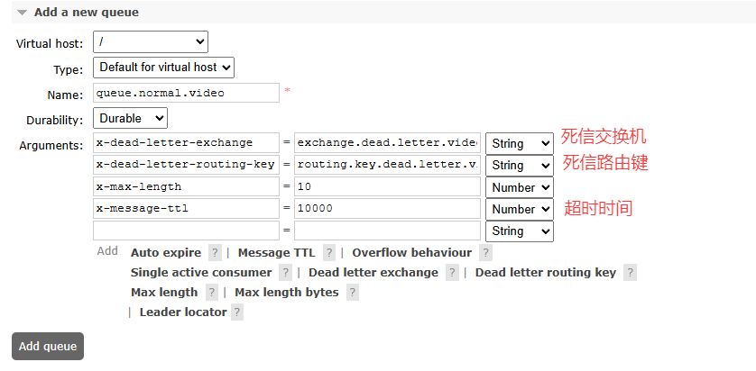

**正常路由键**

routing.key.normal.video

到正常的队列中指定正常的交换机和正常路由键。

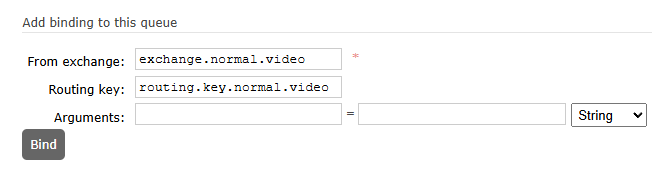

### 测试Code

#### 因拒绝产生

**含义：**

- 本来时监听正常队列的，处理一些逻辑，但是因为某些原因消息成死信了，消息转到死信队列中。
- 这时候，在下面又监听了死信队列，死信队列可以监听到成死信的消息。

```java
/* 测试死信---监听正常队列 */
@RabbitListener(queues = {"queue.normal.video"})
public void processMessageNormal(String dataString, Channel channel, Message message) throws IOException, InterruptedException {
    log.info("监听正常队列----接受到：{}", dataString);
    channel.basicReject(message.getMessageProperties().getDeliveryTag(), false);
}

/* 测试死信---监听死信队列 */
@RabbitListener(queues = {"queue.dead.letter.video"})
public void processMessageDeadLetter(String dataString, Channel channel, Message message) throws IOException, InterruptedException {
    log.info("监听死信队列----接收到：{}", dataString);
    channel.basicAck(message.getMessageProperties().getDeliveryTag(), false);
}
```

向正常队列发送消息

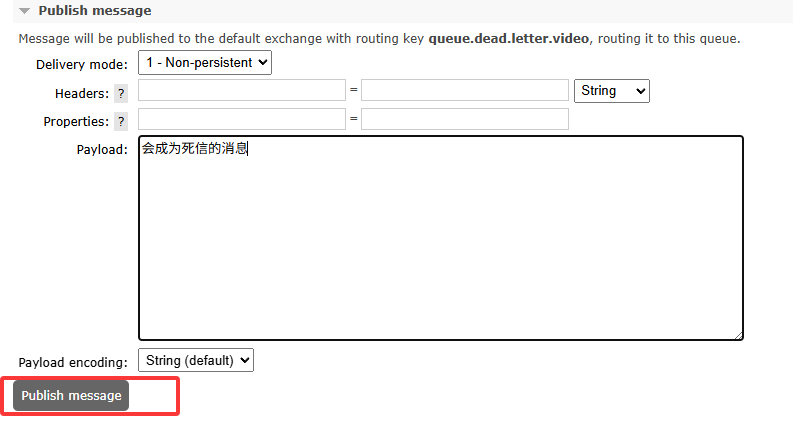

#### 因超时或溢出

在上设置了最大长度为10，如果发送40条那么有30条是溢出的，这时会进入死信队列中。

测试时注释掉监听死信队列和正常队列的代码，之后看UI界面折线图。

```java
/* 因超时或移除产生死信 */
@Test
void buildExchangeOverflowTest() {
    String EXCHANGE = "exchange.normal.video";
    String ROUTING_KEY = "routing.key.normal.video";

    for (int i = 0; i < 40; i++) {
        rabbitTemplate.convertAndSend(EXCHANGE, ROUTING_KEY, "因超时或移除产生死信【" + i + "】");
    }
}
```

从图中可以看出，是分多批进行的。

在之前设置中，消息最大接受是10，最多只能接收到10条消息，之后溢出消息进入死信，其中有10条消息是因为延迟，进入了死信。

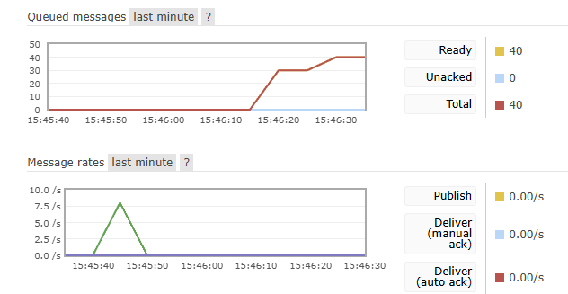

## 延迟队列

### 应用场景

- 订单超时未支付自动取消
- 预约任务延迟触发
- 重试机制中的延迟重试

#### 实现方案对比

| 方案         | 优点                 | 缺点                          |
| :----------- | :------------------- | :---------------------------- |
| TTL+死信队列 | 无需插件             | 队列级别TTL，灵活性差         |
| 延迟消息插件 | 消息级延迟，精确控制 | 需安装插件，延迟有上限（2天） |

### 安装插件

如果不想下，这个文档代码仓库中有的，在根目录下`rabbitmq_delayed_message_exchange-3.13.0.ez`

> [!WARNING]
>
> 插件限制：
>
> - 最大延迟时间：**2天（48小时）**
> - 必须匹配RabbitMQ版本

#### 1、确认docker数据卷

```bash
docker inspect rabbitmq_master | grep -A 10 Mounts
```

找到`Mounts`，如果挂在了`plugins`下载后放到这个目录中，当前版本无法创建`/plugins`目录，只能手动下载之后移入。参考下面的第二点。

若未挂载`/plugins`目录，需手动拷贝插件文件：

```bash
docker cp rabbitmq_delayed_message_exchange-3.13.0.ez rabbitmq_master:/plugins/
```

#### 2、安装插件

**安装步骤**

需要注意，版本是否对应上，我当前RabbitMQ版本是`rabbitmq:3.13.7-management`

```bash
# 下载插件（版本必须匹配）
wget https://github.com/rabbitmq/rabbitmq-delayed-message-exchange/releases/download/v3.13.0/rabbitmq_delayed_message_exchange-3.13.0.ez

# 启用插件
docker exec rabbitmq_master rabbitmq-plugins enable rabbitmq_delayed_message_exchange

# 重启容器生效
docker restart rabbitmq_master
```

**验证安装**

```bash
docker exec rabbitmq_master rabbitmq-plugins list | grep delay
```

应输出：`[E*] rabbitmq_delayed_message_exchange`

### 测试环境配置

#### **1. 创建延迟交换机**

- 名称：`exchange.test.delay`
- 类型：`x-delayed-message`
- **必须参数**：

```json
{
  "x-delayed-type": "direct"  // 指定底层交换机类型（direct/topic/fanout）
}
```

> [!IMPORTANT]
>
> 在指定交换机时，因为本身的Type类型已经设置成了`x-delayed-message`，但是又没有指定交换机类型，又必须指定交换机类型，所以指定下面参数选项中设置延迟交换机的类型。
>
> 需要在下面参数中设置：`x-delayed-type：交换机类型`。

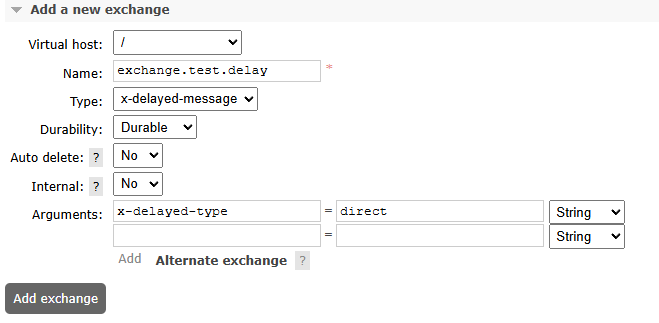

#### **2. 创建队列与绑定**

- 队列：`queue.test.delay`（无需特殊参数）
- 路由键：`routing.key.test.delay`

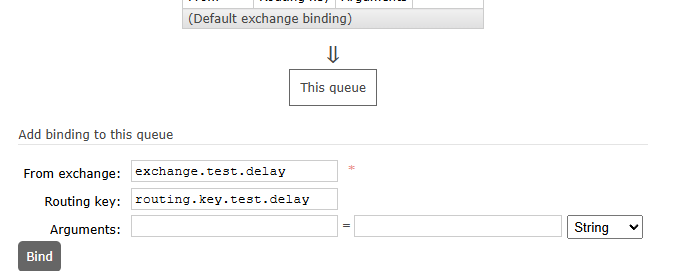

### 测试Code

**生产者端**

```java
/* 测试延迟消息 */
@Test
void delayedPublishTest() {

    // 在下面测试中，如果没有安装延迟插件，设置了 x-delay 没有作用
    MessagePostProcessor messagePostProcessor = message -> {
        // 10秒延迟
        message.getMessageProperties().setHeader("x-delay", 10000);
        return message;
    };

    rabbitTemplate.convertAndSend("exchange.test.delay",
            "routing.key.test.delay",
            "延迟消息插件：" + new SimpleDateFormat("yyyy-MM-dd HH:mm:ss").format(new Date()),
            messagePostProcessor
    );
}
```

**消费者端**

```java
/* 测试延迟消息 */
@RabbitListener(queues = "queue.test.delay")
public void processMessageDelay(String dataString, Channel channel, Message message) throws IOException, InterruptedException {
    log.info("<延迟消息>----消息本身{}", dataString);
    log.info("<延迟消息>----当前时间{}", new SimpleDateFormat("yyyy-MM-dd HH:mm:ss").format(new Date()));
}
```

## 消息事务

在 RabbitMQ 中使用事务（Transaction）可以确保消息的可靠性，但并不推荐在高并发场景下使用，因为它会带来显著的性能开销。以下是详细分析和替代方案建议：

**1. RabbitMQ 事务的机制**

通过 `channel.txSelect()`、`channel.txCommit()`、`channel.txRollback()` 实现：
```java
channel.txSelect(); // 开启事务
try {
    channel.basicPublish(exchange, routingKey, props, message.getBytes());
    // 其他业务操作（如数据库写入）
    channel.txCommit(); // 提交事务
} catch (Exception e) {
    channel.txRollback(); // 回滚事务
}
```

#### **存在的问题**
| 问题             | 说明                                                         |
| ---------------- | ------------------------------------------------------------ |
| **性能差**       | 事务会同步阻塞信道，吞吐量下降约 2~10 倍（实测数据）         |
| **伪原子性**     | 只能保证消息发送到 Broker，无法保证业务操作（如 DB 更新）的原子性 |
| **复杂场景失效** | 分布式系统中，跨服务的事务需依赖 Seata 等方案，MQ 事务无法覆盖 |

---

### **2. 生产环境推荐方案**
#### **（1）Confirm 模式（轻量级确认）**
- **原理**：异步确认消息是否成功到达 Broker。
- **配置方式**：
  ```java
  // 开启 Confirm 模式
  channel.confirmSelect();
  
  // 异步监听确认结果
  channel.addConfirmListener((deliveryTag, multiple) -> {
      // 消息成功投递
  }, (deliveryTag, multiple) -> {
      // 消息投递失败（可重试或记录日志）
  });
  ```
- **优点**：性能接近非事务模式，可靠性高。

#### **（2）消息补偿 + 幂等设计**
- **步骤**：
  1. 消息表记录发送状态（如 `status: sending/success/fail`）。
  2. 定时任务补偿失败消息。
  3. 消费者端做幂等处理（如唯一 ID + 去重表）。
- **适用场景**：订单支付、库存扣减等关键业务。

#### **（3）本地消息表（最终一致性）**
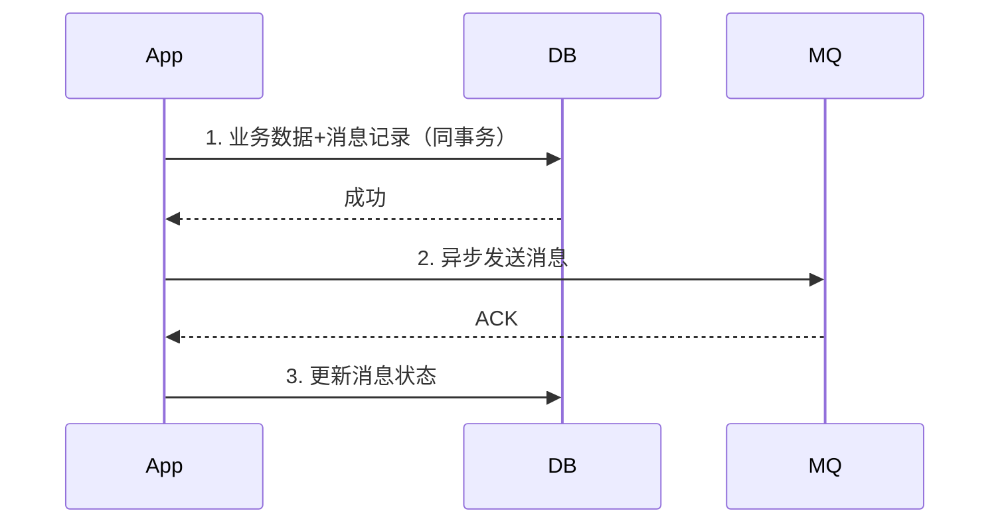

仅在以下情况考虑使用：
- **低频操作**：如日均消息量 < 1k。
- **强一致性要求**：且无法接受异步补偿的极端场景。
- **简单业务**：无嵌套调用（如纯消息发送无 DB 操作）。

| 模式         | 吞吐量（条/秒） | 延迟 | 可靠性 |
| ------------ | --------------- | ---- | ------ |
| 事务模式     | 500~1k          | 高   | 高     |
| Confirm 模式 | 10k~50k         | 低   | 高     |
| 无确认       | 50k+            | 极低 | 低     |

## 惰性队列

> [!NOTE]
>
> 1. **性能权衡**：惰性队列的吞吐量可能低于普通队列(尤其是内存队列)
> 2. **磁盘I/O压力**：会增加磁盘I/O操作，需要考虑磁盘性能
> 3. **不适合低延迟场景**：由于涉及磁盘操作，不适合对延迟极其敏感的场景

- 在创建队列时，在`Durability:`可以有两种选择：
  - Durable：持久化队列，消息持久化到硬盘上。
  - Transient：临时队列，不做持久化操作，broker重启后消息会丢失。

### 惰性队列的核心特点

1. **消息直接写入磁盘**：不像普通队列先将消息存入内存再刷盘
2. **按需加载到内存**：只有在消费者需要时才将消息加载到内存
3. **减少内存占用**：特别适合处理大量消息且消费速度较慢的场景

### 主要应用场景

#### 1. 大流量消息积压场景

- 当生产者速度远高于消费者速度时
- 传统队列可能导致内存溢出，而惰性队列能有效控制内存使用

#### 2. 长时间消息堆积

- 需要长时间存储大量消息(如日志、审计数据)
- 消息可能需要在队列中保留数小时甚至数天

#### 3. 高可用性要求场景

- 减少节点故障时的消息丢失风险(因为消息已持久化到磁盘)
- 配合镜像队列使用可提高系统可靠性

#### 4. 内存敏感环境

- 在内存资源有限的服务器上
- 需要处理大量消息但无法提供足够内存的情况

#### 5. 突发流量处理

- 能够吸收突发的大量消息而不影响系统稳定性
- 为消费者处理高峰流量提供缓冲时间

### 配置方式

可以通过以下方式声明惰性队列：

```java
// Java客户端示例
Map<String, Object> args = new HashMap<>();
args.put("x-queue-mode", "lazy");
channel.queueDeclare("myLazyQueue", true, false, false, args);
```