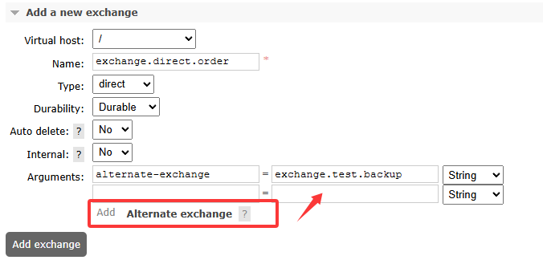

# RabbitMQ

## 基本示例

**生产者**

```java
@SpringBootTest
class MqDemoApplicationTests {

    @Autowired
    private RabbitTemplate rabbitTemplate;

    /**
     * 1. 测试发送消息，示例代码
     * 2. 测试成功的情况
     */
    @Test
    void publishTest() {
        String exchangeDirect = RabbitMQMessageListenerConstants.EXCHANGE_DIRECT;
        String routingKeyDirect = RabbitMQMessageListenerConstants.ROUTING_KEY_DIRECT;
        rabbitTemplate.convertAndSend(exchangeDirect, routingKeyDirect, "你好小球球~~~");

        Bunny bunny = Bunny.builder().rabbitName("Bunny").age(2).build();
        rabbitTemplate.convertAndSend(exchangeDirect, routingKeyDirect, JSON.toJSONString(bunny));
    }

}
```

**消费者**

```java
@Component
@Slf4j
public class MessageListenerOrder {

    @RabbitListener(bindings = @QueueBinding(
            exchange = @Exchange(value = EXCHANGE_DIRECT),
            value = @Queue(value = QUEUE_NAME, durable = "true"),
            key = ROUTING_KEY_DIRECT
    )
    )
    public void processMessage(String dataString, Message message, Channel channel) {
        System.out.println("消费端接受消息：" + dataString);
    }

}
```

## 可靠性

在Rabbi中队列和交换机都是持久化的，自动删除都是False。

### 生产者确认

**配置文件**

```yaml
rabbitmq:
  host: ${bunny.rabbitmq.host}
  port: ${bunny.rabbitmq.port}
  username: ${bunny.rabbitmq.username}
  password: ${bunny.rabbitmq.password}
  virtual-host: ${bunny.rabbitmq.virtual-host}
  publisher-confirm-type: correlated # 交换机确认
  publisher-returns: true # 队列确认
```

#### RabbitMQ配置

> [!NOTE]  
> **@PostConstruct 注解**  
> **作用**：在Bean依赖注入完成后执行初始化方法（构造器之后，`afterPropertiesSet()`之前）。  
>
> **特点**：  
> - 方法需**无参**、返回**void**，名称任意  
> - 执行顺序：构造器 → 依赖注入 → `@PostConstruct`  
> - 若抛出异常，Bean创建会失败  
>
> **注意**：  
> - 代理类（如`@Transactional`）中，会在**原始对象**初始化时调用  
> - `prototype`作用域的Bean每次创建均会执行  
> - 避免耗时操作，推荐轻量级初始化  
>
> **替代方案**：  
> `InitializingBean`接口 或 `@Bean(initMethod="xxx")`  

```java
@Slf4j
@Configuration
@RequiredArgsConstructor
public class RabbitConfiguration implements RabbitTemplate.ConfirmCallback, RabbitTemplate.ReturnsCallback {

    private final RabbitTemplate rabbitTemplate;

    @PostConstruct
    public void initRabbitTemplate() {
        rabbitTemplate.setConfirmCallback(this);
        rabbitTemplate.setReturnsCallback(this);
    }

    @Override
    public void confirm(CorrelationData correlationData, boolean ack, String cause) {
        System.out.println("============correlationData <回调函数打印> = " + correlationData);
        System.out.println("============ack <输出> = " + ack);
        System.out.println("============cause <输出> = " + cause);
    }

    @Override
    public void returnedMessage(ReturnedMessage returnedMessage) {
        // 发送到队列失败才会走这个
        log.error("消息主体:{}", returnedMessage.getMessage().getBody());
        log.error("应答码：{}", returnedMessage.getReplyCode());
        log.error("消息使用的父交换机：{}", returnedMessage.getExchange());
        log.error("消息使用的路由键：{}", returnedMessage.getRoutingKey());
    }
}
```

**测试失败的情况**

交换机找不到

```java
/* 测试失败交换机的情况 */
@Test
void publishExchangeErrorTest() {
    String exchangeDirect = RabbitMQMessageListenerConstants.EXCHANGE_DIRECT;
    String routingKeyDirect = RabbitMQMessageListenerConstants.ROUTING_KEY_DIRECT;
    rabbitTemplate.convertAndSend(exchangeDirect, routingKeyDirect, "----失败的消息发送----");

    Bunny bunny = Bunny.builder().rabbitName("Bunny").age(2).build();
    rabbitTemplate.convertAndSend(exchangeDirect + "~", routingKeyDirect, JSON.toJSONString(bunny));
}
```

队列找不到

```java
/* 测试失败队列的情况 */
@Test
void publishQueueErrorTest() {
    String exchangeDirect = RabbitMQMessageListenerConstants.EXCHANGE_DIRECT;
    String routingKeyDirect = RabbitMQMessageListenerConstants.ROUTING_KEY_DIRECT;
    rabbitTemplate.convertAndSend(exchangeDirect, routingKeyDirect, "----失败的队列发送----");

    Bunny bunny = Bunny.builder().rabbitName("Bunny").age(2).build();
    rabbitTemplate.convertAndSend(exchangeDirect, routingKeyDirect + "~", JSON.toJSONString(bunny));
}
```

#### 备份交换机

> [!NOTE]
>
> 创建好的交换机是无法修改的，只能删除重新建立。

创建广播类型的交换机，因为没有路由键，只能通过广播的方式去找。


创建与备份交换机的队列，交换机是广播的模式，不指定路由键。


通过指定`Alternate exchange`的交换机进行绑定。第一个填写的不是备份交换机，是投递交换机，之后通过`Alternate exchange`绑定备份的交换机。

