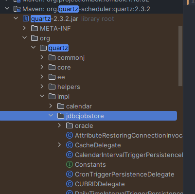
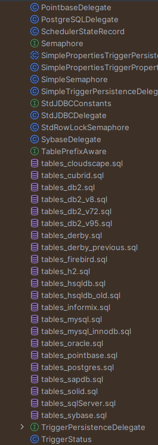
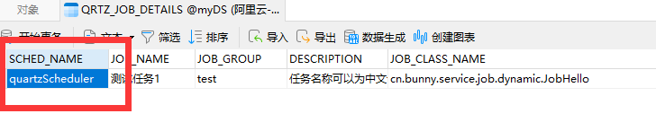

# quartz配置单独数据库

quartz默认安装时，她的包里面会有数据库相关内容，你可以自己去手动创建数据库，也可以使用自带的创建，这里以MySQL为例。

可能版本不一样，有的版本好像是不能自动创建的；我的版本是`2.3.2`。

这里主要说怎么连接数据库以及创建和连接数据库时一些问题。

```xml
<!-- quartz定时任务 -->
<dependency>
    <groupId>org.quartz-scheduler</groupId>
    <artifactId>quartz</artifactId>
    <version>2.3.2</version>
</dependency>
<dependency>
    <groupId>com.mchange</groupId>
    <artifactId>c3p0</artifactId>
    <version>0.9.5.5</version>
</dependency>
<!-- 直接找不到上下文 -->
<dependency>
    <groupId>org.springframework</groupId>
    <artifactId>spring-context-support</artifactId>
    <version>6.1.6</version>
</dependency>
```

> 如果想看动态添加、删除、暂停、恢复参考：https://gitee.com/BunnyBoss/quartz-demo

## quartz连接数据库

连接数据库如果不设置配置文件会使用默认数据库，包括在使用多数据源时，如果你使用的是多数据源配置，那么会自动找主数据库，在Service实现类上加上注解制定数据库是不行的，这也是毋庸置疑的。

如果需要两个数据库，想让quartz单独，需要写配置文件以及相关实现类。

### 配置数据库连接

`application.yml`中，需要将仓库类型设置为数据库表示以数据库作为存储。

```yml
quartz:
  # 使用数据库连接
  job-store-type: jdbc
  jdbc:
    # 是否设置数据库自动创建
    initialize-schema: always
  auto-startup: true
  wait-for-jobs-to-complete-on-shutdown: true
  overwrite-existing-jobs: false
```

> **这里自动创建需要注意，如果没有写类配置文件可以自动创建，但是写了就创建不了了。没有写之前我的项目是可以创建的，但是写了之后就无法自动创建了。**
>
> 如果不能自动创建可以创参考下面，我也将MySQL创建语句放在下面了。
>
> #### 手动创建数据库
>
> 手动去搜索包，找到里面你想要的数据库，数据库类型在下面图片，几乎主流数据库都有。
>
> > 数据库连接需要SQL文件，SQL文件在自带的包中也有，在这个文件夹下，之后只找到你的SQL版本。
> >
> > 
> >
> > 
> >
> > ```mysql
> > #
> > # Quartz seems to work best with the driver mm.mysql-2.0.7-bin.jar
> > #
> > # PLEASE consider using mysql with innodb tables to avoid locking issues
> > #
> > # In your Quartz properties file, you'll need to set
> > # org.quartz.jobStore.driverDelegateClass = org.quartz.impl.jdbcjobstore.StdJDBCDelegate
> > #
> > 
> > DROP TABLE IF EXISTS QRTZ_FIRED_TRIGGERS;
> > DROP TABLE IF EXISTS QRTZ_PAUSED_TRIGGER_GRPS;
> > DROP TABLE IF EXISTS QRTZ_SCHEDULER_STATE;
> > DROP TABLE IF EXISTS QRTZ_LOCKS;
> > DROP TABLE IF EXISTS QRTZ_SIMPLE_TRIGGERS;
> > DROP TABLE IF EXISTS QRTZ_SIMPROP_TRIGGERS;
> > DROP TABLE IF EXISTS QRTZ_CRON_TRIGGERS;
> > DROP TABLE IF EXISTS QRTZ_BLOB_TRIGGERS;
> > DROP TABLE IF EXISTS QRTZ_TRIGGERS;
> > DROP TABLE IF EXISTS QRTZ_JOB_DETAILS;
> > DROP TABLE IF EXISTS QRTZ_CALENDARS;
> > 
> > 
> > CREATE TABLE QRTZ_JOB_DETAILS
> >   (
> >     SCHED_NAME VARCHAR(120) NOT NULL,
> >     JOB_NAME  VARCHAR(200) NOT NULL,
> >     JOB_GROUP VARCHAR(200) NOT NULL,
> >     DESCRIPTION VARCHAR(250) NULL,
> >     JOB_CLASS_NAME   VARCHAR(250) NOT NULL,
> >     IS_DURABLE VARCHAR(1) NOT NULL,
> >     IS_NONCONCURRENT VARCHAR(1) NOT NULL,
> >     IS_UPDATE_DATA VARCHAR(1) NOT NULL,
> >     REQUESTS_RECOVERY VARCHAR(1) NOT NULL,
> >     JOB_DATA BLOB NULL,
> >     PRIMARY KEY (SCHED_NAME,JOB_NAME,JOB_GROUP)
> > );
> > 
> > CREATE TABLE QRTZ_TRIGGERS
> >   (
> >     SCHED_NAME VARCHAR(120) NOT NULL,
> >     TRIGGER_NAME VARCHAR(200) NOT NULL,
> >     TRIGGER_GROUP VARCHAR(200) NOT NULL,
> >     JOB_NAME  VARCHAR(200) NOT NULL,
> >     JOB_GROUP VARCHAR(200) NOT NULL,
> >     DESCRIPTION VARCHAR(250) NULL,
> >     NEXT_FIRE_TIME BIGINT(13) NULL,
> >     PREV_FIRE_TIME BIGINT(13) NULL,
> >     PRIORITY INTEGER NULL,
> >     TRIGGER_STATE VARCHAR(16) NOT NULL,
> >     TRIGGER_TYPE VARCHAR(8) NOT NULL,
> >     START_TIME BIGINT(13) NOT NULL,
> >     END_TIME BIGINT(13) NULL,
> >     CALENDAR_NAME VARCHAR(200) NULL,
> >     MISFIRE_INSTR SMALLINT(2) NULL,
> >     JOB_DATA BLOB NULL,
> >     PRIMARY KEY (SCHED_NAME,TRIGGER_NAME,TRIGGER_GROUP),
> >     FOREIGN KEY (SCHED_NAME,JOB_NAME,JOB_GROUP)
> >         REFERENCES QRTZ_JOB_DETAILS(SCHED_NAME,JOB_NAME,JOB_GROUP)
> > );
> > 
> > CREATE TABLE QRTZ_SIMPLE_TRIGGERS
> >   (
> >     SCHED_NAME VARCHAR(120) NOT NULL,
> >     TRIGGER_NAME VARCHAR(200) NOT NULL,
> >     TRIGGER_GROUP VARCHAR(200) NOT NULL,
> >     REPEAT_COUNT BIGINT(7) NOT NULL,
> >     REPEAT_INTERVAL BIGINT(12) NOT NULL,
> >     TIMES_TRIGGERED BIGINT(10) NOT NULL,
> >     PRIMARY KEY (SCHED_NAME,TRIGGER_NAME,TRIGGER_GROUP),
> >     FOREIGN KEY (SCHED_NAME,TRIGGER_NAME,TRIGGER_GROUP)
> >         REFERENCES QRTZ_TRIGGERS(SCHED_NAME,TRIGGER_NAME,TRIGGER_GROUP)
> > );
> > 
> > CREATE TABLE QRTZ_CRON_TRIGGERS
> >   (
> >     SCHED_NAME VARCHAR(120) NOT NULL,
> >     TRIGGER_NAME VARCHAR(200) NOT NULL,
> >     TRIGGER_GROUP VARCHAR(200) NOT NULL,
> >     CRON_EXPRESSION VARCHAR(200) NOT NULL,
> >     TIME_ZONE_ID VARCHAR(80),
> >     PRIMARY KEY (SCHED_NAME,TRIGGER_NAME,TRIGGER_GROUP),
> >     FOREIGN KEY (SCHED_NAME,TRIGGER_NAME,TRIGGER_GROUP)
> >         REFERENCES QRTZ_TRIGGERS(SCHED_NAME,TRIGGER_NAME,TRIGGER_GROUP)
> > );
> > 
> > CREATE TABLE QRTZ_SIMPROP_TRIGGERS
> >   (
> >     SCHED_NAME VARCHAR(120) NOT NULL,
> >     TRIGGER_NAME VARCHAR(200) NOT NULL,
> >     TRIGGER_GROUP VARCHAR(200) NOT NULL,
> >     STR_PROP_1 VARCHAR(512) NULL,
> >     STR_PROP_2 VARCHAR(512) NULL,
> >     STR_PROP_3 VARCHAR(512) NULL,
> >     INT_PROP_1 INT NULL,
> >     INT_PROP_2 INT NULL,
> >     LONG_PROP_1 BIGINT NULL,
> >     LONG_PROP_2 BIGINT NULL,
> >     DEC_PROP_1 NUMERIC(13,4) NULL,
> >     DEC_PROP_2 NUMERIC(13,4) NULL,
> >     BOOL_PROP_1 VARCHAR(1) NULL,
> >     BOOL_PROP_2 VARCHAR(1) NULL,
> >     PRIMARY KEY (SCHED_NAME,TRIGGER_NAME,TRIGGER_GROUP),
> >     FOREIGN KEY (SCHED_NAME,TRIGGER_NAME,TRIGGER_GROUP)
> >     REFERENCES QRTZ_TRIGGERS(SCHED_NAME,TRIGGER_NAME,TRIGGER_GROUP)
> > );
> > 
> > CREATE TABLE QRTZ_BLOB_TRIGGERS
> >   (
> >     SCHED_NAME VARCHAR(120) NOT NULL,
> >     TRIGGER_NAME VARCHAR(200) NOT NULL,
> >     TRIGGER_GROUP VARCHAR(200) NOT NULL,
> >     BLOB_DATA BLOB NULL,
> >     PRIMARY KEY (SCHED_NAME,TRIGGER_NAME,TRIGGER_GROUP),
> >     FOREIGN KEY (SCHED_NAME,TRIGGER_NAME,TRIGGER_GROUP)
> >         REFERENCES QRTZ_TRIGGERS(SCHED_NAME,TRIGGER_NAME,TRIGGER_GROUP)
> > );
> > 
> > CREATE TABLE QRTZ_CALENDARS
> >   (
> >     SCHED_NAME VARCHAR(120) NOT NULL,
> >     CALENDAR_NAME  VARCHAR(200) NOT NULL,
> >     CALENDAR BLOB NOT NULL,
> >     PRIMARY KEY (SCHED_NAME,CALENDAR_NAME)
> > );
> > 
> > CREATE TABLE QRTZ_PAUSED_TRIGGER_GRPS
> >   (
> >     SCHED_NAME VARCHAR(120) NOT NULL,
> >     TRIGGER_GROUP  VARCHAR(200) NOT NULL,
> >     PRIMARY KEY (SCHED_NAME,TRIGGER_GROUP)
> > );
> > 
> > CREATE TABLE QRTZ_FIRED_TRIGGERS
> >   (
> >     SCHED_NAME VARCHAR(120) NOT NULL,
> >     ENTRY_ID VARCHAR(95) NOT NULL,
> >     TRIGGER_NAME VARCHAR(200) NOT NULL,
> >     TRIGGER_GROUP VARCHAR(200) NOT NULL,
> >     INSTANCE_NAME VARCHAR(200) NOT NULL,
> >     FIRED_TIME BIGINT(13) NOT NULL,
> >     SCHED_TIME BIGINT(13) NOT NULL,
> >     PRIORITY INTEGER NOT NULL,
> >     STATE VARCHAR(16) NOT NULL,
> >     JOB_NAME VARCHAR(200) NULL,
> >     JOB_GROUP VARCHAR(200) NULL,
> >     IS_NONCONCURRENT VARCHAR(1) NULL,
> >     REQUESTS_RECOVERY VARCHAR(1) NULL,
> >     PRIMARY KEY (SCHED_NAME,ENTRY_ID)
> > );
> > 
> > CREATE TABLE QRTZ_SCHEDULER_STATE
> >   (
> >     SCHED_NAME VARCHAR(120) NOT NULL,
> >     INSTANCE_NAME VARCHAR(200) NOT NULL,
> >     LAST_CHECKIN_TIME BIGINT(13) NOT NULL,
> >     CHECKIN_INTERVAL BIGINT(13) NOT NULL,
> >     PRIMARY KEY (SCHED_NAME,INSTANCE_NAME)
> > );
> > 
> > CREATE TABLE QRTZ_LOCKS
> >   (
> >     SCHED_NAME VARCHAR(120) NOT NULL,
> >     LOCK_NAME  VARCHAR(40) NOT NULL,
> >     PRIMARY KEY (SCHED_NAME,LOCK_NAME)
> > );
> > 
> > 
> > commit;
> > ```
>

### 配置文件编写

光写配置文件是没用的，这个配置文件写完，如果不写配置类是不生效的。

- `instanceName`这个要注意下，如果你的名称为现在的`quartzScheduler`，如果将这个名称换成`MyScheduler`那么你所制定所有的带`quartzScheduler`任务都不会执行，相反如果你的任务是`MyScheduler`但是你想执行之前任务是`quartzScheduler`也无法执行，只有当你的名称改为指定的才可以正常启动！！！
- 特别要注意`org.quartz.dataSource.xxx`后面的`xxx`是你的数据库名称！！！否则连接不上



```
# 就是上面所说的用处
org.quartz.scheduler.instanceName=MyScheduler
# 最大线程数
org.quartz.threadPool.threadCount=5
org.quartz.jobStore.class=org.quartz.impl.jdbcjobstore.JobStoreTX
org.quartz.jobStore.driverDelegateClass=org.quartz.impl.jdbcjobstore.StdJDBCDelegate
# 数据库连接的前缀，如果你是默认按照官方数据库生成就写这个
org.quartz.jobStore.tablePrefix=QRTZ_
# 连接的数据库名称
org.quartz.jobStore.dataSource=quartz
# 数据库连接驱动
org.quartz.dataSource.quartz.driver=com.mysql.cj.jdbc.Driver
# 数据库连接地址
org.quartz.dataSource.quartz.URL=jdbc:mysql://192.168.3.98:3306/quartz?serverTimezone=GMT%2B8&useSSL=false&characterEncoding=utf-8&allowPublicKeyRetrieval=true
# 数据库连接用户名
org.quartz.dataSource.quartz.user=root
# 数据库连接密码
org.quartz.dataSource.quartz.password=123456
# 最大连接数
org.quartz.dataSource.quartz.maxConnections=5
```

> ### 注意事项
>
> 在连接数据库时需要注意这下面几行配置当中的`xxx.xxxx.xxx.quartz.xxx`，其中`quartz`指的是你的数据库名称
>
> ```properties
> org.quartz.jobStore.dataSource=quartz
> org.quartz.dataSource.quartz.driver=com.mysql.cj.jdbc.Driver
> org.quartz.dataSource.quartz.URL=jdbc:mysql://192.168.3.98:3306/quartz?serverTimezone=GMT%2B8&useSSL=false&characterEncoding=utf-8&allowPublicKeyRetrieval=true
> org.quartz.dataSource.quartz.user=root
> org.quartz.dataSource.quartz.password=123456
> org.quartz.dataSource.quartz.maxConnections=5
> ```
>
> #### 例子
>
> 如果你的数据库名称叫`bunnyQuartz`，那么下面应当换成
>
> ```properties
> org.quartz.jobStore.dataSource=bunnyQuartz
> org.quartz.dataSource.bunnyQuartz.driver=com.mysql.cj.jdbc.Driver
> org.quartz.dataSource.bunnyQuartz.URL=jdbc:mysql://192.168.3.98:3306/bunnyQuartz?serverTimezone=GMT%2B8&useSSL=false&characterEncoding=utf-8&allowPublicKeyRetrieval=true
> org.quartz.dataSource.bunnyQuartz.user=root
> org.quartz.dataSource.bunnyQuartz.password=123456
> org.quartz.dataSource.bunnyQuartz.maxConnections=5
> ```
>

### 配置类编写

#### 工厂类

```java
package cn.bunny.service.quartz;

import lombok.extern.slf4j.Slf4j;
import org.jetbrains.annotations.NotNull;
import org.quartz.spi.TriggerFiredBundle;
import org.springframework.beans.factory.annotation.Autowired;
import org.springframework.beans.factory.config.AutowireCapableBeanFactory;
import org.springframework.scheduling.quartz.AdaptableJobFactory;
import org.springframework.stereotype.Component;

@Component
@Slf4j
public class QuartzJobFactory extends AdaptableJobFactory {

    // 这个对象Spring会帮我们自动注入进来
    @Autowired
    private AutowireCapableBeanFactory capableBeanFactory;

    // 重写创建Job任务的实例方法
    @NotNull
    @Override
    protected Object createJobInstance(@NotNull TriggerFiredBundle bundle) throws Exception {
        Object jobInstance = super.createJobInstance(bundle);
        // 通过以下方式，解决Job任务无法使用Spring中的Bean问题
        capableBeanFactory.autowireBean(jobInstance);
        return super.createJobInstance(bundle);
    }
}
```

#### 配置类

我定的延迟，5秒感觉要有点久了，我想防止程序一开始就启动想让她往后面一点。

其次要注意你的配置文件名称一定要和`ClassPathResource`中名称一样！！！

```java
package cn.bunny.service.quartz;

import org.quartz.Scheduler;
import org.springframework.beans.factory.annotation.Autowired;
import org.springframework.beans.factory.config.PropertiesFactoryBean;
import org.springframework.context.annotation.Bean;
import org.springframework.context.annotation.Configuration;
import org.springframework.core.io.ClassPathResource;
import org.springframework.scheduling.quartz.SchedulerFactoryBean;

import java.io.IOException;
import java.util.Properties;

@Configuration
public class QuartzConfiguration {

    @Autowired
    private QuartzJobFactory quartzJobFactory;

    //创建调度器工厂
    @Bean
    public SchedulerFactoryBean schedulerFactoryBean(){
        //1.创建SchedulerFactoryBean
        //2.加载自定义的quartz.properties配置文件
        //3.设置MyJobFactory
        SchedulerFactoryBean factoryBean=new SchedulerFactoryBean();
        try {
            factoryBean.setAutoStartup(true);
            factoryBean.setStartupDelay(5);//延时5秒启动
            factoryBean.setQuartzProperties(quartzProperties());
            factoryBean.setJobFactory(quartzJobFactory);
            return factoryBean;
        } catch (IOException e) {
            throw new RuntimeException(e);
        }
    }

    @Bean
    public Properties quartzProperties() throws IOException {
        PropertiesFactoryBean propertiesFactoryBean=new PropertiesFactoryBean();
        propertiesFactoryBean.setLocation(new ClassPathResource("/quartz.properties"));
        propertiesFactoryBean.afterPropertiesSet();
        return propertiesFactoryBean.getObject();
    }

    @Bean(name="scheduler")
    public Scheduler scheduler(){
        return schedulerFactoryBean().getScheduler();
    }
}
```

> 之前尝试过将这个改成`yml`文件但是必须要添加一次任务才可以启动，暂不清楚原因。

## 常见问题

### 连接中报错

缺少依赖导致无法启动。

如果报错类型有下面的，添加包，包的版本根据你的项目而定，我的是SpringBoot3.x的

```xml
<dependency>
    <groupId>com.mchange</groupId>
    <artifactId>c3p0</artifactId>
    <version>0.9.5.5</version> <!-- 请使用适合你项目的版本 -->
</dependency>
```

如果报错类型有下面的

```properties
org.quartz.SchedulerException: Could not initialize DataSource: myDS
 [See nested exception: org.quartz.SchedulerException: ConnectionProvider class 'org.quartz.utils.C3p0PoolingConnectionProvider' could not be instantiated. [See nested exception: java.lang.reflect.InvocationTargetException]]
	at org.quartz.impl.StdSchedulerFactory.instantiate(StdSchedulerFactory.java:1054)
	at org.quartz.impl.StdSchedulerFactory.getScheduler(StdSchedulerFactory.java:1579)
	at org.quartz.impl.StdSchedulerFactory.getDefaultScheduler(StdSchedulerFactory.java:1595)
	at cn.bunny.service.job.MyJobTest.test4(MyJobTest.java:62)
	at java.base/java.lang.reflect.Method.invoke(Method.java:580)
	at java.base/java.util.ArrayList.forEach(ArrayList.java:1597)
	at java.base/java.util.ArrayList.forEach(ArrayList.java:1597)
Caused by: org.quartz.SchedulerException: ConnectionProvider class 'org.quartz.utils.C3p0PoolingConnectionProvider' could not be instantiated. [See nested exception: java.lang.reflect.InvocationTargetException]
	at org.quartz.impl.StdSchedulerFactory.instantiate(StdSchedulerFactory.java:1044)
	... 6 more
Caused by: java.lang.reflect.InvocationTargetException
	at java.base/jdk.internal.reflect.DirectConstructorHandleAccessor.newInstance(DirectConstructorHandleAccessor.java:74)
	at java.base/java.lang.reflect.Constructor.newInstanceWithCaller(Constructor.java:502)
	at java.base/java.lang.reflect.Constructor.newInstance(Constructor.java:486)
	at org.quartz.impl.StdSchedulerFactory.instantiate(StdSchedulerFactory.java:1042)
	... 6 more
Caused by: java.lang.NoClassDefFoundError: com/mchange/v2/async/ThreadPoolReportingAsynchronousRunner
	at com.mchange.v2.c3p0.C3P0Registry.<clinit>(C3P0Registry.java:184)
	at com.mchange.v2.c3p0.impl.PoolBackedDataSourceBase.<init>(PoolBackedDataSourceBase.java:289)
	at com.mchange.v2.c3p0.impl.AbstractPoolBackedDataSource.<init>(AbstractPoolBackedDataSource.java:39)
	at com.mchange.v2.c3p0.AbstractComboPooledDataSource.<init>(AbstractComboPooledDataSource.java:107)
	at com.mchange.v2.c3p0.AbstractComboPooledDataSource.<init>(AbstractComboPooledDataSource.java:103)
	at com.mchange.v2.c3p0.ComboPooledDataSource.<init>(ComboPooledDataSource.java:12)
	at org.quartz.utils.C3p0PoolingConnectionProvider.initialize(C3p0PoolingConnectionProvider.java:186)
	at org.quartz.utils.C3p0PoolingConnectionProvider.<init>(C3p0PoolingConnectionProvider.java:131)
	at java.base/jdk.internal.reflect.DirectConstructorHandleAccessor.newInstance(DirectConstructorHandleAccessor.java:62)
	... 9 more
Caused by: java.lang.ClassNotFoundException: com.mchange.v2.async.ThreadPoolReportingAsynchronousRunner
	at java.base/jdk.internal.loader.BuiltinClassLoader.loadClass(BuiltinClassLoader.java:641)
	at java.base/jdk.internal.loader.ClassLoaders$AppClassLoader.loadClass(ClassLoaders.java:188)
	at java.base/java.lang.ClassLoader.loadClass(ClassLoader.java:525)
	... 18 more
```

