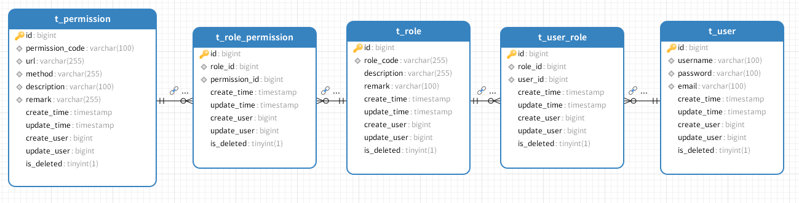

# Spring Security 6 入门指南

> [!TIP]
>
> 打包：mvn clean package -DskipTests

整个数据库的表构建差不多是这样的，也是简化的，作为一个小demo讲解。



## 基本配置

### 添加依赖

在Maven项目中添加Spring Security依赖：
```xml
<dependency>
    <groupId>org.springframework.boot</groupId>
    <artifactId>spring-boot-starter-security</artifactId>
</dependency>
```

### 基础安全配置

这个注解可以放在任何的配置类或者是启动项上。

创建一个配置类启用Web安全：
```java
@EnableWebSecurity
@Configuration
public class SecurityWebConfiguration {
}
```

## 自定义登录配置

> [!IMPORTANT]
>
> 使用自定义页面时，必须在控制器中明确指定跳转地址，否则Security无法正确路由，即使URL正确也无法跳转。

### 启用与禁用选项
- 使用默认登录页：`.formLogin(Customizer.withDefaults())`
- 禁用表单登录：`.formLogin(AbstractHttpConfigurer::disable)`

> 上述不仅适用于登录页。同样也适用于csrf等一些其它组件。

### 配置示例

```java
@Configuration
@EnableWebSecurity
@EnableMethodSecurity
@RequiredArgsConstructor
public class SecurityWebConfiguration {

    private final DbUserDetailService dbUserDetailService;

    @Bean
    SecurityFilterChain filterChain(HttpSecurity http) throws Exception {

        http.authorizeHttpRequests(authorizeRequests ->
                        // 访问路径为 /api 时需要进行认证
                        authorizeRequests
                                // 只认证 /api/** 下的所有接口
                                .requestMatchers("/api/**").authenticated()
                                // 其余请求都放行
                                .anyRequest().permitAll()
                )
                .formLogin(loginPage -> loginPage
                        // 自定义登录页路径
                        .loginPage("/login-page")
                        // 处理登录的URL（默认就是/login）
                        .loginProcessingUrl("/login")
                        // 登录成功跳转
                        .defaultSuccessUrl("/")
                        // 登录失败跳转
                        .failureUrl("/login-page?error=true")
                        .permitAll()
                )
                // 使用默认的登录
                // .formLogin(Customizer.withDefaults())
                // 禁用表单登录
                // .formLogin(AbstractHttpConfigurer::disable)
                .logout(logout -> logout
                        .logoutSuccessUrl("/login-page?logout=true")
                        .permitAll()
                )
                .csrf(AbstractHttpConfigurer::disable)
                .exceptionHandling(configurer -> configurer
                        // 自定无权访问返回内容
                        .accessDeniedHandler(new SecurityAccessDeniedHandler())
                        // 自定义未授权返回内容
                        .authenticationEntryPoint(new SecurityAuthenticationEntryPoint())
                )

                .userDetailsService(dbUserDetailService)
        ;

        return http.build();
    }
}
```

1. **配置内存用户：**

> [!WARNING] 
>
> 可以作为测试使用，或者是应急访问使用，比如管理员账号密码忘了。
>
> 如果是长期使用是不推荐的。
>
> ⚠️ 生产环境通常不推荐常规使用内存用户。

```java
@Bean
@ConditionalOnMissingBean(UserDetailsService.class)
InMemoryUserDetailsManager inMemoryUserDetailsManager(PasswordEncoder passwordEncoder) {
    String encodedPassword = passwordEncoder.encode("123456");
    
    UserDetails user = User.builder()
        .username("user")
        .password(encodedPassword)
        .roles("USER")
        .authorities("read")
        .build();
        
    UserDetails admin = User.builder()
        .username("admin")
        .password(encodedPassword)
        .roles("ADMIN")
        .authorities("all", "read")
        .build();
        
    return new InMemoryUserDetailsManager(user, admin);
}
```

## URL认证与授权配置

> [!NOTE]
>
> 一般在`http.authorizeHttpRequests`配置的都是粗粒度的，在方法上是细粒度的。
>
> 所使用的内容根据业务而定。

### 1. 基本角色认证拦截

**基本介绍**

- 如果匹配的地址较多可以创建数组，之后将数组传入

- 数组可以允许全部通过也可以全部鉴权。

```java
String[] permitAllUrls = {
    "/", "/doc.html/**",
    "/webjars/**", "/images/**", ".well-known/**", "favicon.ico", "/error/**",
    "/v3/api-docs/**"
};

http.authorizeHttpRequests(authorizeRequests ->
    authorizeRequests
        .requestMatchers("/api/**").authenticated()
        .requestMatchers(permitAllUrls).permitAll()
)
```

> [!NOTE]
>
> 通过`SecurityContextHolder`查看下当前用户的信息。
>
> 详细的可以看下与项目的接口地址：`/api/security/current-user`

1. ##### 单角色配置

配置`/api/**`路径下的所有接口需要`ADMIN`角色才能访问：

```java
@Bean
SecurityFilterChain filterChain(HttpSecurity http) throws Exception {
    http.authorizeHttpRequests(authorize -> authorize
            // 注意：会自动添加"ROLE_"前缀，实际检查的是ROLE_ADMIN
            .requestMatchers("/api/**").hasRole("ADMIN")
        )
        // 其他配置...
    ;
    return http.build();
}
```

##### 多角色配置（满足任一角色即可访问）

```java
@Bean
SecurityFilterChain filterChain(HttpSecurity http) throws Exception {
    http.authorizeHttpRequests(authorize -> authorize
            // 检查是否有ADMIN或USER角色（自动添加ROLE_前缀）
            .requestMatchers("/api/**").hasAnyRole("ADMIN", "USER")
        )
        // 其他配置...
    ;
    return http.build();
}
```

### 2. 基于权限的URL访问控制

#### 需要所有指定权限

```java
@Bean
SecurityFilterChain filterChain(HttpSecurity http) throws Exception {
    http.authorizeHttpRequests(authorize -> authorize
            // 需要同时拥有"all"和"read"权限
            .requestMatchers("/api/**").hasAuthority("all")
            .requestMatchers("/api/**").hasAuthority("read")
        )
        // 其他配置...
    ;
    return http.build();
}
```

#### 满足任一权限即可

```java
@Bean
SecurityFilterChain filterChain(HttpSecurity http) throws Exception {
    http.authorizeHttpRequests(authorize -> authorize
            // 拥有"all"或"read"任一权限即可访问
            .requestMatchers("/api/**").hasAnyAuthority("all", "read")
        )
        // 其他配置...
    ;
    return http.build();
}
```

### 综合配置策略

#### 1. 基本配置模式

```java
@Bean
SecurityFilterChain filterChain(HttpSecurity http) throws Exception {
    http.authorizeHttpRequests(authorize -> authorize
            // 特定路径需要认证
            .requestMatchers("/api/**").authenticated()
            // 其他请求全部放行
            .anyRequest().permitAll()
        )
        // 其他配置...
    ;
    return http.build();
}
```

#### 2. 多路径匹配配置

```java
@Bean
SecurityFilterChain filterChain(HttpSecurity http) throws Exception {
    // 定义无需认证的白名单路径
    String[] permitAllUrls = {
        "/", "/doc.html/**",
        "/webjars/**", "/images/**", 
        "/.well-known/**", "/favicon.ico", 
        "/error/**", "/swagger-ui/**", 
        "/v3/api-docs/**"
    };

    http.authorizeHttpRequests(authorize -> authorize
            // API路径需要认证
            .requestMatchers("/api/**").authenticated()
            // 白名单路径直接放行
            .requestMatchers(permitAllUrls).permitAll()
            // 其他请求需要登录（非匿名访问）
            .anyRequest().authenticated()
        )
        // 其他配置...
    ;
    return http.build();
}
```

### 完整配置示例

```java
@EnableMethodSecurity
@EnableWebSecurity
@Configuration
public class SecurityWebConfiguration {

    @Bean
    SecurityFilterChain filterChain(HttpSecurity http) throws Exception {
        String[] permitAllUrls = {
            "/", "/doc.html/**",
            "/webjars/**", "/images/**", ".well-known/**", "favicon.ico", "/error/**",
            "/v3/api-docs/**"
        };

        http.authorizeHttpRequests(authorizeRequests ->
                authorizeRequests
                    .requestMatchers(permitAllUrls).permitAll()
                    .requestMatchers("/api/security/**").permitAll()
                    .requestMatchers(HttpMethod.GET, "/api/anonymous/**").anonymous()
                    .requestMatchers("/api/**").hasAnyAuthority("all", "read")
            )
            .formLogin(loginPage -> loginPage
                .loginPage("/login-page")
                .loginProcessingUrl("/login")
                .defaultSuccessUrl("/")
                .failureUrl("/login-page?error=true")
                .permitAll()
            )
            .logout(logout -> logout
                .logoutSuccessUrl("/login-page?logout=true")
                .permitAll()
            );
        return http.build();
    }
}
```

## 密码校验器

> [!TIP]
>
> 这个是为下面的UserDetailsService做铺垫的。

密码校验器可以自己实现，通常Security为我们提供的就足够使用了，如果是一些老项目迁移等，可以自定义MD5密码校验器。

```java
/**
 * 配置密码编码器Bean
 * 
 * <p>Spring Security提供了多种密码编码器实现，推荐使用BCryptPasswordEncoder作为默认选择。</p>
 * 
 * <p>特点：</p>
 * <ul>
 *   <li>BCryptPasswordEncoder - 使用bcrypt强哈希算法，自动加盐，是当前最推荐的密码编码器</li>
 *   <li>Argon2PasswordEncoder - 使用Argon2算法，抗GPU/ASIC攻击，但需要更多内存</li>
 *   <li>SCryptPasswordEncoder - 使用scrypt算法，内存密集型，抗硬件攻击</li>
 *   <li>Pbkdf2PasswordEncoder - 使用PBKDF2算法，较老但广泛支持</li>
 * </ul>
 * 
 * <p>注意：不推荐使用MD5等弱哈希算法，Spring官方也不推荐自定义弱密码编码器。</p>
 * 
 * @return PasswordEncoder 密码编码器实例
 * @see BCryptPasswordEncoder
 */
@Bean
public PasswordEncoder passwordEncoder() {
    // 实际项目中只需返回一个密码编码器
    return new BCryptPasswordEncoder();
    
    // 其他编码器示例（根据需求选择一种）:
    // return new Argon2PasswordEncoder(16, 32, 1, 1 << 14, 2);
    // return new SCryptPasswordEncoder();
    // return new Pbkdf2PasswordEncoder("secret", 185000, 256);
}
```

### 密码校验器的作用和特点

#### 作用

密码校验器(PasswordEncoder)在Spring Security中负责：

1. 密码加密 - 将明文密码转换为不可逆的哈希值
2. 密码验证 - 比较输入的密码与存储的哈希是否匹配
3. 防止密码泄露 - 即使数据库泄露，攻击者也无法轻易获得原始密码

#### 各编码器特点

1. **BCryptPasswordEncoder**
   - 使用bcrypt算法
   - 自动加盐，防止彩虹表攻击
   - 可配置强度参数(默认10)
   - 目前最推荐的密码哈希方案
2. **Argon2PasswordEncoder**
   - 使用Argon2算法(2015年密码哈希比赛获胜者)
   - 抗GPU/ASIC攻击
   - 内存密集型，参数配置复杂
   - 适合高安全需求场景
3. **SCryptPasswordEncoder**
   - 使用scrypt算法
   - 内存密集型，抗硬件攻击
   - 比bcrypt更抗ASIC攻击
4. **Pbkdf2PasswordEncoder**
   - 使用PBKDF2算法
   - 较老的算法，但广泛支持
   - 需要高迭代次数才安全

#### 最佳实践

**最佳实践是使用BCryptPasswordEncoder**，原因包括：

1. 它是Spring Security默认推荐的编码器
2. 自动处理盐值，无需额外存储
3. 经过充分的安全审查和实际验证
4. 平衡了安全性和性能
5. 广泛支持，易于配置

在Spring Security 5+版本中，BCryptPasswordEncoder是官方文档中首推的密码编码器实现。除非有特殊安全需求，否则应优先选择它。

### 实现自定义校验器

在Spring Security中，自定义密码编码器需要实现`PasswordEncoder`接口。

以下是实现MD5示例及注意事项：

```java
/**
 * <h1>MD5密码编码器实现</h1>
 *
 * <strong>安全警告：</strong>此类使用MD5算法进行密码哈希，已不再安全，不推荐用于生产环境。
 *
 * <p>MD5算法因其计算速度快且易受彩虹表攻击而被认为不安全。即使密码哈希本身是单向的，
 * 但现代计算能力使得暴力破解和预先计算的彩虹表攻击变得可行。</p>
 *
 * <p>Spring Security推荐使用BCrypt、PBKDF2、Argon2或Scrypt等自适应单向函数替代MD5。</p>
 *
 * @see PasswordEncoder
 * 一般仅用于遗留系统兼容，新系统应使用更安全的密码编码器
 */
public class MD5PasswordEncoder implements PasswordEncoder {

    @Override
    public String encode(CharSequence rawPassword) {
        if (rawPassword == null) {
            throw new IllegalArgumentException("原始密码不能为null");
        }

        byte[] md5Digest = DigestUtils.md5Digest(rawPassword.toString().getBytes());
        return HexFormat.of().formatHex(md5Digest);
    }

    @Override
    public boolean matches(CharSequence rawPassword, String encodedPassword) {
        if (rawPassword == null) {
            throw new IllegalArgumentException("原始密码不能为null");
        }

        if (!StringUtils.hasText(encodedPassword)) {
            return false;
        }

        return encodedPassword.equalsIgnoreCase(encode(rawPassword));
    }

    @Override
    public boolean upgradeEncoding(String encodedPassword) {
        // MD5已不安全，始终返回true建议升级到更安全的算法
        return true;
    }
}
```

## 自定义UserDetailsService

在Spring Security中，如果需要自定义用户认证逻辑，可以通过实现`UserDetailsService`接口来完成。以下是正确实现方式：

### 标准实现示例

```java
@Service
public class CustomUserDetailsService implements UserDetailsService {

    private final PasswordEncoder passwordEncoder;

    // 推荐使用构造器注入
    public CustomUserDetailsService(PasswordEncoder passwordEncoder) {
        this.passwordEncoder = passwordEncoder;
    }

    @Override
    public UserDetails loadUserByUsername(String username) throws UsernameNotFoundException {
        // 1. 这里应该根据username从数据库或其他存储中查询用户信息
        // 以下是模拟数据，实际应用中应从数据库查询
        
        // 2. 如果用户不存在，抛出UsernameNotFoundException
        if (!"bunny".equalsIgnoreCase(username)) {
            throw new UsernameNotFoundException("User not found: " + username);
        }
        
        // 3. 构建UserDetails对象返回
        return User.builder()
                .username(username)  // 使用传入的用户名
                .password(passwordEncoder.encode("123456"))  // 密码应该已经加密存储，这里仅为示例
                .roles("USER")  // 角色会自动添加ROLE_前缀
                .authorities("read", "write")  // 添加具体权限
                .build();
    }
}
```

### 当前用户登录信息

> [!TIP]
>
> 下面是控制器中的方法摘自同步的项目中，项目模块是【step2】。

用户的信息都保存在`SecurityContextHolder.getContext()`的上下文中。

```java
/**
 * 获取当前认证用户的基本信息
 * 使用Spring Security的SecurityContextHolder获取当前认证信息
 */
@Operation(summary = "当前用户的信息", description = "当前用户的信息")
@GetMapping("/current-user")
public Authentication getCurrentUser() {
    // 从SecurityContextHolder获取当前认证对象
    Authentication auth = SecurityContextHolder.getContext().getAuthentication();
    
    // 打印当前用户名和权限信息到控制台（用于调试）
    System.out.println("Current user: " + auth.getName());
    System.out.println("Authorities: " + auth.getAuthorities());
    
    // 返回完整的认证对象
    return auth;
}

/**
 * 获取当前用户的详细信息
 * 从认证主体中提取UserDetails信息
 */
@Operation(summary = "获取用户详情", description = "获取用户详情")
@GetMapping("user-detail")
public UserDetails getCurrentUserDetail() {
    // 从SecurityContextHolder获取当前认证对象
    Authentication auth = SecurityContextHolder.getContext().getAuthentication();
    
    // 获取认证主体(principal)
    Object principal = auth.getPrincipal();

    // 检查主体是否是UserDetails实例
    if (principal instanceof UserDetails) {
        // 如果是，则转换为UserDetails并返回
        return (UserDetails) principal;
    } else {
        // 如果不是UserDetails类型，返回null
        return null;
    }
}
```

### 深入UserDetailsService

> [!IMPORTANT] 
>
> 在SpringSecurity6中不用显式的为角色添加`ROLE_`像这样的字符串，Security会为我们亲自加上，如果加上会有异常抛出：`ROLE_USER cannot start with ROLE_ (it is automatically added)...`

```java
// 设置用户权限
return User.builder()
        .username(userEntity.getUsername())
        .password(userEntity.getPassword())
        .roles(roles)
        // 设置用户 authorities
        .authorities(authorities)
        .build();
```

#### 1. UserDetailsService的核心作用

> [!NOTE]
>
> 如果是前后端分离可以引入JWT，这个是前后端不分离的。

`UserDetailsService`是Spring Security的核心接口，负责提供用户认证数据。它只有一个核心方法：

```java
UserDetails loadUserByUsername(String username) throws UsernameNotFoundException;
```

> [!WARNING]
>
> 如果是页面方式登录(非前后端分离)，如果该用户的权限变化了，需要退出重新登录才会有最新的权限。
>
> 这时候就会出现一个问题，如果当前用户权限被降低了，管理员也修改了这个用户权限，但是信息还是之前的，除非用户退出权限才会刷新。

当用户尝试登录时，Spring Security会自动调用这个方法来获取用户详情。

#### 2. 为什么不需要手动校验密码？

在标准的表单登录流程中，Spring Security的认证流程会自动处理密码校验，这是因为：

1. **自动集成密码编码器**：  
   Spring Security会自动使用配置的`PasswordEncoder`来比对：

   - 用户提交的明文密码
   - 数据库中存储的加密密码（通过`UserDetails`返回）

2. **认证流程内部处理**：  
   认证管理器(`AuthenticationManager`)会自动处理以下流程：

   ```mermaid
   graph TD
   A[用户提交凭证] --> B[调用UserDetailsService]
   B --> C[获取UserDetails]
   C --> D[PasswordEncoder比对密码]
   D --> E[认证成功/失败]
   ```

#### 4. 关键注意事项

1. **必须提供PasswordEncoder**：  
   如果没有配置，会出现`There is no PasswordEncoder mapped`错误

   ```java
   @Bean
   PasswordEncoder passwordEncoder() {
       return new BCryptPasswordEncoder();
   }
   ```

2. **UserDetails实现要求**：  
   你的自定义`UserDetails`实现必须包含：

   - 正确的用户名
   - 加密后的密码
   - 账号状态信息（是否过期/锁定等）

3. **自动发现机制**：  
   当以下条件满足时，Spring Boot会自动配置：

   - 容器中存在唯一的`UserDetailsService`实现
   - 存在`PasswordEncoder` bean
   - 没有显式配置`AuthenticationManager`

#### 总结对比表

| 场景         | 需要手动处理                       | 自动处理                |
| ------------ | ---------------------------------- | ----------------------- |
| 用户查找     | 实现`loadUserByUsername()`         | ✅                       |
| 密码比对     | ❌                                  | 由`PasswordEncoder`处理 |
| 账号状态检查 | 通过`UserDetails`返回的状态        | ✅                       |
| 权限加载     | 通过`UserDetails.getAuthorities()` | ✅                       |

这样设计的好处是：开发者只需关注业务数据获取（用户信息查询），安全相关的校验逻辑由框架统一处理，既保证了安全性又减少了重复代码。

## 获取角色与权限

### 1. 角色处理

在`UserDetailsService`实现中获取并设置用户角色：

```java
@DS("testJwt")
@Service
@Transactional
@RequiredArgsConstructor
public class DbUserDetailService implements UserDetailsService {

    private final UserMapper userMapper;

    @Override
    public UserDetails loadUserByUsername(String username) throws UsernameNotFoundException {
        // 查询当前用户
        UserEntity userEntity = userMapper.selectByUsername(username);

        // 判断当前用户是否存在
        if (userEntity == null) {
            throw new UsernameNotFoundException("用户不存在");
        }

        Long userId = userEntity.getId();

        // 设置用户角色
        String[] roles = findUserRolesByUserId(userId);

        // 设置用户权限
        List<String> permissionsByUserId = findPermissionByUserId(userId);
        String[] permissions = permissionsByUserId.toArray(String[]::new);

        // 也可以转成下面的形式
        // List<String> permissions = permissionsByUserId.stream()
        //         .map(SimpleGrantedAuthority::new)
        //         .toList();

        String[] authorities = ArrayUtils.addAll(roles, permissions);

        // 设置用户权限
        return User.builder()
                .username(userEntity.getUsername())
                .password(userEntity.getPassword())
                // 设置用户 authorities
                .authorities(authorities)
                .roles(roles)
                .build();
    }

    /**
     * 根据用户id查找该用户的角色内容
     *
     * @param userId 用户id
     * @return 当前用户的角色信息
     */
    public String[] findUserRolesByUserId(Long userId) {
        List<RoleEntity> roleList = userMapper.selectRolesByUserId(userId);
        return roleList.stream().map(RoleEntity::getRoleCode).toArray(String[]::new);
    }

    /**
     * 根据用户id查找该用户的权限内容
     *
     * @param userId 用户id
     * @return 当前用户的权限信息
     */
    public List<String> findPermissionByUserId(Long userId) {
        List<PermissionEntity> permissionList = userMapper.selectPermissionByUserId(userId);
        return permissionList.stream().map(PermissionEntity::getPermissionCode).toList();
    }
}
```

**关键说明**：

- `roles()`方法会自动为角色添加`ROLE_`前缀（如`ADMIN`会变成`ROLE_ADMIN`）
- 角色和权限在Spring Security中是不同概念，角色本质是带有特殊前缀的权限

### 2. 权限处理（两种方式）

**方式一：直接使用字符串**

```java
List<String> permissions = findPermissionsByUserId(userId);
return User.withUsername(username)
           .authorities(permissions.toArray(new String[0]))
           // ...
           .build();
```

**方式二：转换为SimpleGrantedAuthority**

```java
List<GrantedAuthority> authorities = permissions.stream()
    .map(SimpleGrantedAuthority::new)
    .collect(Collectors.toList());

return User.withUsername(username)
           .authorities(authorities)
           // ...
           .build();
```

**权限实现类对比**：

| 实现类                       | 适用场景      | 特点             |
| ---------------------------- | ------------- | ---------------- |
| `SimpleGrantedAuthority`     | 普通权限/角色 | 最常用实现       |
| `SwitchUserGrantedAuthority` | 用户切换场景  | 包含原始用户信息 |
| `JaasGrantedAuthority`       | JAAS集成      | 用于Java认证服务 |

### 3. Mapper示例

**角色查询Mapper**：

```xml
<select id="selectRolesByUserId" resultType="com.example.entity.Role">
    SELECT r.* 
    FROM t_role r
    JOIN t_user_role ur ON r.id = ur.role_id
    WHERE ur.user_id = #{userId}
</select>
```

**权限查询Mapper**：

```xml
<select id="selectPermissionsByUserId" resultType="java.lang.String">
    SELECT p.permission_code
    FROM t_permission p
    JOIN t_role_permission rp ON p.id = rp.permission_id
    JOIN t_user_role ur ON rp.role_id = ur.role_id
    WHERE ur.user_id = #{userId}
</select>
```

## 方法资源认证配置

通过在任何 `@Configuration` 类上添加 `@EnableMethodSecurity` 注解。

Spring Boot Starter Security 默认情况下不会激活方法级别的授权。

**角色与权限的区别**：

- `hasRole()`会自动添加"ROLE_"前缀
- `hasAuthority()`直接使用指定的权限字符串

**匹配顺序**：

- Spring Security会按照配置的顺序进行匹配
- 更具体的路径应该放在前面，通用规则（如anyRequest）放在最后

**方法选择建议**：

- `hasRole()`/`hasAnyRole()`：适合基于角色的访问控制
- `hasAuthority()`/`hasAnyAuthority()`：适合更细粒度的权限控制
- `authenticated()`：只需认证通过，不检查具体角色/权限
- `permitAll()`：完全开放访问

**提供的注解**

1. @PreAuthorize
2. @PostAuthorize
3. @PreFilter
4. @PostFilter

**最佳实践**：

- 对于REST API，通常使用`authenticated()`配合方法级权限控制
- 静态资源应明确配置`permitAll()`
- 生产环境不建议使用`anyRequest().permitAll()`

### 1. 基础使用说明

> [!IMPORTANT] 
>
> 使用权限注解时需注意：
>
> - `hasAuthority()` 严格区分大小写
> - 类级别注解会被方法级别注解覆盖
> - 默认需要启用注解支持：`@EnableMethodSecurity`

如果类上面也加了注解，方法也加了，那么方法的会覆盖掉类上的。

```java
@PreAuthorize("hasAuthority('permission:read')")
@PostAuthorize("returnObject.data == authentication.name")
@Operation(summary = "分页查询系统角色表", description = "分页系统角色表")
@GetMapping("{page}/{limit}")
public Result<PageResult<RoleVo>> getRolePage(
    // ...
}
```

### 2. 前置与后置授权对比

#### 1. @PreAuthorize

- **执行时机**：在方法执行**之前**进行权限检查
- **行为**：
  - 如果当前用户没有满足注解中指定的权限条件，方法**不会被执行**，直接抛出`AccessDeniedException`
  - 这是一种"先验"的权限检查方式，可以防止无权限用户触发方法执行
- **典型用途**：适用于方法执行前的权限验证，特别是当方法执行可能有副作用(如修改数据)时

```java
@PreAuthorize("hasRole('ADMIN')")
public void deleteUser(Long userId) {
    // 只有ADMIN角色可以执行此方法
    // 如果不是ADMIN，代码不会执行到这里
}
```

#### 2. @PostAuthorize

- **执行时机**：在方法执行**之后**进行权限检查
- **行为**：
  - 方法**会先完整执行**，然后在返回结果前检查权限
  - 如果权限检查不通过，同样会抛出`AccessDeniedException`，但方法已经执行完毕
  - 可以基于方法的返回值进行权限判断(使用`returnObject`引用返回值)
- **典型用途**：适用于需要根据方法返回结果决定是否允许访问的情况

```java
@PostAuthorize("returnObject.owner == authentication.name")
public Document getDocument(Long docId) {
    // 方法会先执行
    // 返回前检查文档所有者是否是当前用户
    return documentRepository.findById(docId);
}
```

**如果需要关闭**

如果不需要这种注解，可以按照下面的方式进行关闭。

```java
@Configuration
@EnableMethodSecurity(prePostEnabled = false)
class MethodSecurityConfig {
    
}
```

#### 关键区别总结

如果使用`PostAuthorize`注解，但是服务中没有标记事务注解，那么会将整个方法全部执行，即使没有权限也不会回滚。

**默认情况下，Spring 事务会对未捕获的 `RuntimeException` 进行回滚**，因此：

- 如果事务仍然活跃（未提交），则会回滚。
- 但如果事务已经提交（例如方法执行完毕且事务已提交），则**不会回滚**。

1. **优先使用@PreAuthorize**：除非你需要基于返回值做判断，否则应该使用`@PreAuthorize`，因为它能更早地阻止未授权访问

2. **注意方法副作用**：使用`@PostAuthorize`时要特别注意，即使最终会拒绝访问，方法中的所有代码(包括数据库修改等操作)都已经执行了

3. **组合使用**：有时可以组合使用两者，先用`@PreAuthorize`做基本权限检查，再用`@PostAuthorize`做更精细的检查

4. **性能敏感场景**：对于性能敏感或可能产生副作用的方法，避免使用`@PostAuthorize`

| 特性             | @PreAuthorize        | @PostAuthorize                 |
| ---------------- | -------------------- | ------------------------------ |
| 执行时机         | 方法执行前           | 方法执行后                     |
| 方法是否会被执行 | 不满足条件时不执行   | 总是执行                       |
| 可访问的上下文   | 方法参数             | 方法参数和返回值(returnObject) |
| 性能影响         | 更好(避免不必要执行) | 稍差(方法总会执行)             |
| 主要用途         | 防止未授权访问       | 基于返回值的访问控制           |

#### 使用示例

```java
@Tag(name = "测试接口", description = "测试用的接口")
@Slf4j
@RestController
@RequestMapping("/api/test")
public class TestController {

    @PreAuthorize("hasAuthority('role::read')")
    @Operation(summary = "拥有 role:read 的角色可以访问", description = "当前用户拥有 role:read 角色可以访问这个接口")
    @GetMapping("role-user")
    public Result<String> roleUser() {
        return Result.success();
    }

    @PreAuthorize("hasAuthority('USER')")
    @Operation(summary = "拥有 USER 的角色可以访问", description = "当前用户拥有 USER 角色可以访问这个接口")
    @GetMapping("upper-user")
    public Result<String> upperUser() {
        String data = "是区分大小写的";
        return Result.success(data);
    }

    @PreAuthorize("hasAuthority('user')")
    @Operation(summary = "拥有 USER 的角色可以访问", description = "当前用户拥有 USER 角色可以访问这个接口")
    @GetMapping("lower-user")
    public Result<String> lowerUser() {
        String data = "如果是大写，但是在这里是小写无法访问";
        return Result.success(data);
    }

    @PostAuthorize("returnObject.data == authentication.name")
    @Operation(summary = "测试使用返回参数判断权限", description = "测试使用返回参数判断权限 用户拥有 role::read 可以访问这个接口")
    @GetMapping("test-post-authorize")
    public Result<String> testPostAuthorize() {
        log.info("方法内容已经执行。。。");
        String data = "Bunny";
        return Result.success(data);
    }
}
```

### 3. 高级用法

#### 元注解封装

```java
// 管理员权限注解
@Target({ElementType.METHOD, ElementType.TYPE})
@Retention(RetentionPolicy.RUNTIME)
@PreAuthorize("hasRole('ADMIN')")
public @interface AdminOnly {}

// 资源所属校验注解
@Target(ElementType.METHOD)
@Retention(RetentionPolicy.RUNTIME)
@PostAuthorize("returnObject.ownerId == authentication.principal.id")
public @interface ResourceOwner {}
```

#### 模板化注解

```java
@Target({ElementType.METHOD, ElementType.TYPE})
@Retention(RetentionPolicy.RUNTIME)
@PreAuthorize("hasAuthority('USER') or hasAuthority(#permission)")
public @interface UserOrPermission {
    String permission();
}

// 使用示例
@UserOrPermission(permission = "report:read")
public Report getReport(Long id) { ... }
```

**自定义Any模板元注解**

> [!WARNING]
>
> SpringSecurity6.3.10版本与最新版的6.5.1写法不一样。

如果需要自定义任意权限都可通过需要引入下面的内容。

```java
@Bean
static PrePostTemplateDefaults prePostTemplateDefaults() {
	return new PrePostTemplateDefaults();
}
```

**示例**

```java
@Target({ElementType.METHOD, ElementType.TYPE})
@Retention(RetentionPolicy.RUNTIME)
@PreAuthorize("hasAnyAuthority({auth})")
public @interface HasAnyAuthority {
    String[] auth();
}

@HasAnyAuthority(auth = {"'USER'", "'ADMIN'"})
@Operation(summary = "拥有 HasAnyXXX 的角色可以访问", description = "当前用户拥有 HasAnyXXX 角色可以访问这个接口")
@GetMapping("role-user")
public Result<String> roleUser() {
    return Result.success();
}
```

### 4. 其他注解

#### JSR-250注解

需显式启用：

```java
@EnableMethodSecurity(jsr250Enabled = true)
```

提供注解：

- `@RolesAllowed("ROLE")` - 等效于`@PreAuthorize("hasRole('ROLE')")`
- `@PermitAll` - 允许所有访问
- `@DenyAll` - 拒绝所有访问

#### 已废弃注解

- `@Secured` 在Spring Security 6中已废弃，如需使用需显式启用：

  ```java
  @EnableMethodSecurity(securedEnabled = true)
  ```

### 5. 示例

```java
@Tag(name = "权限测试接口")
@RestController
@RequestMapping("/api/auth-test")
public class AuthTestController {

    // 精确权限控制
    @AdminOnly
    @GetMapping("/admin")
    public Result<String> adminEndpoint() {
        return Result.success("Admin access");
    }

    // 复合权限检查
    @PreAuthorize("hasAnyAuthority('DATA_READ', 'REPORT_READ')")
    @GetMapping("/reports")
    public Result<List<Report>> getReports() {
        return Result.success(reportService.getAll());
    }

    // 返回值校验
    @ResourceOwner
    @GetMapping("/documents/{id}")
    public Document getDocument(@PathVariable Long id) {
        return docService.getById(id); // 执行后校验所有者
    }

    // 模板注解使用
    @UserOrPermission(permission = "audit:read")
    @GetMapping("/audit-logs")
    public Result<PageResult<AuditLog>> getAuditLogs(Pageable pageable) {
        return Result.success(auditService.getLogs(pageable));
    }
}
```

## 其余授权方式

### 前置条件

为了做一个较为通用看起来比较规范，写了一个配置类，可以在Spring配置文件中进行配置。

```java
@Getter
@Setter
@Configuration
@ConfigurationProperties(prefix = "security-path")
@Schema(name = "SecurityPathsProperties对象", description = "路径忽略和认证")
public class SecurityConfigProperties {

    @Schema(name = "noAuthPaths", description = "不用认证的路径")
    public List<String> noAuthPaths;

    @Schema(name = "securedPaths", description = "需要认证的路径")
    public List<String> securedPaths;

    @Schema(name = "允许的角色或权限", description = "允许的角色或权限")
    public List<String> adminAuthorities;

}
```

之后在配置文件中指定哪些可以放行的角色或权限。

```yaml
security-path:
  # 配置放行的角色或权限
  admin-authorities:
    - "ADMIN"
```

### 通过编程方式授权方法

#### 简单使用

如果需要对权限做出自定义的需求，将传入参数作为判断权限条件，这会很有用，比如某些参数不可以传入，或者参数做权限校验等。

首先创建一个Spring组件，包含自定义的授权逻辑：

```java
@Component("auth")
public class AuthorizationLogic {

    /**
     * 自定义授权决策方法
     * @param name 要检查的名称
     * @return 如果授权通过返回true，否则返回false
     */
    public boolean decide(String name) {
        // 示例逻辑：仅当name为"user"(不区分大小写)时授权通过
        return name.equalsIgnoreCase("user");
    }
    
    /**
     * 更复杂的授权逻辑示例
     * @param id 资源ID
     * @param currentUsername 当前认证用户名
     * @return 授权结果
     */
    public boolean checkResourceAccess(Long id, String currentUsername) {
        // 这里可以添加数据库查询等复杂逻辑
        return id != null && id > 0 && currentUsername != null;
    }
}
```

在控制器中使用

```java
@PreAuthorize("@auth.decide(#name)")
@Operation(summary = "拥有 USER 的角色可以访问", description = "当前用户拥有 USER 角色可以访问这个接口")
@GetMapping("lower-user")
public Result<String> lowerUser(String name) {
    return Result.success(name);
}
```

#### 进阶使用

> [!NOTE]
>
> 参考文档：[使用自定义的 `@Bean` 而不是对 `DefaultMethodSecurityExpressionHandler` 进行子类化](https://docs.spring.io/spring-security/reference/6.3/servlet/authorization/method-security.html#_use_a_custom_bean_instead_of_subclassing_defaultmethodsecurityexpressionhandler)

在上面可以大致了解到如何使用自定义的方式进行扩展，好处是可以简单易用。

可以对比下下面章节**【使用自定义授权管理器实现自定义权限校验】**实现哪个更符合你期望预期。

```java
@Component("auth")
@RequiredArgsConstructor
public class AuthorizationLogic {

    private final SecurityConfigProperties securityConfigProperties;

    /**
     * 基本权限检查
     */
    public boolean decide(String requiredAuthority) {
        Authentication authentication = SecurityContextHolder.getContext().getAuthentication();

        if (authentication == null || !authentication.isAuthenticated()) {
            return false;
        }

        // 检查用户是否有指定权限或是admin
        return hasAuthority(authentication, requiredAuthority) || isAdmin(authentication);
    }

    /**
     * 检查是否是管理员
     */
    public boolean isAdmin() {
        Authentication authentication = SecurityContextHolder.getContext().getAuthentication();
        return authentication != null && isAdmin(authentication);
    }

    private boolean isAdmin(Authentication authentication) {
        return securityConfigProperties.getAdminAuthorities().stream()
                .anyMatch(auth -> authentication.getAuthorities().stream()
                        .map(GrantedAuthority::getAuthority)
                        .anyMatch(ga -> ga.equals(auth)));
    }

    private boolean hasAuthority(Authentication authentication, String authority) {
        return authentication.getAuthorities().stream()
                .map(GrantedAuthority::getAuthority)
                .anyMatch(auth -> auth.equals(authority));
    }
}
```

### 使用自定义授权管理器实现自定义权限校验

在实际开发中对于SpringSecurity提供的两个权限校验注解`@PreAuthorize`和`@PostAuthorize`，需要对这两个进行覆盖或者改造，需要实现两个`AuthorizationManager<T>`。

实现完成后需要显式的在配置中禁用原先的内容。

#### 1. 实现前置

**方式一：正则表达式**

> [!WARNING]
>
> 这种实现方式是要判断传入的内容是否和预期一致，这里使用了正则，但并不是很优雅。
>
> 有些违背了Spring设计哲学。

在方法中写入自己的校验逻辑。

`MethodInvocation`类型是执行方法之前相当于是一个反射，可以获取到当前方法上的注解、方法名称、当前类等。

```java
@Component
@RequiredArgsConstructor
public class PreAuthorizationManager implements AuthorizationManager<MethodInvocation> {

    private final SecurityConfigProperties securityConfigProperties;

    @Override
    public AuthorizationDecision check(Supplier<Authentication> authenticationSupplier, MethodInvocation methodInvocation) {
        Authentication authentication = authenticationSupplier.get();

        // 如果方法有 @PreAuthorize 注解，会先到这里
        if (authentication == null || !authentication.isAuthenticated()) {
            return new AuthorizationDecision(false);
        }

        // 检查权限
        boolean granted = hasPermission(authentication, methodInvocation);
        return new AuthorizationDecision(granted);
    }

    private boolean hasPermission(Authentication authentication, MethodInvocation methodInvocation) {
        PreAuthorize preAuthorize = AnnotationUtils.findAnnotation(methodInvocation.getMethod(), PreAuthorize.class);
        if (preAuthorize == null) {
            return true; // 没有注解默认放行
        }

        String expression = preAuthorize.value();
        // 解析表达式中的权限要求
        List<String> requiredAuthorities = extractAuthoritiesFromExpression(expression);

        // 获取配置的admin权限
        List<String> adminAuthorities = securityConfigProperties.getAdminAuthorities();

        return authentication.getAuthorities().stream()
                .map(GrantedAuthority::getAuthority)
                .anyMatch(auth ->
                        adminAuthorities.contains(auth) ||
                                requiredAuthorities.contains(auth)
                );
    }

    private List<String> extractAuthoritiesFromExpression(String expression) {
        List<String> authorities = new ArrayList<>();

        // 处理 hasAuthority('permission') 格式
        Pattern hasAuthorityPattern = Pattern.compile("hasAuthority\\('([^']+)'\\)");
        Matcher hasAuthorityMatcher = hasAuthorityPattern.matcher(expression);
        while (hasAuthorityMatcher.find()) {
            authorities.add(hasAuthorityMatcher.group(1));
        }

        // 处理 hasRole('ROLE_XXX') 格式 (Spring Security 会自动添加 ROLE_ 前缀)
        Pattern hasRolePattern = Pattern.compile("hasRole\\('([^']+)'\\)");
        Matcher hasRoleMatcher = hasRolePattern.matcher(expression);
        while (hasRoleMatcher.find()) {
            authorities.add(hasRoleMatcher.group(1));
        }

        // 处理 hasAnyAuthority('perm1','perm2') 格式
        Pattern hasAnyAuthorityPattern = Pattern.compile("hasAnyAuthority\\(([^)]+)\\)");
        Matcher hasAnyAuthorityMatcher = hasAnyAuthorityPattern.matcher(expression);
        while (hasAnyAuthorityMatcher.find()) {
            String[] perms = hasAnyAuthorityMatcher.group(1).split(",");
            for (String perm : perms) {
                authorities.add(perm.trim().replaceAll("'", ""));
            }
        }

        // 处理 hasAnyRole('role1','role2') 格式
        Pattern hasAnyRolePattern = Pattern.compile("hasAnyRole\\(([^)]+)\\)");
        Matcher hasAnyRoleMatcher = hasAnyRolePattern.matcher(expression);
        while (hasAnyRoleMatcher.find()) {
            String[] roles = hasAnyRoleMatcher.group(1).split(",");
            for (String role : roles) {
                authorities.add(role.trim().replaceAll("'", ""));
            }
        }

        return authorities;
    }
}
```

**方式二：自带的**

需要重新设置配置：

```java
@Configuration
@EnableMethodSecurity(prePostEnabled = false)
public class AuthorizationManagerConfiguration {

    @Bean
    @Role(BeanDefinition.ROLE_INFRASTRUCTURE)
    public MethodSecurityExpressionHandler methodSecurityExpressionHandler() {
        DefaultMethodSecurityExpressionHandler handler = new DefaultMethodSecurityExpressionHandler();
        // // 可选配置---移除 ROLE_ 前缀
        // handler.setDefaultRolePrefix("");
        return handler;
    }


    @Bean
    @Role(BeanDefinition.ROLE_INFRASTRUCTURE)
    Advisor preAuthorize(PreAuthorizationManager manager) {
        return AuthorizationManagerBeforeMethodInterceptor.preAuthorize(manager);
    }

    @Bean
    @Role(BeanDefinition.ROLE_INFRASTRUCTURE)
    Advisor postAuthorize(PostAuthorizationManager manager) {
        return AuthorizationManagerAfterMethodInterceptor.postAuthorize(manager);
    }

}
```

实现

```java
@Component
@RequiredArgsConstructor
public class PreAuthorizationManager implements AuthorizationManager<MethodInvocation> {

    private final SecurityConfigProperties securityConfigProperties;
    private final MethodSecurityExpressionHandler expressionHandler;

    @Override
    public AuthorizationDecision check(Supplier<Authentication> authenticationSupplier, MethodInvocation methodInvocation) {

        // 获取方法上的@PreAuthorize注解
        PreAuthorize preAuthorize = AnnotationUtils.findAnnotation(methodInvocation.getMethod(), PreAuthorize.class);

        if (preAuthorize == null) {
            // 没有注解默认放行
            return new AuthorizationDecision(true);
        }

        // 使用Spring的表达式解析器
        EvaluationContext ctx = expressionHandler.createEvaluationContext(authenticationSupplier.get(), methodInvocation);

        try {
            // 解析表达式并获取结果
            Expression expression = expressionHandler.getExpressionParser().parseExpression(preAuthorize.value());

            boolean granted = Boolean.TRUE.equals(expression.getValue(ctx, Boolean.class));

            // 如果表达式不通过，检查是否是admin
            if (!granted) {
                granted = isAdmin(authenticationSupplier.get());
            }

            return new AuthorizationDecision(granted);
        } catch (EvaluationException | ParseException e) {
            return new AuthorizationDecision(false);
        }
    }

    private boolean isAdmin(Authentication authentication) {
        return securityConfigProperties.getAdminAuthorities().stream()
                .anyMatch(auth -> authentication.getAuthorities().stream()
                        .map(GrantedAuthority::getAuthority)
                        .anyMatch(ga -> ga.equals(auth)));
    }
}
```

#### 2. 实现后置

```java
/**
 * 处理方法调用后的授权检查
 * check()方法接收的是MethodInvocationResult对象，包含已执行方法的结果
 * 用于决定是否允许返回某个方法的结果(后置过滤)
 * 这是Spring Security较新的"后置授权"功能
 */
@Component
@RequiredArgsConstructor
public class PostAuthorizationManager implements AuthorizationManager<MethodInvocationResult> {

    private final SecurityConfigProperties securityConfigProperties;

    @Override
    public AuthorizationDecision check(Supplier<Authentication> authenticationSupplier, MethodInvocationResult methodInvocationResult) {
        Authentication authentication = authenticationSupplier.get();

        // 如果方法有 @PreAuthorize 注解，会先到这里
        if (authentication == null || !authentication.isAuthenticated()) {
            return new AuthorizationDecision(false);
        }

        // 检查权限
        boolean granted = hasPermission(authentication, methodInvocationResult);
        return new AuthorizationDecision(granted);
    }

    private boolean hasPermission(Authentication authentication, MethodInvocationResult methodInvocationResult) {
        // 获取当前校验方法的返回值
        if (methodInvocationResult.getResult() instanceof Result<?> result) {
            // 拿到当前返回值中权限内容
            List<String> auths = result.getAuths();

            // 允许全局访问的 角色或权限
            List<String> adminAuthorities = securityConfigProperties.adminAuthorities;

            // 判断返回值中返回方法全新啊是否和用户权限匹配
            return authentication.getAuthorities().stream().map(GrantedAuthority::getAuthority)
                    .anyMatch(auth ->
                            // 允许放行的角色或权限 和 匹配到的角色或权限
                            adminAuthorities.contains(auth) || auths.contains(auth)
                    );
        }

        // ❗这里可以设置自己的返回状态
        // ======================================
        // 默认返回 TRUE 是因为有可能当前方法不需要验证
        // 所以才设置默认返回为 TURE
        // ======================================
        return true;
    }
}
```

#### 3. 禁用自带的

> [!IMPORTANT]
>
> 这是一个非常关键的一步，如果需要实现自定义，必须要禁用原来的，替换之前的；否则不会生效。

需要加上注解`@EnableMethodSecurity(prePostEnabled = false)`。

```java
@Configuration
@EnableMethodSecurity(prePostEnabled = false)
public class AuthorizationManagerConfiguration {

    @Bean
    @Role(BeanDefinition.ROLE_INFRASTRUCTURE)
    Advisor preAuthorize(PreAuthorizationManager manager) {
        return AuthorizationManagerBeforeMethodInterceptor.preAuthorize(manager);
    }

    @Bean
    @Role(BeanDefinition.ROLE_INFRASTRUCTURE)
    Advisor postAuthorize(PostAuthorizationManager manager) {
        return AuthorizationManagerAfterMethodInterceptor.postAuthorize(manager);
    }
    
}
```

### 将方法与自定义切入点相匹配

由于是基于 Spring AOP 构建的，您可以声明与注解无关的模式，类似于请求级别的授权。 这具有将方法级别的授权规则集中化的潜在优势。

例如，可以发布自己的 `Advisor` 或使用 `<protect-pointcut>` 将 AOP 表达式与服务层的授权规则相匹配，如下所示：

```java
import static org.springframework.security.authorization.AuthorityAuthorizationManager.hasRole

@Bean
@Role(BeanDefinition.ROLE_INFRASTRUCTURE)
static Advisor protectServicePointcut() {
    AspectJExpressionPointcut pattern = new AspectJExpressionPointcut()
    pattern.setExpression("execution(* com.mycompany.*Service.*(..))")
    return new AuthorizationManagerBeforeMethodInterceptor(pattern, hasRole("USER"))
}
```

## 监听授权事件

监听授权事件分为两种，一种是授权成功的事件，一种是授权失败事件。

对于授权事件可以作为日志进行处理，一般来说会处理授权失败事件，如果要处理成功的事件确保不会影响太多业务上的内容。

### 授权失败和成功事件

在这里说下失败的事件，如果要处理成功的事件和失败的事件一样。

授权事件都实现于`AuthorizationEvent`接口：

```java
public class AuthorizationDeniedEvent<T> extends AuthorizationEvent {}
public class AuthorizationGrantedEvent<T> extends AuthorizationEvent {}
```

**getSource和getObject**

这两个本质上是一样的，`getObject`也是获取`getSource`只是Security做了类型转换：`(T) getSource();`。

所以在获取的时候如果传入了泛型，那么直接获取`getObject`即可。

如果要获取别的信息可以自己手动转换`getSource`方法内容。

源码如下：

```java
public class AuthorizationDeniedEvent<T> extends AuthorizationEvent {

    public AuthorizationDeniedEvent(Supplier<Authentication> authentication, T object, AuthorizationDecision decision) {
       super(authentication, object, decision);
    }

    @Override
    @SuppressWarnings("unchecked")
    public T getObject() {
       return (T) getSource();
    }

}
```

**Authentication**

获取授权相关的信息，比如当前用户会话Id(前后端不分离)，当前用户的IP地址(remoteAddress)等。

如下面的信息：

```JSON
{
  "authorities": [
    {
      "authority": "ROLE_ADMIN"
    },
    {
      "authority": "ROLE_USER"
    }
  ],
  "details": {
    "remoteAddress": "0:0:0:0:0:0:0:1",
    "sessionId": "B830DE326FC6F4468B539A7A519C0257"
  },
  "authenticated": true,
  "principal": {
    "password": null,
    "username": "Bunny",
    "authorities": [
      {
        "authority": "ROLE_ADMIN"
      },
      {
        "authority": "ROLE_USER"
      }
    ],
    "accountNonExpired": true,
    "accountNonLocked": true,
    "credentialsNonExpired": true,
    "enabled": true
  },
  "credentials": null,
  "name": "Bunny"
}
```

**AuthorizationDecision**

授权方法上的信息，被拒绝的方法名称、表达式信息。

```properties
ExpressionAuthorizationDecision [granted=false, expressionAttribute=hasAuthority('ADMIN')]
```

### 示例

```java
@Slf4j
@Component
public class AuthenticationEvents {

    /**
     * 监听拒绝授权内容
     *
     * @param failure 授权失败
     */
    @EventListener
    public void onFailure(AuthorizationDeniedEvent<MethodInvocation> failure) {
        // getSource 和 getObject意思一样，一种是传入泛型自动转换一种是要手动转换
        Object source = failure.getSource();

        // 直接获取泛型对象
        MethodInvocation methodInvocation = failure.getObject();
        Method method = methodInvocation.getMethod();
        Object[] args = methodInvocation.getArguments();

        log.warn("方法调用被拒绝: {}.{}, 参数: {}",
                method.getDeclaringClass().getSimpleName(),
                method.getName(),
                Arrays.toString(args));

        // 这里面的信息，和接口 /api/security/current-user 内容一样
        Authentication authentication = failure.getAuthentication().get();

        AuthorizationDecision authorizationDecision = failure.getAuthorizationDecision();
        // ExpressionAuthorizationDecision [granted=false, expressionAttribute=hasAuthority('ADMIN')]
        System.out.println(authorizationDecision);

        log.warn("授权失败 - 用户: {}, 权限: {}", authentication.getName(), authorizationDecision);
    }


    /**
     * 监听授权的内容
     * 如果要监听授权成功的内容，这个内容可能相当的多，毕竟正常情况授权成功的内容还是比较多的。
     * 既然内容很多又要监听，如果真的需要，一定要处理好业务逻辑，不要被成功的消息淹没。
     *
     * @param success 授权成功
     */
    @EventListener
    public void onSuccess(AuthorizationGrantedEvent<Object> success) {
    }
}
```

## 实现JWT的认证

### 过滤器的介绍

过滤器添加分为：`addFilterBefore`、`addFilterAt`、`addFilter`、`addFilterAfter`。

这里不推荐使用`addFilter`，指定顺序不明确，如需指定顺序使用其余三个。如果不指定顺序会报下面的错。

```properties
The Filter class com.spring.step3.security.filter.JwtAuthenticationFilter does not have a registered order and cannot be added without a specified order. Consider using addFilterBefore or addFilterAfter instead.
```

### 生成JWT令牌

> [!TIP]
>
> 如果需要JWTUtil工具类需要到项目的`com.spring.step2.utils.JwtTokenUtil`下寻找。

在Spring的配置文件中写入下面的内容。

```yaml
jwtToken:
  # 密钥
  secret: aVeryLongAndSecureRandomStringWithAtLeast32Characters
  # 主题
  subject: SecurityBunny
  # 过期事件 7天
  expired: 604800
```

之后要读取配置文件中的信息。

在文件中包含三个方法，分别是：创建令牌，解析令牌为用户名，解析令牌为用户Id。

```java
@Configuration
@ConfigurationProperties(prefix = "jwt-token")
public class JwtBearTokenService {

    @Value("${jwtToken.secret}")
    public String secret;

    @Value("${jwtToken.subject}")
    public String subject;

    // private final SecretKey securityKey = Keys.hmacShaKeyFor("Bunny-Auth-Server-Private-SecretKey".getBytes(StandardCharsets.UTF_8));
    // JWT 的 秘钥
    @Value("${jwtToken.expired}")
    public Long expired;

    /**
     * 创建Token
     *
     * @param userId   用户Id
     * @param username 用户名
     * @return 令牌Token
     */
    public String createToken(Long userId, String username,
                              List<String> roles, List<String> permissions) {
        SecretKey key = getSecretKey();
        // return JwtTokenUtil.createToken(userId, username, subject, key, expired);
        return JwtTokenUtil.createToken(userId, username, roles, permissions, subject, key, expired);
    }

    /**
     * 获取安全密钥
     *
     * @return {@link SecretKey}
     */
    private SecretKey getSecretKey() {
        byte[] secretBytes = secret.getBytes(StandardCharsets.UTF_8);
        return new SecretKeySpec(secretBytes, "HmacSHA256");
    }

    /**
     * 根据Token获取用户名
     *
     * @param token 令牌
     * @return 用户名
     */
    public String getUsernameFromToken(String token) {
        SecretKey secretKey = getSecretKey();
        return JwtTokenUtil.getUsername(token, secretKey);
    }

    /**
     * 根据Token获取用户Id
     *
     * @param token 令牌
     * @return 用户Id
     */
    public Long getUserIdFromToken(String token) {
        SecretKey secretKey = getSecretKey();
        return JwtTokenUtil.getUserId(token, secretKey);
    }

    /**
     * 根据Token获取用户Id
     *
     * @param token 令牌
     * @return 用户Id
     */
    public Map<String, Object> getMapByToken(String token) {
        SecretKey secretKey = getSecretKey();
        return JwtTokenUtil.getMapByToken(token, secretKey);
    }

}
```

之后对方法进行测试。

```java
@SpringBootTest
class JwtBearTokenServiceTest {

    private String token;

    @Autowired
    private JwtBearTokenService jwtBearTokenService;

    @Autowired
    private DbUserDetailService dbUserDetailService;

    @Test
    void createToken() {
        long userId = 1944384432521744386L;
        List<String> roles = dbUserDetailService.findUserRolesByUserId(userId);
        List<String> permissions = dbUserDetailService.findPermissionByUserId(userId);

        String token = jwtBearTokenService.createToken(userId,
                "Bunny",
                roles,
                permissions);
        this.token = token;
        System.out.println(token);
    }

    @Test
    void getUsernameFromToken() {
        createToken();

        String username = jwtBearTokenService.getUsernameFromToken(token);
        System.out.println(username);

        Long userId = jwtBearTokenService.getUserIdFromToken(token);
        System.out.println(userId);

        Map<String, Object> map = jwtBearTokenService.getMapByToken(token);

        List<?> roles = (List<?>) map.get("roles");
        System.out.println(roles);

        // 安全转换 permissions
        List<?> permissions = (List<?>) map.get("permissions");
        System.out.println(permissions);
    }
}
```

输出以下内容：

```properties
# 生成的令牌
eyJ6aXAiOiJHWklQIiwiYWxnIjoiSFMyNTYifQ.H4sIAAAAAAAA_0WMzQ6CMBCE32XPNIHSH-hNowcOepB4Mh5qWRKMFNLSRGJ8d6tiPEyyM7PzPcCHCyio0QTXTfM6WDtDAngfQWWSU16yjLMEgkdXNTErGcuLKMppJt-3-JZW9xhBP4AbbuhBnWC12VX7GBzr7QHOCYzo-s77brCf-m-VcqibZbqY-H-duojFFAUvTUtaqTVhVEpSmEIQnjV5m_NUtIbC8wV0LG6kzgAAAA.lf4TXuafIQ2X5Ec3CsKR5ZN3q9KpJkeEBiYQbmNMuoQ
# 解析的用户名
Bunny
# 解析的用户Id
1944384432521744386
# 解析的用户角色
[ADMIN, USER]
# 解析的用户权限
[permission::read, role::read]
```

### 创建过滤器

```java
@Slf4j
@Component
@RequiredArgsConstructor
public class JwtAuthenticationFilter extends OncePerRequestFilter {

    private final JwtTokenService jwtTokenService;
    private final DbUserDetailService userDetailsService;
    private final SecurityAuthenticationEntryPoint securityAuthenticationEntryPoint;

    @Override
    protected void doFilterInternal(@NotNull HttpServletRequest request,
                                    @NotNull HttpServletResponse response,
                                    @NotNull FilterChain filterChain)
            throws ServletException, IOException {
        try {
            // 检查白名单路径
            if (isNoAuthPath(request)) {
                filterChain.doFilter(request, response);
                return;
            }

            // 检查是否需要认证的路径
            if (!isSecurePath(request)) {
                filterChain.doFilter(request, response);
                return;
            }

            // 验证 Token
            if (validToken(request, response, filterChain)) return;

            filterChain.doFilter(request, response);
        } catch (AuthenticSecurityException e) {
            // 直接处理认证异常，不再调用filterChain.doFilter()
            securityAuthenticationEntryPoint.commence(
                    request,
                    response,
                    new MyAuthenticationException(e.getMessage(), e)
            );
        } catch (RuntimeException e) {
            securityAuthenticationEntryPoint.commence(
                    request,
                    response,
                    new MyAuthenticationException("Authentication failed", e)
            );
        }
    }

    private boolean validToken(@NotNull HttpServletRequest request, @NotNull HttpServletResponse response, @NotNull FilterChain filterChain) throws IOException, ServletException {
        // 验证Token
        String authHeader = request.getHeader("Authorization");

        // Token验证
        if (authHeader == null || !authHeader.startsWith("Bearer ")) {
            filterChain.doFilter(request, response);
            return true;
            // throw new AuthenticSecurityException(ResultCodeEnum.LOGIN_AUTH);
        }

        String jwtToken = authHeader.substring(7);

        if (jwtTokenService.isExpired(jwtToken)) {
            throw new AuthenticSecurityException(ResultCodeEnum.AUTHENTICATION_EXPIRED);
        }

        // 设置认证信息
        String username = jwtTokenService.getUsernameFromToken(jwtToken);
        Long userId = jwtTokenService.getUserIdFromToken(jwtToken);

        if (username != null && SecurityContextHolder.getContext().getAuthentication() == null) {
            UserDetails userDetails = userDetailsService.loadUserByUsername(username);
            UsernamePasswordAuthenticationToken authToken = new UsernamePasswordAuthenticationToken(
                    userDetails,
                    null,
                    userDetails.getAuthorities()
            );
            authToken.setDetails(new WebAuthenticationDetailsSource().buildDetails(request));
            SecurityContextHolder.getContext().setAuthentication(authToken);
            BaseContext.setUsername(username);
            BaseContext.setUserId(userId);
        }
        return false;
    }

    /**
     * 是否是不用验证的路径
     */
    private boolean isNoAuthPath(HttpServletRequest request) {
        RequestMatcher[] matchers = SecurityWebConfiguration.noAuthPaths.stream()
                .map(AntPathRequestMatcher::new)
                .toArray(RequestMatcher[]::new);
        return new OrRequestMatcher(matchers).matches(request);
    }

    /**
     * 是否是要验证的路径
     */
    private boolean isSecurePath(HttpServletRequest request) {
        RequestMatcher[] matchers = SecurityWebConfiguration.securedPaths.stream()
                .map(AntPathRequestMatcher::new)
                .toArray(RequestMatcher[]::new);
        return new OrRequestMatcher(matchers).matches(request);
    }
}
```

### 添加过滤器

添加过滤器为之前认证。

```java
@Configuration
@EnableWebSecurity
@EnableMethodSecurity(jsr250Enabled = true, securedEnabled = true)
@RequiredArgsConstructor
public class SecurityWebConfiguration {
    
    private final JwtAuthenticationFilter jwtAuthenticationFilter;

    @Bean
    SecurityFilterChain securityFilterChain(HttpSecurity http) throws Exception {

        http
                // ...
                .addFilterBefore(jwtAuthenticationFilter, UsernamePasswordAuthenticationFilter.class)
        ;

        return http.build();
    }
}
```

## 常见问题

### 1. 返回两次

如果请求接口时候发现接口返回两次问题，往往是过滤器链写的有问题，比如使用过滤器链后面没有return。

比如下面写法就会导致返回两次情况。

#### 问题复现

```java
@Slf4j
@Component
@RequiredArgsConstructor
public class JwtAuthenticationFilter extends OncePerRequestFilter {

    @Override
    protected void doFilterInternal(@NotNull HttpServletRequest request,
                                    @NotNull HttpServletResponse response,
                                    @NotNull FilterChain filterChain)
            throws ServletException, IOException {
        try {
            // 检查白名单路径
            // 略.

            // 检查是否需要认证的路径
            // 略.

            // ⚠⚠⚠ 这里没有 return
            checkToken(request, response, filterChain);

            filterChain.doFilter(request, response);
        } catch (AuthenticSecurityException e) {
            // ...
        } 
    }

    private void checkToken(@NotNull HttpServletRequest request, @NotNull HttpServletResponse response, @NotNull FilterChain filterChain) throws IOException, ServletException {
            // 验证Token
            // 设置认证信息，但是没有返回 ...
        }
    }

    /**
     * 是否是不用验证的路径
     */
    private boolean isNoAuthPath(HttpServletRequest request) {
       // ...
    }

    /**
     * 是否是要验证的路径
     */
    private boolean isSecurePath(HttpServletRequest request) {
        // ...
    }
}
```

#### 解决方案

z只需要将`checkToken`返回Boolean值，之后判断再return。

```java
@Slf4j
@Component
@RequiredArgsConstructor
public class JwtAuthenticationFilter extends OncePerRequestFilter {

    @Override
    protected void doFilterInternal(@NotNull HttpServletRequest request,
                                    @NotNull HttpServletResponse response,
                                    @NotNull FilterChain filterChain)
            throws ServletException, IOException {
        try {
            // 检查白名单路径
            // 略.

            // 检查是否需要认证的路径
            // 略.

            // ⚠⚠⚠ 这里判断是否为ture
            if (checkToken(request, response, filterChain)) return;

            filterChain.doFilter(request, response);
        } catch (AuthenticSecurityException e) {
            // ...
        } 
    }

    private boolean checkToken(@NotNull HttpServletRequest request, @NotNull HttpServletResponse response, @NotNull FilterChain filterChain) throws IOException, ServletException {
            // 验证Token
            // 设置认证信息，但是没有返回 ...
        	return ture Or false;
        }
    }

    /**
     * 是否是不用验证的路径
     */
    private boolean isNoAuthPath(HttpServletRequest request) {
       // ...
    }

    /**
     * 是否是要验证的路径
     */
    private boolean isSecurePath(HttpServletRequest request) {
        // ...
    }
}
```

### 2. requestMatchers和@PermitAll权重

> [!NOTE]
>
> 可参考文档：[在类或接口级别声明注解](https://docs.spring.io/spring-security/reference/6.3/servlet/authorization/method-security.html#class-or-interface-annotations)
>
> 官方文档中也提到方法授权和请求授权比较：[请求级授权与方法级授权的比较](https://docs.spring.io/spring-security/reference/6.3/servlet/authorization/method-security.html#request-vs-method)

假如你在requestMatchers上配置了`/api/**`(只要是此接口下都要认证登录)，之后你在`/api/abc`上加上了注解`@PermitAll`或者`@PreAuthorize("permitAll()")`，那么接口`/api/abc`并不会按照你所期望的结果运行(不用登录也可访问)。

因为Security会先校验你的requestMatchers，之后再去方法上验证。大多数开发者直觉上认为，方法注解权重高于requestMatchers，实际上，会校验requestMatchers上的路径之后再去方法。

那么类似`permitAll`这种注解应该怎么用，比如你在控制器上加上了注解`@PreAuthorize("hasAuthority('USER')")`，方法上的`@PreAuthorize("hasAuthority('ADMIN')")`会覆盖掉类上的，同理，如果在方法上加上`@PermitAll`也会覆盖掉类上的。

在官方文档中，并没用直接阐述requestMatchers高于`@PermitAll`只是大多数人觉得，`@PermitAll`高于requestMatchers实际不然；

```java
@RequestMapping("/api/security/programmatically")
@PreAuthorize("hasAuthority('USER')")
public class SecurityProgrammaticallyController {

    @PreAuthorize("hasAuthority('ADMIN')")
    @Operation(summary = "拥有 USER 的角色可以访问", description = "当前用户拥有 USER 角色可以访问这个接口")
    @GetMapping("upper-user")
    public Result<String> upperUser() {
        String data = "是区分大小写的";
        return Result.success(data);
    }

}
```

官方文档只提到了方法注解会覆盖掉类上注解，同时不可以在方法上加上多个注解比如像下面这样。

```java
@RequestMapping("/api/security/programmatically")
@PreAuthorize("hasAuthority('USER')")
public class SecurityProgrammaticallyController {

    @PreAuthorize("hasAuthority('ADMIN')")
    @PreAuthorize("hasAuthority('USER')")
    @Operation(summary = "拥有 USER 的角色可以访问", description = "当前用户拥有 USER 角色可以访问这个接口")
    @GetMapping("upper-user")
    public Result<String> upperUser() {
        String data = "是区分大小写的";
        return Result.success(data);
    }

}
```

如果要使用`@PermitAll`需要显式的开启。

```java
@EnableMethodSecurity(jsr250Enabled = true) // 启用了 JSR-250
```

### 3. 忽略接口无法获取用户信息

> [!NOTE]
>
> 可以参考文档：[使用 SpEL 表达授权](https://docs.spring.io/spring-security/reference/6.3/servlet/authorization/method-security.html#authorization-expressions)

假如说现在需求是`/api/**`的接口路径是都需要认证的，但是我们想忽略掉部分路径，比如：`/api/a/**`、`/api/b`，那么访问忽略的接口是无法获取到当前用户信息的。因为是不走校验的。

SpringSecurity官方解释的是，这样校验会更快。

```java
permitAll - The method requires no authorization to be invoked; note that in this case, the Authentication is never retrieved from the session

denyAll - The method is not allowed under any circumstances; note that in this case, the Authentication is never retrieved from the session
```

### 4. 同时使用@PreAuthorize和@PermitAll达不到预期

- 如果当前用户无权限或者未登录：

  - 访问当前控制器必须要有`USER`权限，但是访问`upperUser`方法时无需登录或认证，这时`@PermitAll`不会起到作用，相反会拒绝请求。

  - 即使显式的开启了jsr250Enabled也无效。

    ```java
    @EnableMethodSecurity(jsr250Enabled = true) // 启用了 JSR-250
    ```

```java
@RestController
@RequestMapping("/api/security/programmatically")
@PreAuthorize("hasAuthority('USER')")
public class SecurityProgrammaticallyController {

    @PermitAll
    @Operation(summary = "拥有 USER 的角色可以访问", description = "当前用户拥有 USER 角色可以访问这个接口")
    @GetMapping("upper-user")
    public Result<String> upperUser() {
        String data = "是区分大小写的";
        return Result.success(data);
    }

}
```

解决方法是，使用`@PreAuthorize("permitAll()")`

```java
@RestController
@RequestMapping("/api/security/programmatically")
@PreAuthorize("hasAuthority('USER')")
public class SecurityProgrammaticallyController {

    @PreAuthorize("permitAll()")
    @Operation(summary = "拥有 USER 的角色可以访问", description = "当前用户拥有 USER 角色可以访问这个接口")
    @GetMapping("upper-user")
    public Result<String> upperUser() {
        String data = "是区分大小写的";
        return Result.success(data);
    }

}
```

