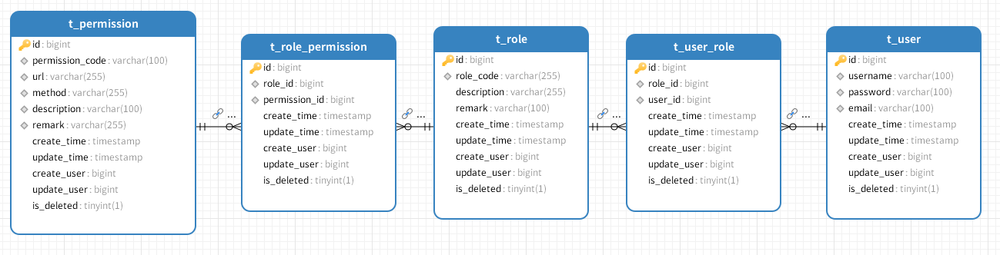
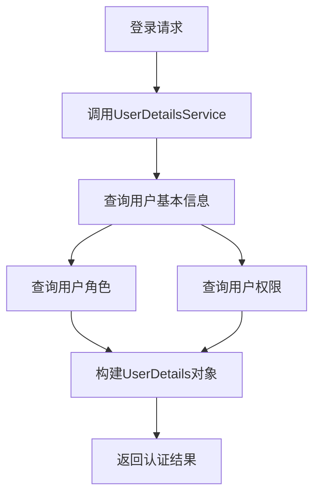

# Spring Security 6 入门指南



## 基本配置

### 添加依赖
在Maven项目中添加Spring Security依赖：
```xml
<dependency>
    <groupId>org.springframework.boot</groupId>
    <artifactId>spring-boot-starter-security</artifactId>
</dependency>
```

### 基础安全配置
创建一个配置类启用Web安全：
```java
@EnableWebSecurity
@Configuration
public class SecurityWebConfiguration {
}
```

## 自定义登录配置

### 重要提示
使用自定义页面时，必须在控制器中明确指定跳转地址，否则Security无法正确路由，即使URL正确也无法跳转。

### 启用与禁用选项
- 使用默认登录页：`.formLogin(Customizer.withDefaults())`
- 禁用表单登录：`.formLogin(AbstractHttpConfigurer::disable)`

#### 配置示例

```java
@Configuration
@EnableWebSecurity
@EnableMethodSecurity
@RequiredArgsConstructor
public class SecurityWebConfiguration {

    private final DbUserDetailService dbUserDetailService;

    @Bean
    SecurityFilterChain filterChain(HttpSecurity http) throws Exception {

        http.authorizeHttpRequests(authorizeRequests ->
                        // 访问路径为 /api 时需要进行认证
                        authorizeRequests
                                // 只认证 /api/** 下的所有接口
                                .requestMatchers("/api/**").authenticated()
                                // 其余请求都放行
                                .anyRequest().permitAll()
                )
                .formLogin(loginPage -> loginPage
                        // 自定义登录页路径
                        .loginPage("/login-page")
                        // 处理登录的URL（默认就是/login）
                        .loginProcessingUrl("/login")
                        // 登录成功跳转
                        .defaultSuccessUrl("/")
                        // 登录失败跳转
                        .failureUrl("/login-page?error=true")
                        .permitAll()
                )
                // 使用默认的登录
                // .formLogin(Customizer.withDefaults())
                // 禁用表单登录
                // .formLogin(AbstractHttpConfigurer::disable)
                .logout(logout -> logout
                        .logoutSuccessUrl("/login-page?logout=true")
                        .permitAll()
                )
                .csrf(AbstractHttpConfigurer::disable)
                .exceptionHandling(configurer -> configurer
                        // 自定无权访问返回内容
                        .accessDeniedHandler(new SecurityAccessDeniedHandler())
                        // 自定义未授权返回内容
                        .authenticationEntryPoint(new SecurityAuthenticationEntryPoint())
                )

                .userDetailsService(dbUserDetailService)
        ;

        return http.build();
    }
}
```

## 认证与授权配置

### URL访问控制

#### 基本认证拦截
```java
String[] permitAllUrls = {
    "/", "/doc.html/**",
    "/webjars/**", "/images/**", ".well-known/**", "favicon.ico", "/error/**",
    "/v3/api-docs/**"
};

http.authorizeHttpRequests(authorizeRequests ->
    authorizeRequests
        .requestMatchers("/api/**").authenticated()
        .requestMatchers(permitAllUrls).permitAll()
)
```

#### 基于权限的拦截
> [!WARNING]
>
> 内存模式下无法获取角色信息。

1. 配置内存用户：
```java
@Bean
@ConditionalOnMissingBean(UserDetailsService.class)
InMemoryUserDetailsManager inMemoryUserDetailsManager(PasswordEncoder passwordEncoder) {
    String encodedPassword = passwordEncoder.encode("123456");
    
    UserDetails user = User.builder()
        .username("user")
        .password(encodedPassword)
        .roles("USER")
        .authorities("read")
        .build();
        
    UserDetails admin = User.builder()
        .username("admin")
        .password(encodedPassword)
        .roles("ADMIN")
        .authorities("all", "read")
        .build();
        
    return new InMemoryUserDetailsManager(user, admin);
}
```

2. 配置资源权限：
```java
authorizeRequests
    .requestMatchers(permitAllUrls).permitAll()
    .requestMatchers("/api/security/**").permitAll()
    .requestMatchers(HttpMethod.GET, "/api/anonymous/**").anonymous()
    // 使用hasRole会自动添加ROLE_前缀
    // .requestMatchers("/api/**").hasRole("ADMIN")
    .requestMatchers("/api/**").hasAnyAuthority("all", "read")
```

### 完整配置示例

```java
@EnableMethodSecurity
@EnableWebSecurity
@Configuration
public class SecurityWebConfiguration {

    @Bean
    SecurityFilterChain filterChain(HttpSecurity http) throws Exception {
        String[] permitAllUrls = {
            "/", "/doc.html/**",
            "/webjars/**", "/images/**", ".well-known/**", "favicon.ico", "/error/**",
            "/v3/api-docs/**"
        };

        http.authorizeHttpRequests(authorizeRequests ->
                authorizeRequests
                    .requestMatchers(permitAllUrls).permitAll()
                    .requestMatchers("/api/security/**").permitAll()
                    .requestMatchers(HttpMethod.GET, "/api/anonymous/**").anonymous()
                    .requestMatchers("/api/**").hasAnyAuthority("all", "read")
            )
            .formLogin(loginPage -> loginPage
                .loginPage("/login-page")
                .loginProcessingUrl("/login")
                .defaultSuccessUrl("/")
                .failureUrl("/login-page?error=true")
                .permitAll()
            )
            .logout(logout -> logout
                .logoutSuccessUrl("/login-page?logout=true")
                .permitAll()
            );
        return http.build();
    }
}
```

## 密码校验器

```java
/**
 * 配置密码编码器Bean
 * 
 * <p>Spring Security提供了多种密码编码器实现，推荐使用BCryptPasswordEncoder作为默认选择。</p>
 * 
 * <p>特点：</p>
 * <ul>
 *   <li>BCryptPasswordEncoder - 使用bcrypt强哈希算法，自动加盐，是当前最推荐的密码编码器</li>
 *   <li>Argon2PasswordEncoder - 使用Argon2算法，抗GPU/ASIC攻击，但需要更多内存</li>
 *   <li>SCryptPasswordEncoder - 使用scrypt算法，内存密集型，抗硬件攻击</li>
 *   <li>Pbkdf2PasswordEncoder - 使用PBKDF2算法，较老但广泛支持</li>
 * </ul>
 * 
 * <p>注意：不推荐使用MD5等弱哈希算法，Spring官方也不推荐自定义弱密码编码器。</p>
 * 
 * @return PasswordEncoder 密码编码器实例
 * @see BCryptPasswordEncoder
 */
@Bean
public PasswordEncoder passwordEncoder() {
    // 实际项目中只需返回一个密码编码器
    return new BCryptPasswordEncoder();
    
    // 其他编码器示例（根据需求选择一种）:
    // return new Argon2PasswordEncoder(16, 32, 1, 1 << 14, 2);
    // return new SCryptPasswordEncoder();
    // return new Pbkdf2PasswordEncoder("secret", 185000, 256);
}
```

### 密码校验器的作用和特点

#### 作用

密码校验器(PasswordEncoder)在Spring Security中负责：

1. 密码加密 - 将明文密码转换为不可逆的哈希值
2. 密码验证 - 比较输入的密码与存储的哈希是否匹配
3. 防止密码泄露 - 即使数据库泄露，攻击者也无法轻易获得原始密码

#### 各编码器特点

1. **BCryptPasswordEncoder**
   - 使用bcrypt算法
   - 自动加盐，防止彩虹表攻击
   - 可配置强度参数(默认10)
   - 目前最推荐的密码哈希方案
2. **Argon2PasswordEncoder**
   - 使用Argon2算法(2015年密码哈希比赛获胜者)
   - 抗GPU/ASIC攻击
   - 内存密集型，参数配置复杂
   - 适合高安全需求场景
3. **SCryptPasswordEncoder**
   - 使用scrypt算法
   - 内存密集型，抗硬件攻击
   - 比bcrypt更抗ASIC攻击
4. **Pbkdf2PasswordEncoder**
   - 使用PBKDF2算法
   - 较老的算法，但广泛支持
   - 需要高迭代次数才安全

#### 最佳实践

**最佳实践是使用BCryptPasswordEncoder**，原因包括：

1. 它是Spring Security默认推荐的编码器
2. 自动处理盐值，无需额外存储
3. 经过充分的安全审查和实际验证
4. 平衡了安全性和性能
5. 广泛支持，易于配置

在Spring Security 5+版本中，BCryptPasswordEncoder是官方文档中首推的密码编码器实现。除非有特殊安全需求，否则应优先选择它。

### 实现自定义校验器

在Spring Security中，自定义密码编码器需要实现`PasswordEncoder`接口。

以下是实现MD5示例及注意事项：

```java
/**
 * <h1>MD5密码编码器实现</h1>
 *
 * <strong>安全警告：</strong>此类使用MD5算法进行密码哈希，已不再安全，不推荐用于生产环境。
 *
 * <p>MD5算法因其计算速度快且易受彩虹表攻击而被认为不安全。即使密码哈希本身是单向的，
 * 但现代计算能力使得暴力破解和预先计算的彩虹表攻击变得可行。</p>
 *
 * <p>Spring Security推荐使用BCrypt、PBKDF2、Argon2或Scrypt等自适应单向函数替代MD5。</p>
 *
 * @see PasswordEncoder
 * 一般仅用于遗留系统兼容，新系统应使用更安全的密码编码器
 */
public class MD5PasswordEncoder implements PasswordEncoder {

    @Override
    public String encode(CharSequence rawPassword) {
        if (rawPassword == null) {
            throw new IllegalArgumentException("原始密码不能为null");
        }

        byte[] md5Digest = DigestUtils.md5Digest(rawPassword.toString().getBytes());
        return HexFormat.of().formatHex(md5Digest);
    }

    @Override
    public boolean matches(CharSequence rawPassword, String encodedPassword) {
        if (rawPassword == null) {
            throw new IllegalArgumentException("原始密码不能为null");
        }

        if (!StringUtils.hasText(encodedPassword)) {
            return false;
        }

        return encodedPassword.equalsIgnoreCase(encode(rawPassword));
    }

    @Override
    public boolean upgradeEncoding(String encodedPassword) {
        // MD5已不安全，始终返回true建议升级到更安全的算法
        return true;
    }
}
```

## 自定义UserDetailsService

在Spring Security中，如果需要自定义用户认证逻辑，可以通过实现`UserDetailsService`接口来完成。以下是正确实现方式：

### 标准实现示例

```java
@Service
public class CustomUserDetailsService implements UserDetailsService {

    private final PasswordEncoder passwordEncoder;

    // 推荐使用构造器注入
    public CustomUserDetailsService(PasswordEncoder passwordEncoder) {
        this.passwordEncoder = passwordEncoder;
    }

    @Override
    public UserDetails loadUserByUsername(String username) throws UsernameNotFoundException {
        // 1. 这里应该根据username从数据库或其他存储中查询用户信息
        // 以下是模拟数据，实际应用中应从数据库查询
        
        // 2. 如果用户不存在，抛出UsernameNotFoundException
        if (!"bunny".equalsIgnoreCase(username)) {
            throw new UsernameNotFoundException("User not found: " + username);
        }
        
        // 3. 构建UserDetails对象返回
        return User.builder()
                .username(username)  // 使用传入的用户名
                .password(passwordEncoder.encode("123456"))  // 密码应该已经加密存储，这里仅为示例
                .roles("USER")  // 角色会自动添加ROLE_前缀
                .authorities("read", "write")  // 添加具体权限
                .build();
    }
}
```

## 当前用户登录信息

用户的信息都保存在`SecurityContextHolder.getContext()`的上下文中。

```java
/**
 * 获取当前认证用户的基本信息
 * 使用Spring Security的SecurityContextHolder获取当前认证信息
 */
@Operation(summary = "当前用户的信息", description = "当前用户的信息")
@GetMapping("/current-user")
public Authentication getCurrentUser() {
    // 从SecurityContextHolder获取当前认证对象
    Authentication auth = SecurityContextHolder.getContext().getAuthentication();
    
    // 打印当前用户名和权限信息到控制台（用于调试）
    System.out.println("Current user: " + auth.getName());
    System.out.println("Authorities: " + auth.getAuthorities());
    
    // 返回完整的认证对象
    return auth;
}

/**
 * 获取当前用户的详细信息
 * 从认证主体中提取UserDetails信息
 */
@Operation(summary = "获取用户详情", description = "获取用户详情")
@GetMapping("user-detail")
public UserDetails getCurrentUserDetail() {
    // 从SecurityContextHolder获取当前认证对象
    Authentication auth = SecurityContextHolder.getContext().getAuthentication();
    
    // 获取认证主体(principal)
    Object principal = auth.getPrincipal();

    // 检查主体是否是UserDetails实例
    if (principal instanceof UserDetails) {
        // 如果是，则转换为UserDetails并返回
        return (UserDetails) principal;
    } else {
        // 如果不是UserDetails类型，返回null
        return null;
    }
}
```

## URL资源认证配置

### 角色与权限配置

> [!IMPORTANT]
>
> 1. **角色与权限的区别**：
>    - `hasRole()`会自动添加"ROLE_"前缀
>    - `hasAuthority()`直接使用指定的权限字符串
> 2. **匹配顺序**：
>    - Spring Security会按照配置的顺序进行匹配
>    - 更具体的路径应该放在前面，通用规则（如anyRequest）放在最后
> 3. **方法选择建议**：
>    - `hasRole()`/`hasAnyRole()`：适合基于角色的访问控制
>    - `hasAuthority()`/`hasAnyAuthority()`：适合更细粒度的权限控制
>    - `authenticated()`：只需认证通过，不检查具体角色/权限
>    - `permitAll()`：完全开放访问
> 4. **最佳实践**：
>    - 对于REST API，通常使用`authenticated()`配合方法级权限控制
>    - 静态资源应明确配置`permitAll()`
>    - 生产环境不建议使用`anyRequest().permitAll()`

#### 1. 基于角色的URL访问控制

##### 单角色配置

配置`/api/**`路径下的所有接口需要`ADMIN`角色才能访问：

```java
@Bean
SecurityFilterChain filterChain(HttpSecurity http) throws Exception {
    http.authorizeHttpRequests(authorize -> authorize
            // 注意：会自动添加"ROLE_"前缀，实际检查的是ROLE_ADMIN
            .requestMatchers("/api/**").hasRole("ADMIN")
        )
        // 其他配置...
    ;
    return http.build();
}
```

##### 多角色配置（满足任一角色即可访问）

```java
@Bean
SecurityFilterChain filterChain(HttpSecurity http) throws Exception {
    http.authorizeHttpRequests(authorize -> authorize
            // 检查是否有ADMIN或USER角色（自动添加ROLE_前缀）
            .requestMatchers("/api/**").hasAnyRole("ADMIN", "USER")
        )
        // 其他配置...
    ;
    return http.build();
}
```

#### 2. 基于权限的URL访问控制

##### 需要所有指定权限

```java
@Bean
SecurityFilterChain filterChain(HttpSecurity http) throws Exception {
    http.authorizeHttpRequests(authorize -> authorize
            // 需要同时拥有"all"和"read"权限
            .requestMatchers("/api/**").hasAuthority("all")
            .requestMatchers("/api/**").hasAuthority("read")
        )
        // 其他配置...
    ;
    return http.build();
}
```

##### 满足任一权限即可

```java
@Bean
SecurityFilterChain filterChain(HttpSecurity http) throws Exception {
    http.authorizeHttpRequests(authorize -> authorize
            // 拥有"all"或"read"任一权限即可访问
            .requestMatchers("/api/**").hasAnyAuthority("all", "read")
        )
        // 其他配置...
    ;
    return http.build();
}
```

### 综合配置策略

#### 1. 基本配置模式

```java
@Bean
SecurityFilterChain filterChain(HttpSecurity http) throws Exception {
    http.authorizeHttpRequests(authorize -> authorize
            // 特定路径需要认证
            .requestMatchers("/api/**").authenticated()
            // 其他请求全部放行
            .anyRequest().permitAll()
        )
        // 其他配置...
    ;
    return http.build();
}
```

#### 2. 多路径匹配配置

```java
@Bean
SecurityFilterChain filterChain(HttpSecurity http) throws Exception {
    // 定义无需认证的白名单路径
    String[] permitAllUrls = {
        "/", "/doc.html/**",
        "/webjars/**", "/images/**", 
        "/.well-known/**", "/favicon.ico", 
        "/error/**", "/swagger-ui/**", 
        "/v3/api-docs/**"
    };

    http.authorizeHttpRequests(authorize -> authorize
            // API路径需要认证
            .requestMatchers("/api/**").authenticated()
            // 白名单路径直接放行
            .requestMatchers(permitAllUrls).permitAll()
            // 其他请求需要登录（非匿名访问）
            .anyRequest().authenticated()
        )
        // 其他配置...
    ;
    return http.build();
}
```

### 基于方法的授权

> [!NOTE]
>
> 通过在任何 `@Configuration` 类上添加 `@EnableMethodSecurity` 注解。
>
> Spring Boot Starter Security 默认情况下不会激活方法级别的授权。

#### 提供的注解

1. @PreAuthorize
2. @PostAuthorize
3. @PreFilter
4. @PostFilter

## 关于UserDetailsService的深入解析

> [!IMPORTANT]
>
> 在SpringSecurity6中版本是6.3.10，如果显式的为User设置角色，在示例的Security上下文中时获取不到roles相关信息的，只能获取到authorities信息。
>
> 如果需要使用角色判断需要将角色的内容和权限内容一并放到authorities中。
>
> 在SpringSecurity6中不用显式的为角色添加`ROLE_`像这样的字符串，Security会为我们亲自加上，如果加上会有异常抛出：`ROLE_USER cannot start with ROLE_ (it is automatically added)...`

```java
// 设置用户权限
return User.builder()
        .username(userEntity.getUsername())
        .password(userEntity.getPassword())
        .roles(roles)
        // 设置用户 authorities
        .authorities(authorities)
        .build();
```

如有上述需要可以尝试这样写。

```java
// 设置用户角色
String[] roles = findUserRolesByUserId(userId);

// 设置用户权限
List<String> permissionsByUserId = findPermissionByUserId(userId);
String[] permissions = permissionsByUserId.toArray(String[]::new);

// 也可以转成下面的形式
// List<String> permissions = permissionsByUserId.stream()
//         .map(SimpleGrantedAuthority::new)
//         .toList();

String[] authorities = ArrayUtils.addAll(roles, permissions);

// 设置用户权限
return User.builder()
        .username(userEntity.getUsername())
        .password(userEntity.getPassword())
        // 设置用户 authorities
        .authorities(authorities)
        .build();
```

### 简单阐述

#### 1. UserDetailsService的核心作用

`UserDetailsService`是Spring Security的核心接口，负责提供用户认证数据。它只有一个核心方法：

```java
UserDetails loadUserByUsername(String username) throws UsernameNotFoundException;
```

当用户尝试登录时，Spring Security会自动调用这个方法来获取用户详情。

#### 2. 为什么不需要手动校验密码？

在标准的表单登录流程中，Spring Security的认证流程会自动处理密码校验，这是因为：

1. **自动集成密码编码器**：  
   Spring Security会自动使用配置的`PasswordEncoder`来比对：

   - 用户提交的明文密码
   - 数据库中存储的加密密码（通过`UserDetails`返回）

2. **认证流程内部处理**：  
   认证管理器(`AuthenticationManager`)会自动处理以下流程：

   ```mermaid
   graph TD
   A[用户提交凭证] --> B[调用UserDetailsService]
   B --> C[获取UserDetails]
   C --> D[PasswordEncoder比对密码]
   D --> E[认证成功/失败]
   ```

#### 3. 完整的安全配置示例

```java
@Configuration
@EnableWebSecurity
@RequiredArgsConstructor
public class SecurityConfig {

    private final DbUserDetailService dbUserDetailService;
    private final PasswordEncoder passwordEncoder;

    @Bean
    SecurityFilterChain filterChain(HttpSecurity http) throws Exception {
        http
            .authorizeHttpRequests(auth -> auth
                .requestMatchers("/api/**").authenticated()
                .anyRequest().permitAll()
            )
            .formLogin(form -> form
                .loginProcessingUrl("/login")
                .permitAll()
            )
            // 即使不显式设置也会自动生效
            .userDetailsService(dbUserDetailService)
            // 必须配置PasswordEncoder
            .authenticationManager(authenticationManager(http));
        
        return http.build();
    }

    @Bean
    AuthenticationManager authenticationManager(HttpSecurity http) throws Exception {
        return http.getSharedObject(AuthenticationManagerBuilder.class)
                .userDetailsService(dbUserDetailService)
                .passwordEncoder(passwordEncoder)
                .and()
                .build();
    }
}
```

#### 4. 关键注意事项

1. **必须提供PasswordEncoder**：  
   如果没有配置，会出现`There is no PasswordEncoder mapped`错误

   ```java
   @Bean
   PasswordEncoder passwordEncoder() {
       return new BCryptPasswordEncoder();
   }
   ```

2. **UserDetails实现要求**：  
   你的自定义`UserDetails`实现必须包含：

   - 正确的用户名
   - 加密后的密码
   - 账号状态信息（是否过期/锁定等）

3. **自动发现机制**：  
   当以下条件满足时，Spring Boot会自动配置：

   - 容器中存在唯一的`UserDetailsService`实现
   - 存在`PasswordEncoder` bean
   - 没有显式配置`AuthenticationManager`

#### 5. 扩展场景

如果需要自定义认证逻辑（如增加验证码校验），可以：

```java
@Component
@RequiredArgsConstructor
public class CustomAuthProvider implements AuthenticationProvider {

    private final UserDetailsService userDetailsService;
    private final PasswordEncoder passwordEncoder;

    @Override
    public Authentication authenticate(Authentication auth) {
        // 自定义逻辑
        UserDetails user = userDetailsService.loadUserByUsername(auth.getName());
        // 手动密码比对
        if (!passwordEncoder.matches(auth.getCredentials().toString(), user.getPassword())) {
            throw new BadCredentialsException("密码错误");
        }
        return new UsernamePasswordAuthenticationToken(user, null, user.getAuthorities());
    }

    @Override
    public boolean supports(Class<?> authentication) {
        return UsernamePasswordAuthenticationToken.class.isAssignableFrom(authentication);
    }
}
```

然后在配置中注册：

```java
http.authenticationProvider(customAuthProvider);
```

#### 总结对比表

| 场景         | 需要手动处理                       | 自动处理                |
| ------------ | ---------------------------------- | ----------------------- |
| 用户查找     | 实现`loadUserByUsername()`         | ✅                       |
| 密码比对     | ❌                                  | 由`PasswordEncoder`处理 |
| 账号状态检查 | 通过`UserDetails`返回的状态        | ✅                       |
| 权限加载     | 通过`UserDetails.getAuthorities()` | ✅                       |

这样设计的好处是：开发者只需关注业务数据获取（用户信息查询），安全相关的校验逻辑由框架统一处理，既保证了安全性又减少了重复代码。

### 获取角色与权限

#### 1. 角色信息处理

在`UserDetailsService`实现中获取并设置用户角色：

```java
@Override
public UserDetails loadUserByUsername(String username) throws UsernameNotFoundException {
    // 1. 查询用户基本信息
    UserEntity userEntity = userMapper.selectByUsername(username);
    if (userEntity == null) {
        throw new UsernameNotFoundException("用户不存在");
    }

    // 2. 获取角色信息（自动添加ROLE_前缀）
    String[] roles = findUserRolesByUserId(userEntity.getId());
    
    // 3. 获取权限信息
    List<String> permissions = findPermissionsByUserId(userEntity.getId());
    
    return User.builder()
            .username(userEntity.getUsername())
            .password(userEntity.getPassword())
            // 角色会自动添加ROLE_前缀
            .roles(roles)  
            // 直接作为权限字符串使用
            .authorities(permissions.toArray(new String[0])) 
            .build();
}
```

**关键说明**：

- `roles()`方法会自动为角色添加`ROLE_`前缀（如`ADMIN`会变成`ROLE_ADMIN`）
- 角色和权限在Spring Security中是不同概念，角色本质是带有特殊前缀的权限

#### 2. 权限信息处理（两种方式）

**方式一：直接使用字符串**

```java
List<String> permissions = findPermissionsByUserId(userId);
return User.withUsername(username)
           .authorities(permissions.toArray(new String[0]))
           // ...
           .build();
```

**方式二：转换为SimpleGrantedAuthority**

```java
List<GrantedAuthority> authorities = permissions.stream()
    .map(SimpleGrantedAuthority::new)
    .collect(Collectors.toList());

return User.withUsername(username)
           .authorities(authorities)
           // ...
           .build();
```

**权限实现类对比**：

| 实现类                       | 适用场景      | 特点             |
| ---------------------------- | ------------- | ---------------- |
| `SimpleGrantedAuthority`     | 普通权限/角色 | 最常用实现       |
| `SwitchUserGrantedAuthority` | 用户切换场景  | 包含原始用户信息 |
| `JaasGrantedAuthority`       | JAAS集成      | 用于Java认证服务 |

#### 3. Mapper配置优化

**角色查询Mapper**：

```xml
<select id="selectRolesByUserId" resultType="com.example.entity.Role">
    SELECT r.* 
    FROM t_role r
    JOIN t_user_role ur ON r.id = ur.role_id
    WHERE ur.user_id = #{userId}
</select>
```

**权限查询Mapper**：

```xml
<select id="selectPermissionsByUserId" resultType="java.lang.String">
    SELECT p.permission_code
    FROM t_permission p
    JOIN t_role_permission rp ON p.id = rp.permission_id
    JOIN t_user_role ur ON rp.role_id = ur.role_id
    WHERE ur.user_id = #{userId}
</select>
```

#### 4. 重要注意事项

1. **角色与权限的存储建议**：

   - 角色建议存储为`ADMIN`、`USER`等形式
   - 权限建议存储为`user:read`、`order:delete`等具体操作

2. **性能优化**：

   ```java
   // 使用一次查询获取所有权限信息（避免N+1查询）
   @Select("SELECT p.permission_code FROM ... WHERE ur.user_id = #{userId}")
   List<String> selectAllUserPermissions(@Param("userId") Long userId);
   ```

3. **Spring Security的默认行为**：

   - 如果同时配置`roles()`和`authorities()`，后者会覆盖前者
   - 推荐统一使用`authorities()`方法处理所有授权信息

4. **最佳实践示例**：

```java
List<GrantedAuthority> authorities = new ArrayList<>();
// 添加角色（手动添加ROLE_前缀）
roles.forEach(role -> 
    authorities.add(new SimpleGrantedAuthority("ROLE_" + role)));
// 添加权限
authorities.addAll(permissions.stream()
    .map(SimpleGrantedAuthority::new)
    .toList());

return User.builder()
    // ...
    .authorities(authorities)
    .build();
```

#### 5. 完整流程示意图


```mermaid
graph TD
    A[登录请求] --> B[调用UserDetailsService]
    B --> C[查询用户基本信息]
    C --> D[查询用户角色]
    C --> E[查询用户权限]
    D --> F[构建UserDetails对象]
    E --> F
    F --> G[返回认证结果]
```

## 注解使用

### 1. 基础使用说明

> [!IMPORTANT] 
>
> 使用权限注解时需注意：
>
> - `hasAuthority()` 严格区分大小写
> - 类级别注解会被方法级别注解覆盖
> - 默认需要启用注解支持：`@EnableMethodSecurity`

如果需要使用某个注解，直接在方法加上即可，当然也可以加载类上面。

如果类上面也加了注解，方法也加了，那么方法的会覆盖掉类上的。

```java
@PreAuthorize("hasAuthority('permission:read')")
@PostAuthorize("returnObject.data == authentication.name")
@Operation(summary = "分页查询系统角色表", description = "分页系统角色表")
@GetMapping("{page}/{limit}")
public Result<PageResult<RoleVo>> getRolePage(
        @Parameter(name = "page", description = "当前页", required = true)
        @PathVariable("page") Integer page,
        @Parameter(name = "limit", description = "每页记录数", required = true)
        @PathVariable("limit") Integer limit,
        RoleDto dto) {
    Page<RoleEntity> pageParams = new Page<>(page, limit);
    PageResult<RoleVo> pageResult = roleService.getRolePage(pageParams, dto);
    return Result.success(pageResult);
}
```

### 2. 前置与后置授权对比

在Spring Security 6中，`@PreAuthorize`和`@PostAuthorize`确实有不同的执行时机和行为，你的理解基本正确，我来详细说明一下：

#### 1. @PreAuthorize

- **执行时机**：在方法执行**之前**进行权限检查
- **行为**：
  - 如果当前用户没有满足注解中指定的权限条件，方法**不会被执行**，直接抛出`AccessDeniedException`
  - 这是一种"先验"的权限检查方式，可以防止无权限用户触发方法执行
- **典型用途**：适用于方法执行前的权限验证，特别是当方法执行可能有副作用(如修改数据)时

```java
@PreAuthorize("hasRole('ADMIN')")
public void deleteUser(Long userId) {
    // 只有ADMIN角色可以执行此方法
    // 如果不是ADMIN，代码不会执行到这里
}
```

#### 2. @PostAuthorize

- **执行时机**：在方法执行**之后**进行权限检查
- **行为**：
  - 方法**会先完整执行**，然后在返回结果前检查权限
  - 如果权限检查不通过，同样会抛出`AccessDeniedException`，但方法已经执行完毕
  - 可以基于方法的返回值进行权限判断(使用`returnObject`引用返回值)
- **典型用途**：适用于需要根据方法返回结果决定是否允许访问的情况

```java
@PostAuthorize("returnObject.owner == authentication.name")
public Document getDocument(Long docId) {
    // 方法会先执行
    // 返回前检查文档所有者是否是当前用户
    return documentRepository.findById(docId);
}
```

**如果需要关闭**

```java
@Configuration
@EnableMethodSecurity(prePostEnabled = false)
class MethodSecurityConfig {
    
}
```


#### 关键区别总结

| 特性             | @PreAuthorize        | @PostAuthorize                 |
| ---------------- | -------------------- | ------------------------------ |
| 执行时机         | 方法执行前           | 方法执行后                     |
| 方法是否会被执行 | 不满足条件时不执行   | 总是执行                       |
| 可访问的上下文   | 方法参数             | 方法参数和返回值(returnObject) |
| 性能影响         | 更好(避免不必要执行) | 稍差(方法总会执行)             |
| 主要用途         | 防止未授权访问       | 基于返回值的访问控制           |

> [!CAUTION] 
>
> 如果使用`PostAuthorize`注解，但是服务中没有标记事务注解，那么会将整个方法全部执行，即使没有权限也不会回滚。
>
> **默认情况下，Spring 事务会对未捕获的 `RuntimeException` 进行回滚**，因此：
>
> - 如果事务仍然活跃（未提交），则会回滚。
> - 但如果事务已经提交（例如方法执行完毕且事务已提交），则**不会回滚**。

1. **优先使用@PreAuthorize**：除非你需要基于返回值做判断，否则应该使用`@PreAuthorize`，因为它能更早地阻止未授权访问

2. **注意方法副作用**：使用`@PostAuthorize`时要特别注意，即使最终会拒绝访问，方法中的所有代码(包括数据库修改等操作)都已经执行了

3. **组合使用**：有时可以组合使用两者，先用`@PreAuthorize`做基本权限检查，再用`@PostAuthorize`做更精细的检查

4. **性能敏感场景**：对于性能敏感或可能产生副作用的方法，避免使用`@PostAuthorize`

**使用示例**

```java
@Tag(name = "测试接口", description = "测试用的接口")
@Slf4j
@RestController
@RequestMapping("/api/test")
public class TestController {

    @PreAuthorize("hasAuthority('role::read')")
    @Operation(summary = "拥有 role:read 的角色可以访问", description = "当前用户拥有 role:read 角色可以访问这个接口")
    @GetMapping("role-user")
    public Result<String> roleUser() {
        return Result.success();
    }

    @PreAuthorize("hasAuthority('USER')")
    @Operation(summary = "拥有 USER 的角色可以访问", description = "当前用户拥有 USER 角色可以访问这个接口")
    @GetMapping("upper-user")
    public Result<String> upperUser() {
        String data = "是区分大小写的";
        return Result.success(data);
    }

    @PreAuthorize("hasAuthority('user')")
    @Operation(summary = "拥有 USER 的角色可以访问", description = "当前用户拥有 USER 角色可以访问这个接口")
    @GetMapping("lower-user")
    public Result<String> lowerUser() {
        String data = "如果是大写，但是在这里是小写无法访问";
        return Result.success(data);
    }

    @PostAuthorize("returnObject.data == authentication.name")
    @Operation(summary = "测试使用返回参数判断权限", description = "测试使用返回参数判断权限 用户拥有 role::read 可以访问这个接口")
    @GetMapping("test-post-authorize")
    public Result<String> testPostAuthorize() {
        log.info("方法内容已经执行。。。");
        String data = "Bunny";
        return Result.success(data);
    }
}
```

### 3. 高级用法

#### 元注解封装

```java
// 管理员权限注解
@Target({ElementType.METHOD, ElementType.TYPE})
@Retention(RetentionPolicy.RUNTIME)
@PreAuthorize("hasRole('ADMIN')")
public @interface AdminOnly {}

// 资源所属校验注解
@Target(ElementType.METHOD)
@Retention(RetentionPolicy.RUNTIME)
@PostAuthorize("returnObject.ownerId == authentication.principal.id")
public @interface ResourceOwner {}
```

#### 模板化注解

```java
@Target({ElementType.METHOD, ElementType.TYPE})
@Retention(RetentionPolicy.RUNTIME)
@PreAuthorize("hasAuthority('USER') or hasAuthority(#permission)")
public @interface UserOrPermission {
    String permission();
}

// 使用示例
@UserOrPermission(permission = "report:read")
public Report getReport(Long id) { ... }
```

**自定义Any模板元注解**

> [!WARNING]
>
> SpringSecurity6.3.10版本与最新版的6.5.1写法不一样。

如果需要自定义任意权限都可通过需要引入下面的内容。

```java
@Bean
static PrePostTemplateDefaults prePostTemplateDefaults() {
	return new PrePostTemplateDefaults();
}
```

**示例**

```java
@Target({ElementType.METHOD, ElementType.TYPE})
@Retention(RetentionPolicy.RUNTIME)
@PreAuthorize("hasAnyAuthority({auth})")
public @interface HasAnyAuthority {
    String[] auth();
}

@HasAnyAuthority(auth = {"'USER'", "'ADMIN'"})
@Operation(summary = "拥有 HasAnyXXX 的角色可以访问", description = "当前用户拥有 HasAnyXXX 角色可以访问这个接口")
@GetMapping("role-user")
public Result<String> roleUser() {
    return Result.success();
}
```

### 4. 其他注解支持

#### JSR-250注解

需显式启用：

```java
@EnableMethodSecurity(jsr250Enabled = true)
```

提供注解：

- `@RolesAllowed("ROLE")` - 等效于`@PreAuthorize("hasRole('ROLE')")`
- `@PermitAll` - 允许所有访问
- `@DenyAll` - 拒绝所有访问

#### 已废弃注解

- `@Secured` 在Spring Security 6中已废弃，如需使用需显式启用：

  ```java
  @EnableMethodSecurity(securedEnabled = true)
  ```

### 5. 最佳实践示例

```java
@Tag(name = "权限测试接口")
@RestController
@RequestMapping("/api/auth-test")
public class AuthTestController {

    // 精确权限控制
    @AdminOnly
    @GetMapping("/admin")
    public Result<String> adminEndpoint() {
        return Result.success("Admin access");
    }

    // 复合权限检查
    @PreAuthorize("hasAnyAuthority('DATA_READ', 'REPORT_READ')")
    @GetMapping("/reports")
    public Result<List<Report>> getReports() {
        return Result.success(reportService.getAll());
    }

    // 返回值校验
    @ResourceOwner
    @GetMapping("/documents/{id}")
    public Document getDocument(@PathVariable Long id) {
        return docService.getById(id); // 执行后校验所有者
    }

    // 模板注解使用
    @UserOrPermission(permission = "audit:read")
    @GetMapping("/audit-logs")
    public Result<PageResult<AuditLog>> getAuditLogs(Pageable pageable) {
        return Result.success(auditService.getLogs(pageable));
    }
}
```

### 关键注意事项

1. **事务边界问题**：

   - `@PostAuthorize`注解的方法若包含写操作，需确保：

     ```java
     @Transactional
     @PostAuthorize("...")
     public void updateData() {
         // 若授权失败，已执行的操作不会回滚
     }
     ```

2. **权限命名规范**：

   - 角色：`ROLE_ADMIN`（自动前缀）
   - 权限：`module:action`（如`user:delete`）

3. **性能考虑**：

   - 避免在`@PostAuthorize`中执行耗时操作
   - 对高频接口优先使用`@PreAuthorize`

4. **测试覆盖**：

   - 必须为每个安全注解编写测试用例
   - 验证正向和反向场景

5. **注解组合**：

   ```java
   @AdminOnly
   @PostAuthorize("returnObject.status == 'PUBLIC'")
   public Content getContent(Long id) {
       // 需要管理员权限且只允许返回公开内容
   }
   ```

## 通过编程方式授权方法

```java
@Component("auth")
public class AuthorizationLogic {

    public boolean decide(String name) {
        System.out.println(name);
        // 直接使用name的实现
        return name.equalsIgnoreCase("user");
    }

}
```

在控制器中使用

```java
@PreAuthorize("@auth.decide(#name)")
@Operation(summary = "拥有 USER 的角色可以访问", description = "当前用户拥有 USER 角色可以访问这个接口")
@GetMapping("lower-user")
public Result<String> lowerUser(String name) {
    return Result.success(name);
}
```

