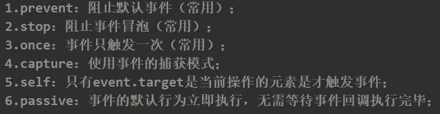

# Vue2 事件处理机制文档

## 一、基本概念

Vue2 提供了 `v-on` 指令（简写为 `@`）用于监听 DOM 事件并执行相应的 JavaScript 代码。本示例展示了 Vue2 中事件处理的基本用法，包括不传参和传参两种场景。

## 二、代码示例解析

```html
<div id="app">
    <h1>Vue2-事件处理</h1>
    <button @click="showinfo1">函数不传参</button>
    <button @click="showinfo2($event,66)">函数传参</button>
</div>

<script>
    const vm = new Vue({
        el: "#app",
        methods: {
            showinfo1() {
                alert("函数不传参");
            },
            showinfo2(event, val) {
                alert("函数传参")
                console.log(event, val);
            }
        }
    })
</script>
```

## 三、核心特性说明

### 1. 事件绑定语法

| 语法形式 | 示例                   | 说明              |
| -------- | ---------------------- | ----------------- |
| 完整写法 | `v-on:click="handler"` | 使用 `v-on:` 前缀 |
| 简写形式 | `@click="handler"`     | 更简洁的写法      |

### 2. 方法定义位置

所有事件处理函数应定义在 Vue 实例的 `methods` 选项中：
```javascript
methods: {
    handler1() { /* ... */ },
    handler2() { /* ... */ }
}
```

### 3. 参数传递方式

| 场景           | 示例                            | 说明                           |
| -------------- | ------------------------------- | ------------------------------ |
| 不传参         | `@click="showinfo1"`            | 自动传入事件对象               |
| 传参           | `@click="showinfo2($event,66)"` | 使用 `$event` 传递原生事件对象 |
| 仅传自定义参数 | `@click="showinfo2(66)"`        | 事件对象将不可用               |

## 四、事件对象详解

### 1. 获取事件对象的方式
- **不传参时**：自动作为第一个参数传入
  ```javascript
  methods: {
      showinfo1(event) {
          // event 可用
      }
  }
  ```
  
- **传参时需要**：必须显式传递 `$event`
  ```html
  <button @click="showinfo2($event,66)">按钮</button>
  ```

### 2. 常用事件对象属性
| 属性/方法               | 类型     | 说明           |
| ----------------------- | -------- | -------------- |
| event.target            | Element  | 触发事件的元素 |
| event.currentTarget     | Element  | 绑定事件的元素 |
| event.preventDefault()  | Function | 阻止默认行为   |
| event.stopPropagation() | Function | 停止事件冒泡   |

## 五、最佳实践建议

1. **方法命名**：
   - 使用动词开头（如 `handleClick`、`submitForm`）
   - 保持名称语义化

2. **参数处理**：
   - 需要事件对象时确保正确传递 `$event`
   - 复杂参数建议使用对象形式：
     ```html
     <button @click="handleClick({id: 1, name: 'test'})">按钮</button>
     ```

3. **方法组织**：
   - 相关功能的方法放在一起
   - 大型组件可考虑按功能分模块

## 六、扩展应用

### 1. 事件修饰符
Vue 提供了特殊的事件修饰符：

```html
<!-- 阻止默认行为 -->
<form @submit.prevent="onSubmit"></form>

<!-- 停止事件冒泡 -->
<div @click.stop="doThis"></div>

<!-- 按键修饰符 -->
<input @keyup.enter="submit">

<!-- 串联修饰符 -->
<button @click.stop.prevent="doThat"></button>
```



### 2. 自定义事件

组件间通信时使用：

```javascript
// 子组件
this.$emit('my-event', payload);

// 父组件
<child-component @my-event="handleEvent"></child-component>
```

### 3. 原生事件绑定到组件
使用 `.native` 修饰符：

```html
<my-component @click.native="handleClick"></my-component>
```

## 七、注意事项

1. **避免内联计算**：
   ```html
   <!-- 不推荐 -->
   <button @click="counter++">增加</button>
   
   <!-- 推荐 -->
   <button @click="increment">增加</button>
   ```

2. **this 指向**：
   - methods 中的方法自动绑定到 Vue 实例
   - 避免使用箭头函数定义方法，会导致 this 指向错误

3. **性能考虑**：
   - 频繁触发的事件（如 scroll）建议使用防抖/节流
   - 大量事件监听应考虑事件委托
